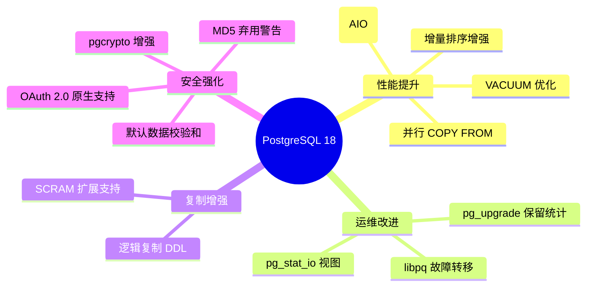

# PostgreSQL 18 DBA 管理工具教程

  

> 🐘 从入门到精通的 PostgreSQL 18 数据库管理员实战指南

---

## 📚 课程概述

本教程系统性地介绍 PostgreSQL 18 DBA 常用的管理工具，涵盖核心命令行工具、图形化管理界面、性能监控、备份恢复、高可用架构等关键领域。

### 🎯 学习目标

- 掌握 PostgreSQL 18 核心管理工具的使用
- 理解 PostgreSQL 18 新特性及其应用场景
- 具备生产环境数据库管理和运维能力
- 能够设计和实施高可用、高性能数据库架构

### 👥 适合人群

- 初级到中级 PostgreSQL DBA
- 希望升级到 PostgreSQL 18 的现有 DBA
- DevOps 工程师和后端开发人员

---

## 🗂️ 课程目录

### 模块 1: 基础入门
| 章节 | 主题 | 描述 |
|------|------|------|
| [1.1](./module-1-basics/1.1-overview/README.md) | PostgreSQL 18 概述与新特性 | 版本特性、架构概览 |
| [1.2](./module-1-basics/1.2-installation/README.md) | 安装与环境配置 | Windows/Linux 安装指南 |
| [1.3](./module-1-basics/1.3-psql-basics/README.md) | psql 命令行工具入门 | 基本连接和操作 |

### 模块 2: 核心管理工具
| 章节 | 主题 | 描述 |
|------|------|------|
| [2.1](./module-2-core-tools/2.1-psql-advanced/README.md) | psql 高级用法 | 元命令、脚本执行 |
| [2.2](./module-2-core-tools/2.2-pgadmin/README.md) | pgAdmin 图形化管理 | 可视化管理界面 |
| [2.3](./module-2-core-tools/2.3-pg_ctl/README.md) | pg_ctl 服务管理 | 数据库服务控制 |
| [2.4](./module-2-core-tools/2.4-initdb/README.md) | initdb 数据库集群初始化 | 集群创建与配置 |

### 模块 3: 性能监控与调优
| 章节 | 主题 | 描述 |
|------|------|------|
| [3.1](./module-3-performance/3.1-pg_stat_io/README.md) | pg_stat_io 性能视图 | 🆕 PG18 I/O 统计 |
| [3.2](./module-3-performance/3.2-pg_stat_statements/README.md) | pg_stat_statements | 查询性能分析 |
| [3.3](./module-3-performance/3.3-explain/README.md) | EXPLAIN 与执行计划 | 查询优化分析 |
| [3.4](./module-3-performance/3.4-pgbadger/README.md) | PgBadger 日志分析 | 日志可视化报告 |
| [3.5](./module-3-performance/3.5-pgtune/README.md) | PgTune 配置优化 | 参数调优建议 |

### 模块 4: 备份与恢复
| 章节 | 主题 | 描述 |
|------|------|------|
| [4.1](./module-4-backup/4.1-pg_dump/README.md) | pg_dump 与 pg_dumpall | 逻辑备份工具 |
| [4.2](./module-4-backup/4.2-pg_restore/README.md) | pg_restore 数据恢复 | 备份恢复操作 |
| [4.3](./module-4-backup/4.3-pg_basebackup/README.md) | pg_basebackup 物理备份 | 热备份方案 |
| [4.4](./module-4-backup/4.4-barman/README.md) | Barman 备份管理 | 企业级备份 |
| [4.5](./module-4-backup/4.5-pitr/README.md) | PITR 时间点恢复 | 灾难恢复策略 |

### 模块 5: 复制与高可用
| 章节 | 主题 | 描述 |
|------|------|------|
| [5.1](./module-5-replication/5.1-streaming-replication/README.md) | 流复制配置 | 主从复制架构 |
| [5.2](./module-5-replication/5.2-logical-replication/README.md) | 逻辑复制 | 🆕 PG18 DDL 复制 |
| [5.3](./module-5-replication/5.3-patroni/README.md) | Patroni 高可用集群 | 自动故障转移 |
| [5.4](./module-5-replication/5.4-pgbouncer/README.md) | PgBouncer 连接池 | 连接管理优化 |

### 模块 6: 安全管理
| 章节 | 主题 | 描述 |
|------|------|------|
| [6.1](./module-6-security/6.1-users-roles/README.md) | 用户与角色管理 | 权限体系设计 |
| [6.2](./module-6-security/6.2-pg_hba/README.md) | pg_hba.conf 权限控制 | 认证配置 |
| [6.3](./module-6-security/6.3-ssl-tls/README.md) | SSL/TLS 配置 | 传输加密 |
| [6.4](./module-6-security/6.4-oauth/README.md) | OAuth 2.0 认证 | 🆕 PG18 原生 OAuth |
| [6.5](./module-6-security/6.5-checksums-crypto/README.md) | 数据校验和与加密 | 🆕 PG18 默认校验和 |

### 模块 7: 维护与运维
| 章节 | 主题 | 描述 |
|------|------|------|
| [7.1](./module-7-maintenance/7.1-vacuum/README.md) | VACUUM 与表膨胀管理 | 🆕 PG18 优化 VACUUM |
| [7.2](./module-7-maintenance/7.2-reindex/README.md) | REINDEX 索引维护 | 索引重建策略 |
| [7.3](./module-7-maintenance/7.3-pg_upgrade/README.md) | pg_upgrade 版本升级 | 🆕 PG18 保留统计 |
| [7.4](./module-7-maintenance/7.4-parallel-copy/README.md) | 并行 COPY 数据导入 | 🆕 PG18 新特性 |
| [7.5](./module-7-maintenance/7.5-async-io/README.md) | 异步 I/O | 🆕 PG18 AIO 架构 |

### 模块 8: 第三方工具生态
| 章节 | 主题 | 描述 |
|------|------|------|
| [8.1](./module-8-third-party/8.1-dbeaver/README.md) | DBeaver 数据库工具 | 跨平台管理 |
| [8.2](./module-8-third-party/8.2-navicat/README.md) | Navicat for PostgreSQL | 可视化管理 |
| [8.3](./module-8-third-party/8.3-dbschema/README.md) | DbSchema 可视化设计 | ERD 设计工具 |

---

## 🆕 PostgreSQL 18 新特性亮点

---

## 🛠️ 环境要求

- **PostgreSQL**: 18.x
- **操作系统**: Windows 10+, Ubuntu 20.04+, CentOS 8+
- **客户端工具**: psql, pgAdmin 4

---

## 📖 使用指南

1. 按模块顺序学习，每个模块内的章节相互关联
2. 每章包含：概述 → 代码示例 → 流程图 → 实战案例
3. 动手实践每个章节的代码示例
4. 完成每章末尾的练习巩固知识

---

## 🔗 参考资源

- [PostgreSQL 18 官方文档](https://www.postgresql.org/docs/18/)
- [PostgreSQL 18 发布说明](https://www.postgresql.org/docs/18/release-18.html)
- [pgAdmin 官网](https://www.pgadmin.org/)

---

  <b>开始你的 PostgreSQL 18 DBA 之旅吧！🚀</b>

