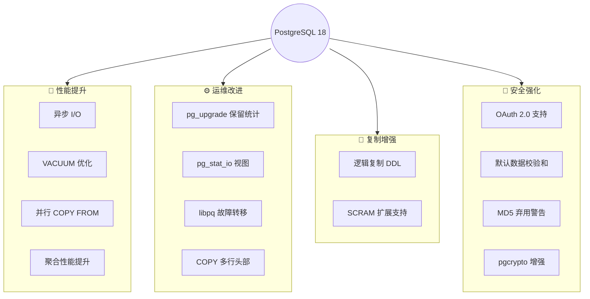
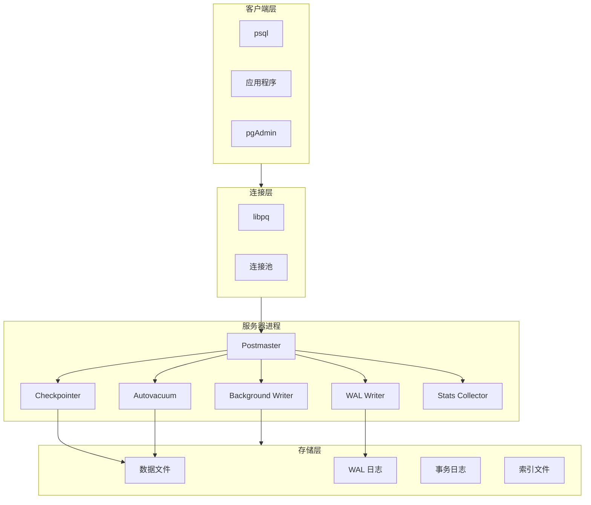

# 1.1 PostgreSQL 18 概述与新特性

## 📚 概述

PostgreSQL 是世界上最先进的开源关系型数据库管理系统，以其可靠性、功能丰富性和标准兼容性而闻名。PostgreSQL 18 于 2025 年 9 月发布，带来了超过 3,000 次提交的重大更新，是一个里程碑式的版本。

### 🎯 学习目标

- 了解 PostgreSQL 的发展历史和核心特点
- 掌握 PostgreSQL 18 的重要新特性
- 理解数据库架构和组件关系

---

## 🔧 功能说明

### PostgreSQL 核心特点

| 特性 | 说明 |
|------|------|
| **ACID 合规** | 完整支持事务的原子性、一致性、隔离性、持久性 |
| **MVCC** | 多版本并发控制，高并发读写不阻塞 |
| **扩展性** | 支持自定义数据类型、函数、操作符 |
| **SQL 标准** | 高度兼容 SQL:2016 标准 |
| **JSON 支持** | 原生 JSON/JSONB 数据类型 |
| **全文搜索** | 内置全文检索功能 |

### PostgreSQL 18 新特性总览



---

## 📖 核心新特性详解

### 1. 异步 I/O (AIO) - 性能革命

PostgreSQL 18 引入原生异步 I/O 子系统，显著提升 I/O 密集型工作负载的性能。

```sql
-- 查看当前 I/O 配置
SHOW io_method;

-- 在 Linux 上使用 io_uring (需要内核 5.1+)
-- 在 postgresql.conf 中配置:
-- io_method = 'io_uring'
```

**性能提升场景：**
- 顺序扫描 (Sequential Scans)
- VACUUM 操作
- 位图堆扫描 (Bitmap Heap Scans)

### 2. pg_stat_io 视图 - I/O 诊断利器

新增系统视图提供详细的 I/O 统计信息。

```sql
-- 查看 I/O 统计
SELECT 
    backend_type,
    object,
    context,
    reads,
    writes,
    extends,
    fsyncs
FROM pg_stat_io
WHERE reads > 0 OR writes > 0
ORDER BY reads + writes DESC;
```

### 3. 逻辑复制支持 DDL

PostgreSQL 18 将逻辑复制扩展到 DDL 语句。

```sql
-- 创建包含 DDL 的发布
CREATE PUBLICATION my_pub 
FOR ALL TABLES
WITH (publish = 'insert, update, delete, truncate');

-- DDL 语句如 CREATE TABLE, ALTER 现在可以复制
```

### 4. pg_upgrade 保留统计信息

升级时不再需要重新运行 `ANALYZE`。

```bash
# 升级时统计信息自动保留
pg_upgrade \
    --old-datadir=/var/lib/pgsql/17/data \
    --new-datadir=/var/lib/pgsql/18/data \
    --old-bindir=/usr/pgsql-17/bin \
    --new-bindir=/usr/pgsql-18/bin

# 升级后无需执行 vacuumdb --analyze
```

### 5. OAuth 2.0 原生支持

```sql
-- 配置 OAuth 认证 (在 pg_hba.conf)
-- host all all 0.0.0.0/0 oauth

-- 查看认证方法
SELECT * FROM pg_hba_file_rules;
```

### 6. 默认启用数据校验和

```bash
# PG18 默认启用校验和
initdb -D /var/lib/pgsql/18/data
# 等同于: initdb -D /var/lib/pgsql/18/data --data-checksums

# 验证校验和状态
pg_controldata /var/lib/pgsql/18/data | grep checksum
```

### 7. 并行 COPY FROM

```sql
-- 并行导入大型 CSV 文件
-- 自动使用多个工作进程

COPY large_table FROM '/path/to/data.csv' 
WITH (FORMAT csv, HEADER true);

-- 查看并行工作进程
SELECT * FROM pg_stat_progress_copy;
```

---

## 📊 架构概览



---

## 🎯 实战案例

### 案例：检查 PostgreSQL 18 安装状态

```sql
-- 连接到数据库后执行

-- 1. 查看版本信息
SELECT version();

-- 2. 查看主要配置
SHOW server_version;
SHOW data_checksums;

-- 3. 查看新的系统视图
SELECT * FROM pg_stat_io LIMIT 5;

-- 4. 查看扩展
SELECT * FROM pg_available_extensions 
WHERE name IN ('pgcrypto', 'pg_stat_statements')
ORDER BY name;
```

**预期输出：**
```
                                                  version
-----------------------------------------------------------------------------------------------------------
 PostgreSQL 18.0 on x86_64-pc-linux-gnu, compiled by gcc (GCC) 11.2.0, 64-bit
(1 row)

 server_version
----------------
 18.0
(1 row)

 data_checksums
----------------
 on
(1 row)
```

---

## 💡 最佳实践

1. **升级前评估**: 阅读完整的 Release Notes，了解不兼容变更
2. **测试环境先行**: 在测试环境验证应用程序兼容性
3. **利用新特性**: 评估 AIO、并行 COPY 等新特性对现有工作负载的影响
4. **安全配置**: 使用 OAuth 2.0 替代传统认证方式
5. **监控增强**: 利用 pg_stat_io 建立 I/O 性能基线

---

## ❓ 常见问题

<details>
<summary><strong>Q: PostgreSQL 18 与 17 的主要区别是什么？</strong></summary>

PostgreSQL 18 是一个重大版本，主要改进包括：
- 原生异步 I/O 支持
- 逻辑复制支持 DDL
- pg_upgrade 保留统计信息
- OAuth 2.0 原生认证
- 默认启用数据校验和
</details>

<details>
<summary><strong>Q: 是否可以从 PostgreSQL 17 直接升级到 18？</strong></summary>

是的，可以使用 pg_upgrade 工具进行就地升级。PostgreSQL 18 的 pg_upgrade 还会自动保留优化器统计信息，无需升级后运行 ANALYZE。
</details>

<details>
<summary><strong>Q: 异步 I/O 需要特殊配置吗？</strong></summary>

在 Linux 系统上，异步 I/O 可以使用 io_uring (需要内核 5.1+)。在 postgresql.conf 中设置 `io_method = 'io_uring'` 即可启用。
</details>

---

## 📚 延伸阅读

- [PostgreSQL 18 Release Notes](https://www.postgresql.org/docs/18/release-18.html)
- [PostgreSQL 架构概述](https://www.postgresql.org/docs/18/tutorial-arch.html)
- [PostgreSQL Wiki: What's New in 18](https://wiki.postgresql.org/wiki/What%27s_new_in_PostgreSQL_18)

---

[⬅️ 返回目录](../../README.md) | [下一章: 安装与环境配置 ➡️](../1.2-installation/README.md)
