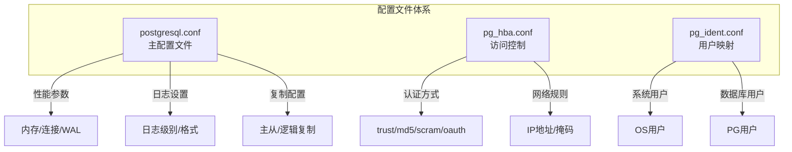
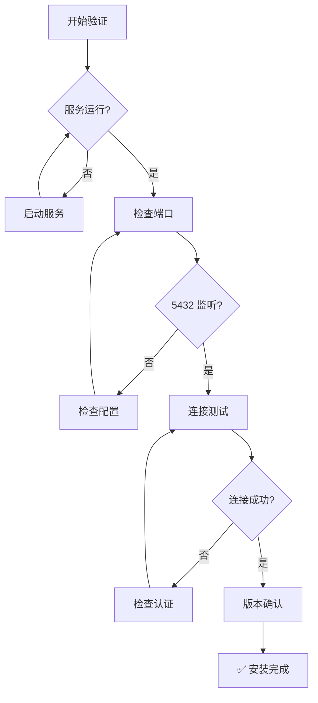

# 1.2 安装与环境配置

## 📚 概述

本章介绍如何在 Windows 和 Linux 系统上安装 PostgreSQL 18，以及关键配置文件的详细说明。

### 🎯 学习目标

- 掌握 PostgreSQL 18 在不同操作系统上的安装方法
- 理解核心配置文件的作用和配置项
- 能够完成生产环境的基础配置

---

## 🔧 安装指南

### Windows 安装


#### 步骤 1: 下载安装包

```powershell
# 从官网下载或使用 winget
winget install PostgreSQL.PostgreSQL.18

# 或访问: https://www.postgresql.org/download/windows/
```

#### 步骤 2: 验证安装

```powershell
# 检查版本
& "C:\Program Files\PostgreSQL\18\bin\psql.exe" --version

# 添加到 PATH (管理员权限)
$env:PATH += ";C:\Program Files\PostgreSQL\18\bin"
[Environment]::SetEnvironmentVariable("PATH", $env:PATH, "Machine")
```

#### 步骤 3: 连接测试

```powershell
# 使用 psql 连接
psql -U postgres -d postgres

# 或指定主机和端口
psql -h localhost -p 5432 -U postgres
```

---

### Linux (Ubuntu/Debian) 安装

```bash
# 1. 添加 PostgreSQL 官方仓库
sudo sh -c 'echo "deb http://apt.postgresql.org/pub/repos/apt $(lsb_release -cs)-pgdg main" > /etc/apt/sources.list.d/pgdg.list'

# 2. 导入仓库签名密钥
wget --quiet -O - https://www.postgresql.org/media/keys/ACCC4CF8.asc | sudo apt-key add -

# 3. 更新包列表
sudo apt-get update

# 4. 安装 PostgreSQL 18
sudo apt-get install postgresql-18 postgresql-contrib-18

# 5. 检查服务状态
sudo systemctl status postgresql

# 6. 验证版本
psql --version
```

### Linux (RHEL/CentOS) 安装

```bash
# 1. 安装仓库 RPM
sudo dnf install -y https://download.postgresql.org/pub/repos/yum/reporpms/EL-8-x86_64/pgdg-redhat-repo-latest.noarch.rpm

# 2. 禁用内置 PostgreSQL 模块
sudo dnf -qy module disable postgresql

# 3. 安装 PostgreSQL 18
sudo dnf install -y postgresql18-server postgresql18-contrib

# 4. 初始化数据库 (PG18 默认启用校验和)
sudo /usr/pgsql-18/bin/postgresql-18-setup initdb

# 5. 启动服务
sudo systemctl enable postgresql-18
sudo systemctl start postgresql-18
```

---

## 📂 配置文件详解

### 配置文件位置

| 系统 | 配置文件路径 |
|------|-------------|
| Windows | `C:\Program Files\PostgreSQL\18\data\` |
| Ubuntu/Debian | `/etc/postgresql/18/main/` |
| RHEL/CentOS | `/var/lib/pgsql/18/data/` |

### 核心配置文件



---

## ⚙️ postgresql.conf 关键配置

### 连接与认证

```ini
# 监听地址 (生产环境建议指定具体IP)
listen_addresses = 'localhost'          # 默认只监听本地
# listen_addresses = '*'                # 监听所有地址

# 最大连接数
max_connections = 100                   # 根据服务器资源调整

# 身份验证超时
authentication_timeout = 1min

# 密码加密方式 (PG18 推荐 scram-sha-256)
password_encryption = 'scram-sha-256'
```

### 内存配置

```ini
# 共享内存 (建议: 系统内存的 25%)
shared_buffers = 256MB

# 工作内存 (每个查询操作使用)
work_mem = 4MB

# 维护操作内存
maintenance_work_mem = 64MB

# 有效缓存大小 (建议: 系统内存的 50-75%)
effective_cache_size = 1GB
```

### WAL 配置

```ini
# WAL 级别 (复制需要 replica 或 logical)
wal_level = replica

# 检查点相关
checkpoint_completion_target = 0.9
max_wal_size = 1GB
min_wal_size = 80MB
```

### PostgreSQL 18 新配置项

```ini
# 异步 I/O 方法 (Linux: io_uring, posix_aio, sync)
io_method = 'io_uring'

# 后台 I/O 工作进程数
io_max_workers = 3

# 并行 COPY 工作进程
max_copy_workers = 4
```

---

## 🔐 pg_hba.conf 访问控制

### 配置格式

```
# TYPE  DATABASE  USER  ADDRESS        METHOD
local   all       all                  peer
host    all       all   127.0.0.1/32   scram-sha-256
host    all       all   ::1/128        scram-sha-256
```

### 认证方法对比

| 方法 | 说明 | 安全级别 |
|------|------|----------|
| `trust` | 无需密码 | ❌ 仅开发环境 |
| `peer` | 系统用户匹配 | ✅ 本地连接 |
| `md5` | MD5 密码 | ⚠️ PG18 已弃用 |
| `scram-sha-256` | SCRAM 认证 | ✅ 推荐 |
| `oauth` | OAuth 2.0 | ✅ PG18 新增 |

### 配置示例

```ini
# 本地连接 (使用系统用户)
local   all             postgres                                peer

# IPv4 本地连接
host    all             all             127.0.0.1/32            scram-sha-256

# 允许内网访问
host    all             all             192.168.1.0/24          scram-sha-256

# 仅允许特定用户访问特定数据库
host    mydb            myuser          10.0.0.0/8              scram-sha-256

# OAuth 认证 (PG18 新特性)
host    all             all             0.0.0.0/0               oauth
```

---

## 📊 安装验证流程



---

## 🎯 实战案例

### 案例：生产环境基础配置

**场景**: 配置一个用于 Web 应用的 PostgreSQL 18 服务器，服务器配置 8GB RAM。

```ini
# postgresql.conf 关键配置

# 连接设置
listen_addresses = '*'
max_connections = 200
superuser_reserved_connections = 3

# 内存设置 (8GB 服务器)
shared_buffers = 2GB                    # 25% of RAM
effective_cache_size = 6GB              # 75% of RAM
work_mem = 20MB                         # 谨慎设置
maintenance_work_mem = 512MB

# WAL 设置
wal_level = replica
max_wal_size = 2GB
min_wal_size = 512MB
checkpoint_completion_target = 0.9

# 日志设置
logging_collector = on
log_directory = 'log'
log_filename = 'postgresql-%Y-%m-%d_%H%M%S.log'
log_statement = 'ddl'
log_min_duration_statement = 1000       # 记录超过1秒的查询

# PG18 新特性
io_method = 'io_uring'                  # Linux 5.1+
password_encryption = 'scram-sha-256'
```

```ini
# pg_hba.conf 配置

# 本地管理
local   all             postgres                                peer

# 本地应用连接
host    all             all             127.0.0.1/32            scram-sha-256
host    all             all             ::1/128                 scram-sha-256

# 应用服务器网段
host    app_db          app_user        10.0.1.0/24             scram-sha-256

# 监控系统
host    all             monitor         10.0.2.0/24             scram-sha-256
```

### 应用配置后重载

```bash
# 重载配置 (不重启服务)
sudo -u postgres psql -c "SELECT pg_reload_conf();"

# 或使用 pg_ctl
pg_ctl reload -D /var/lib/pgsql/18/data

# 验证配置
sudo -u postgres psql -c "SHOW shared_buffers;"
sudo -u postgres psql -c "SHOW max_connections;"
```

---

## 💡 最佳实践

1. **使用 SCRAM 认证**: 从 PG18 开始，MD5 已被标记为弃用
2. **启用数据校验和**: PG18 默认启用，确保数据完整性
3. **合理配置内存**: shared_buffers 约为物理内存的 25%
4. **限制网络访问**: 只开放必要的 IP 范围
5. **日志记录**: 启用慢查询日志，便于性能分析

---

## ❓ 常见问题

<details>
<summary><strong>Q: 如何修改 postgres 用户密码？</strong></summary>

```sql
-- 方法1: 使用 SQL
ALTER USER postgres WITH PASSWORD 'new_secure_password';

-- 方法2: 使用 psql 元命令
\password postgres
```
</details>

<details>
<summary><strong>Q: 配置修改后需要重启吗？</strong></summary>

大多数配置可以通过 `SELECT pg_reload_conf()` 重载生效。但以下配置需要重启：
- `shared_buffers`
- `max_connections`
- `listen_addresses`
- `port`
</details>

<details>
<summary><strong>Q: 如何查看当前配置值？</strong></summary>

```sql
-- 查看单个配置
SHOW work_mem;

-- 查看所有配置
SELECT name, setting, unit, context FROM pg_settings;

-- 查看非默认配置
SELECT name, setting FROM pg_settings WHERE source != 'default';
```
</details>

---

[⬅️ 上一章: PostgreSQL 18 概述](../1.1-overview/README.md) | [返回目录](../../README.md) | [下一章: psql 入门 ➡️](../1.3-psql-basics/README.md)
