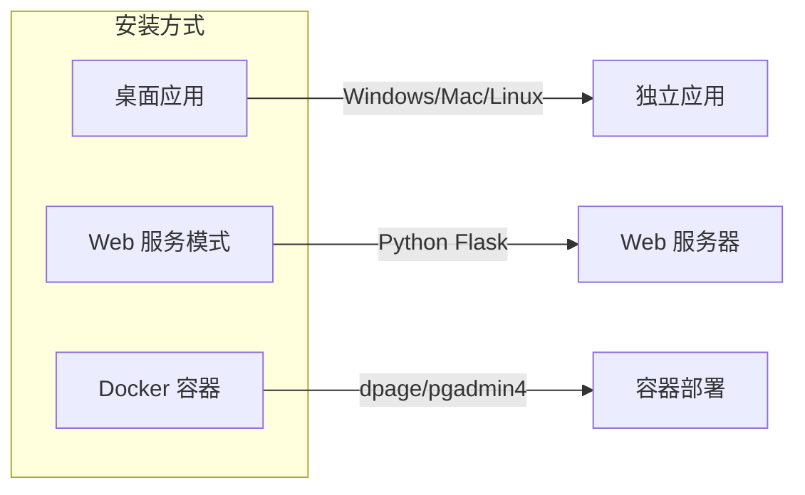
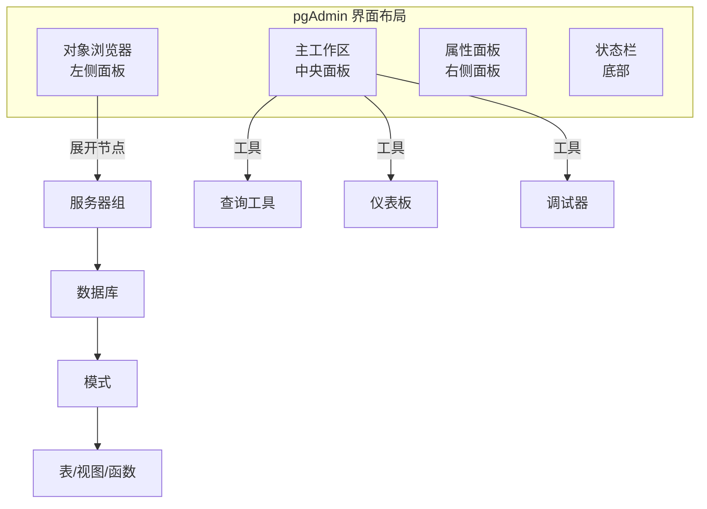
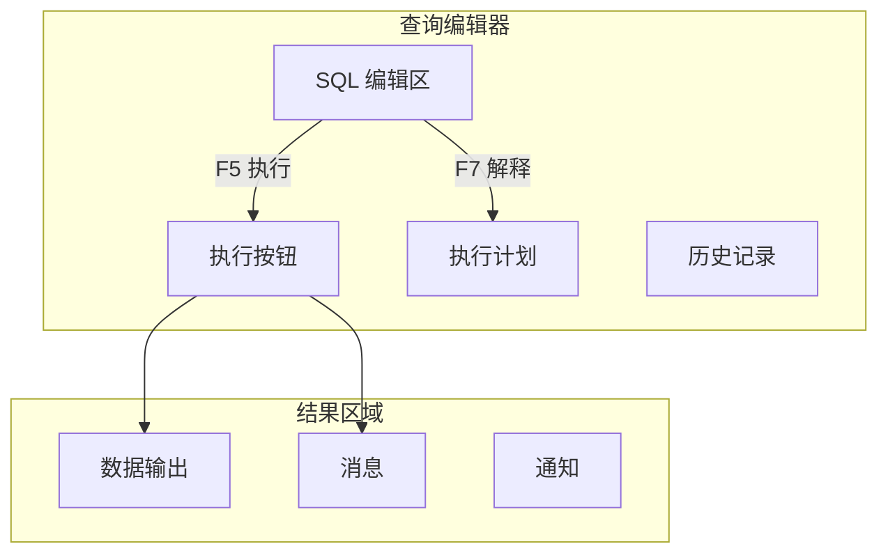
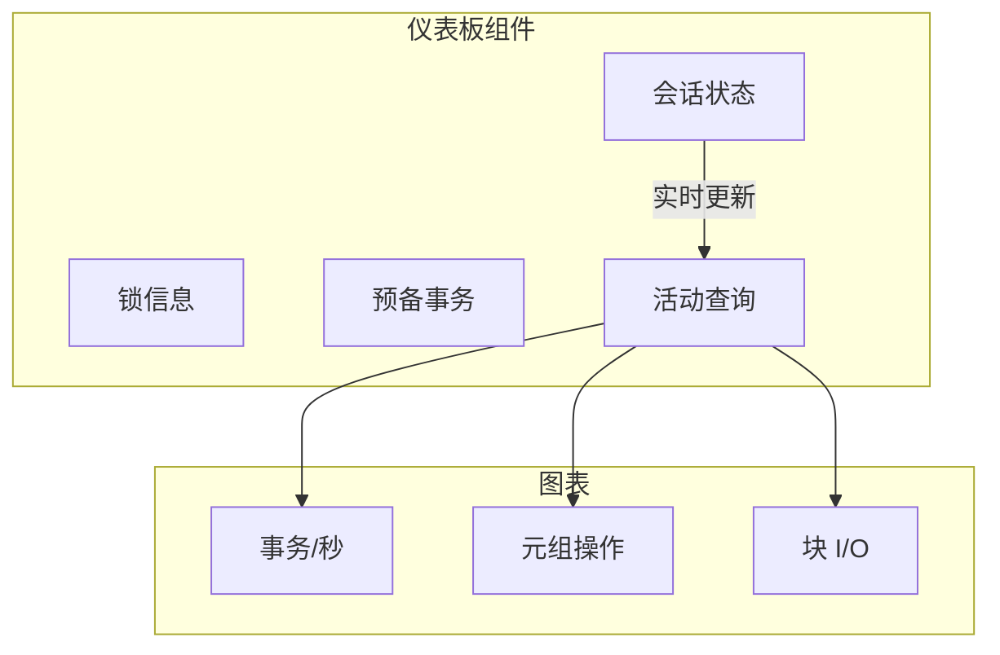
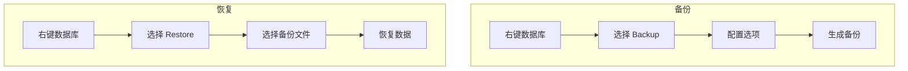

# 2.2 pgAdmin 图形化管理

## 📚 概述

pgAdmin 是 PostgreSQL 官方推荐的开源图形化管理工具，提供直观的界面进行数据库管理、查询编写和性能监控。pgAdmin 4 是最新版本，支持 Web 界面和桌面应用。

### 🎯 学习目标

- 掌握 pgAdmin 的安装和服务器配置
- 熟练使用查询工具和对象管理
- 了解仪表板监控和维护功能

---

## 🔧 安装与配置

### 安装方式



### Windows 安装

从官网下载安装程序：https://www.pgadmin.org/download/

```powershell
# 使用 winget 安装
winget install pgAdmin.pgAdmin

# 或使用 Chocolatey
choco install pgadmin4
```

### Linux 安装

```bash
# Ubuntu/Debian
curl -fsS https://www.pgadmin.org/static/packages_pgadmin_org.pub | sudo gpg --dearmor -o /usr/share/keyrings/packages-pgadmin-org.gpg

sudo sh -c 'echo "deb [signed-by=/usr/share/keyrings/packages-pgadmin-org.gpg] https://ftp.postgresql.org/pub/pgadmin/pgadmin4/apt/$(lsb_release -cs) pgadmin4 main" > /etc/apt/sources.list.d/pgadmin4.list'

sudo apt update
sudo apt install pgadmin4-desktop  # 桌面版
# 或
sudo apt install pgadmin4-web      # Web 版
```

### Docker 部署

```bash
# 拉取镜像
docker pull dpage/pgadmin4

# 运行容器
docker run -d \
    --name pgadmin \
    -p 5050:80 \
    -e PGADMIN_DEFAULT_EMAIL=admin@example.com \
    -e PGADMIN_DEFAULT_PASSWORD=admin123 \
    -v pgadmin_data:/var/lib/pgadmin \
    dpage/pgadmin4

# 访问: http://localhost:5050
```

---

## 🖥️ 界面概览



---

## 🔌 服务器连接

### 添加新服务器

1. 右键点击 **Servers** → **Register** → **Server**
2. 填写连接信息：

| 标签页 | 字段 | 说明 |
|--------|------|------|
| General | Name | 服务器显示名称 |
| Connection | Host | 主机地址 |
| Connection | Port | 端口 (默认 5432) |
| Connection | Maintenance database | 维护数据库 (默认 postgres) |
| Connection | Username | 用户名 |
| Connection | Password | 密码 |
| Connection | Save password | 保存密码 |
| SSL | SSL mode | SSL 连接模式 |

### 连接配置示例

```json
{
  "Name": "Production Server",
  "Group": "Production",
  "Host": "db.example.com",
  "Port": 5432,
  "MaintenanceDB": "postgres",
  "Username": "admin",
  "SSLMode": "require",
  "SSLCert": "/path/to/client.crt",
  "SSLKey": "/path/to/client.key",
  "SSLRootCert": "/path/to/ca.crt"
}
```

---

## 🔍 查询工具

### 查询编辑器功能



### 常用快捷键

| 快捷键 | 功能 |
|--------|------|
| `F5` | 执行查询 |
| `F7` | 显示执行计划 |
| `Shift+F7` | 分析执行计划 |
| `Ctrl+Space` | 自动完成 |
| `Ctrl+/` | 切换注释 |
| `Ctrl+Shift+F` | 格式化 SQL |
| `Ctrl+S` | 保存查询 |

### 查询工具技巧

```sql
-- 在查询工具中可以使用的功能

-- 1. 参数化查询
SELECT * FROM users WHERE id = $1;
-- 点击工具栏的 "Parameters" 按钮设置参数

-- 2. 多语句执行
BEGIN;
INSERT INTO logs (message) VALUES ('Start');
UPDATE counters SET value = value + 1;
INSERT INTO logs (message) VALUES ('End');
COMMIT;

-- 3. 导出结果
-- 右键点击结果 → 下载为 CSV/JSON

-- 4. 执行计划分析
EXPLAIN (ANALYZE, BUFFERS, FORMAT TEXT)
SELECT * FROM large_table WHERE created_at > '2025-01-01';
```

---

## 📊 仪表板

pgAdmin 仪表板提供实时服务器监控。

### 服务器仪表板



### 监控指标

| 指标 | 说明 |
|------|------|
| Sessions | 当前连接数和状态 |
| Transactions | 事务统计 (提交/回滚) |
| Tuples | 元组操作 (插入/更新/删除) |
| Blocks | 块读取 (缓存命中/磁盘读取) |

---

## 🗄️ 对象管理

### 创建数据库

1. 右键 **Databases** → **Create** → **Database**
2. 填写：
   - Database: 数据库名
   - Owner: 所有者
   - Encoding: 编码 (UTF8)
   - Template: 模板数据库

### 创建表

```sql
-- 使用 GUI 或 SQL
CREATE TABLE employees (
    id SERIAL PRIMARY KEY,
    name VARCHAR(100) NOT NULL,
    email VARCHAR(255) UNIQUE,
    department_id INTEGER REFERENCES departments(id),
    salary NUMERIC(10,2),
    hired_at TIMESTAMP DEFAULT CURRENT_TIMESTAMP
);

-- 添加注释
COMMENT ON TABLE employees IS '员工信息表';
COMMENT ON COLUMN employees.salary IS '月薪（人民币）';
```

### 导入/导出数据

```mermaid
flowchart LR
    subgraph Import["导入"]
        CSV1[CSV 文件]
        SQL1[SQL 文件]
        BINARY[二进制]
    end
    
    subgraph PG[(PostgreSQL)]
        TABLE[表]
    end
    
    subgraph Export["导出"]
        CSV2[CSV]
        SQL2[SQL]
        JSON[JSON]
    end
    
    Import --> PG
    PG --> Export
```

---

## 🔧 维护工具

### 表维护操作

右键点击表 → **Maintenance**

| 操作 | 说明 |
|------|------|
| VACUUM | 回收空间 |
| VACUUM FULL | 完全回收 (锁表) |
| ANALYZE | 更新统计信息 |
| REINDEX | 重建索引 |
| CLUSTER | 按索引重排数据 |

### 备份与恢复



### 备份选项

| 选项 | 说明 |
|------|------|
| Format | 格式: Custom, Tar, Plain, Directory |
| Encoding | 字符编码 |
| Role name | 角色名 |
| Include schema | 包含模式定义 |
| Include data | 包含数据 |
| Verbose | 详细输出 |

---

## 🎯 实战案例

### 案例 1: 性能问题诊断

```sql
-- 1. 在仪表板查看活动查询
-- 2. 识别长时间运行的查询
-- 3. 使用查询工具分析

-- 查看活动连接
SELECT pid, usename, datname, state, 
       now() - query_start AS duration,
       query
FROM pg_stat_activity
WHERE state = 'active'
ORDER BY duration DESC;

-- 分析慢查询
EXPLAIN (ANALYZE, BUFFERS)
SELECT * FROM orders o
JOIN customers c ON o.customer_id = c.id
WHERE o.created_at > '2025-01-01';

-- 查看缺失索引
SELECT schemaname, tablename, 
       seq_scan, seq_tup_read,
       idx_scan, idx_tup_fetch
FROM pg_stat_user_tables
WHERE seq_scan > idx_scan
ORDER BY seq_tup_read DESC
LIMIT 10;
```

### 案例 2: 用户权限管理

在 pgAdmin 中管理用户权限：

1. **创建角色**: 右键 Login/Group Roles → Create
2. **授权**:

```sql
-- 创建只读用户
CREATE ROLE readonly_user WITH LOGIN PASSWORD 'secure_password';

-- 授予连接权限
GRANT CONNECT ON DATABASE mydb TO readonly_user;

-- 授予模式使用权限
GRANT USAGE ON SCHEMA public TO readonly_user;

-- 授予表只读权限
GRANT SELECT ON ALL TABLES IN SCHEMA public TO readonly_user;

-- 设置默认权限
ALTER DEFAULT PRIVILEGES IN SCHEMA public
GRANT SELECT ON TABLES TO readonly_user;
```

---

## 💡 最佳实践

1. **使用 SSL 连接**: 生产环境始终启用 SSL
2. **保存查询**: 将常用查询保存为收藏
3. **利用仪表板**: 定期检查服务器状态
4. **备份配置**: 导出服务器连接配置以便迁移
5. **快捷键**: 熟练使用快捷键提高效率

---

## ❓ 常见问题

<details>
<summary><strong>Q: pgAdmin 连接超时怎么办？</strong></summary>

检查以下设置：
1. 服务器的 `listen_addresses` 配置
2. `pg_hba.conf` 访问控制
3. 防火墙规则
4. pgAdmin 连接超时设置 (File → Preferences → Browser → Connection timeout)
</details>

<details>
<summary><strong>Q: 如何重置 pgAdmin 主密码？</strong></summary>

删除配置文件重新设置：
- Windows: `%APPDATA%\pgAdmin\pgadmin4.db`
- Linux: `~/.pgadmin/pgadmin4.db`
</details>

---

[⬅️ 上一章: psql 高级用法](../2.1-psql-advanced/README.md) | [返回目录](../../README.md) | [下一章: pg_ctl ➡️](../2.3-pg_ctl/README.md)
