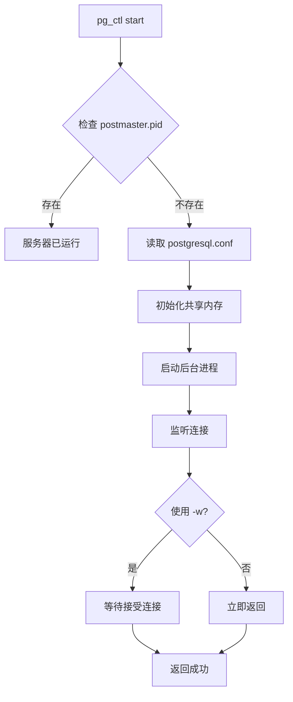
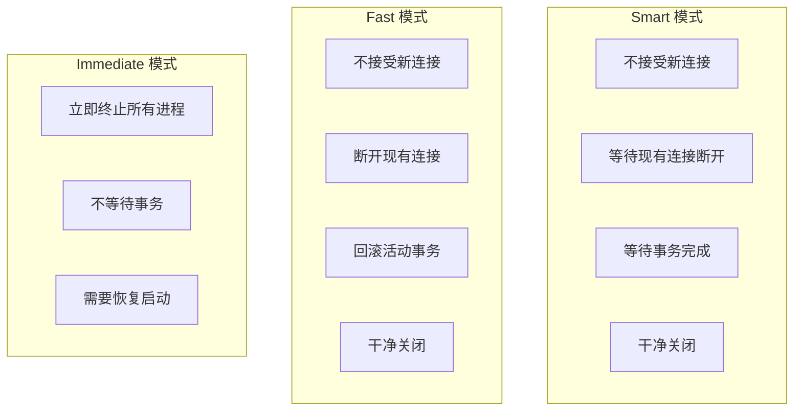
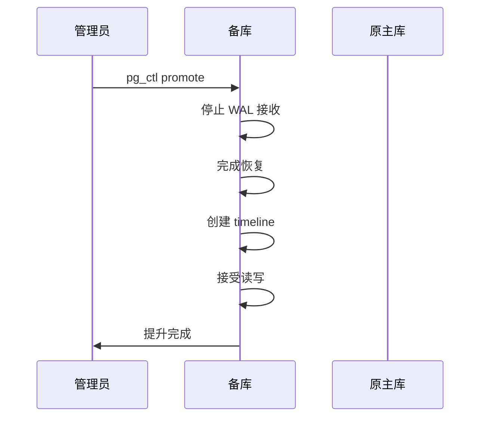
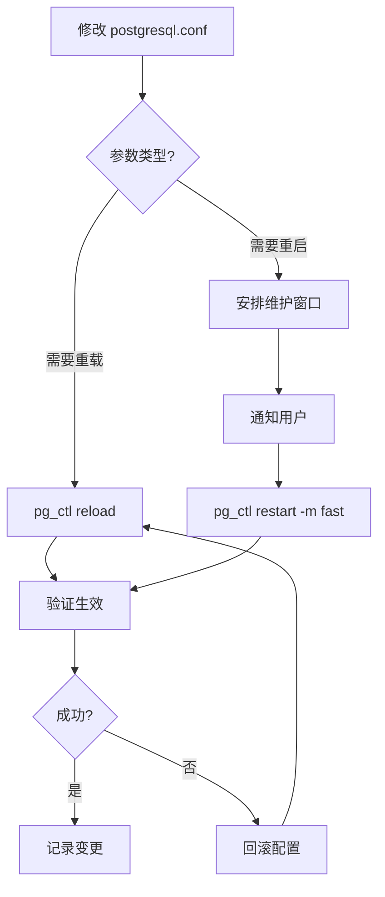

# 2.3 pg_ctl 服务管理

## 📚 概述

`pg_ctl` 是 PostgreSQL 的服务控制工具，用于启动、停止、重启数据库服务器以及检查服务器状态。它是系统管理员日常运维的核心工具。

### 🎯 学习目标

- 掌握 pg_ctl 的各种操作模式
- 了解不同的停机策略及其应用场景
- 熟练进行配置重载和日志管理

---

## 🔧 基本语法

```bash
pg_ctl [OPTION]... COMMAND [COMMAND_OPTIONS]
```

### 主要命令

| 命令 | 说明 |
|------|------|
| `start` | 启动服务器 |
| `stop` | 停止服务器 |
| `restart` | 重启服务器 |
| `reload` | 重载配置文件 |
| `status` | 检查服务器状态 |
| `promote` | 将备库提升为主库 |
| `logrotate` | 轮转日志文件 |
| `kill` | 发送信号给服务器 |

---

## 🚀 启动服务器

### 基本启动

```bash
# 指定数据目录启动
pg_ctl start -D /var/lib/pgsql/18/data

# 后台启动 (默认)
pg_ctl start -D $PGDATA

# 等待启动完成
pg_ctl start -D $PGDATA -w

# 指定超时时间 (秒)
pg_ctl start -D $PGDATA -w -t 60

# 传递选项给 postgres
pg_ctl start -D $PGDATA -o "-p 5433 -c work_mem=256MB"
```

### 启动日志

```bash
# 指定日志文件
pg_ctl start -D $PGDATA -l /var/log/postgresql/startup.log

# Windows 上的日志
pg_ctl start -D "C:\PostgreSQL\18\data" -l "C:\PostgreSQL\18\log\startup.log"
```

### 启动流程



---

## 🛑 停止服务器

### 停止模式

| 模式 | 参数 | 说明 |
|------|------|------|
| Smart | `-m smart` | 等待所有客户端断开 (默认) |
| Fast | `-m fast` | 终止活动事务，断开客户端 |
| Immediate | `-m immediate` | 立即终止，不干净关闭 |

### 停止命令

```bash
# 智能停止 (等待客户端断开)
pg_ctl stop -D $PGDATA -m smart

# 快速停止 (推荐用于大多数场景)
pg_ctl stop -D $PGDATA -m fast

# 立即停止 (紧急情况)
pg_ctl stop -D $PGDATA -m immediate

# 等待停止完成
pg_ctl stop -D $PGDATA -m fast -w -t 300
```

### 停止模式对比



---

## 🔄 重启与重载

### 重启服务器

```bash
# 快速重启
pg_ctl restart -D $PGDATA -m fast

# 等待重启完成
pg_ctl restart -D $PGDATA -m fast -w

# 带新配置重启
pg_ctl restart -D $PGDATA -m fast -o "-c max_connections=200"
```

### 重载配置

```bash
# 重载配置文件 (不重启)
pg_ctl reload -D $PGDATA

# 等效的 SQL 命令
psql -c "SELECT pg_reload_conf();"
```

### 需要重载 vs 需要重启

| 需要重载 | 需要重启 |
|----------|----------|
| `work_mem` | `shared_buffers` |
| `log_statement` | `max_connections` |
| `statement_timeout` | `listen_addresses` |
| `search_path` | `port` |
| `effective_cache_size` | `wal_level` |

---

## 📊 状态检查

```bash
# 检查服务器状态
pg_ctl status -D $PGDATA

# 输出示例:
# pg_ctl: server is running (PID: 12345)
# /usr/pgsql-18/bin/postgres "-D" "/var/lib/pgsql/18/data"
```

### 返回码

| 返回码 | 含义 |
|--------|------|
| 0 | 服务器正在运行 |
| 3 | 服务器未运行 |
| 4 | 无法判断状态 (无权访问) |

---

## 📁 日志轮转

PostgreSQL 18 支持通过 pg_ctl 进行日志轮转。

```bash
# 轮转日志文件
pg_ctl logrotate -D $PGDATA

# 结合 cron 使用
# 0 0 * * * pg_ctl logrotate -D /var/lib/pgsql/18/data
```

### 日志配置

```ini
# postgresql.conf
logging_collector = on
log_directory = 'log'
log_filename = 'postgresql-%Y-%m-%d_%H%M%S.log'
log_rotation_age = 1d
log_rotation_size = 100MB
log_truncate_on_rotation = off
```

---

## 📈 主备库操作

### 提升备库

```bash
# 将备库提升为主库
pg_ctl promote -D $PGDATA

# 等待提升完成
pg_ctl promote -D $PGDATA -w
```

### 提升流程



---

## ⚙️ 高级选项

### 信号发送

```bash
# 发送信号给服务器
pg_ctl kill SIGHUP $PID     # 重载配置
pg_ctl kill SIGINT $PID     # 快速停止
pg_ctl kill SIGTERM $PID    # 智能停止
pg_ctl kill SIGQUIT $PID    # 立即停止

# 获取 PID
cat $PGDATA/postmaster.pid | head -1
```

### 核心参数

| 参数 | 说明 |
|------|------|
| `-D` | 数据目录路径 |
| `-l` | 日志文件路径 |
| `-m` | 停止模式 |
| `-o` | 传递给 postgres 的选项 |
| `-w` | 等待操作完成 |
| `-t` | 超时时间 (秒) |
| `-s` | 静默模式 |

---

## 🎯 实战案例

### 案例 1: 生产环境维护脚本

```bash
#!/bin/bash
# pg_maintenance.sh - PostgreSQL 维护脚本

PGDATA="/var/lib/pgsql/18/data"
PGLOG="/var/log/postgresql"
PGCTL="/usr/pgsql-18/bin/pg_ctl"

case "$1" in
    start)
        echo "Starting PostgreSQL..."
        $PGCTL start -D $PGDATA -l $PGLOG/startup.log -w -t 60
        ;;
    stop)
        echo "Stopping PostgreSQL (fast mode)..."
        $PGCTL stop -D $PGDATA -m fast -w -t 120
        ;;
    restart)
        echo "Restarting PostgreSQL..."
        $PGCTL restart -D $PGDATA -m fast -w -t 120
        ;;
    reload)
        echo "Reloading configuration..."
        $PGCTL reload -D $PGDATA
        ;;
    status)
        $PGCTL status -D $PGDATA
        ;;
    promote)
        echo "Promoting standby to primary..."
        $PGCTL promote -D $PGDATA -w
        ;;
    *)
        echo "Usage: $0 {start|stop|restart|reload|status|promote}"
        exit 1
        ;;
esac
```

### 案例 2: 系统服务配置 (systemd)

```ini
# /etc/systemd/system/postgresql-18.service
[Unit]
Description=PostgreSQL 18 Database Server
After=network.target

[Service]
Type=forking
User=postgres
Group=postgres
Environment=PGDATA=/var/lib/pgsql/18/data

ExecStart=/usr/pgsql-18/bin/pg_ctl start -D ${PGDATA} -w -t 120
ExecStop=/usr/pgsql-18/bin/pg_ctl stop -D ${PGDATA} -m fast -w -t 120
ExecReload=/usr/pgsql-18/bin/pg_ctl reload -D ${PGDATA}

TimeoutSec=120

[Install]
WantedBy=multi-user.target
```

```bash
# 使用 systemctl 管理
sudo systemctl daemon-reload
sudo systemctl enable postgresql-18
sudo systemctl start postgresql-18
sudo systemctl status postgresql-18
```

### 案例 3: 配置更改流程



---

## 💡 最佳实践

1. **使用 -w 选项**: 确保操作完成后再继续
2. **生产使用 fast 模式**: 比 smart 更快，比 immediate 更安全
3. **配置 systemd**: 实现服务自动重启和日志管理
4. **定期日志轮转**: 防止日志文件过大
5. **备份 PGDATA**: 在重大操作前备份数据目录

---

## ❓ 常见问题

<details>
<summary><strong>Q: pg_ctl stop 挂起怎么办？</strong></summary>

可能有长事务或连接阻止关闭：
```bash
# 查看活动连接
psql -c "SELECT pid, usename, state, query FROM pg_stat_activity WHERE state != 'idle';"

# 使用 fast 或 immediate 模式
pg_ctl stop -D $PGDATA -m immediate
```
</details>

<details>
<summary><strong>Q: 如何指定 postgres 用户运行？</strong></summary>

```bash
# 切换用户执行
sudo -u postgres pg_ctl start -D $PGDATA

# 或设置环境变量
su - postgres
export PGDATA=/var/lib/pgsql/18/data
pg_ctl start
```
</details>

---

[⬅️ 上一章: pgAdmin](../2.2-pgadmin/README.md) | [返回目录](../../README.md) | [下一章: initdb ➡️](../2.4-initdb/README.md)
