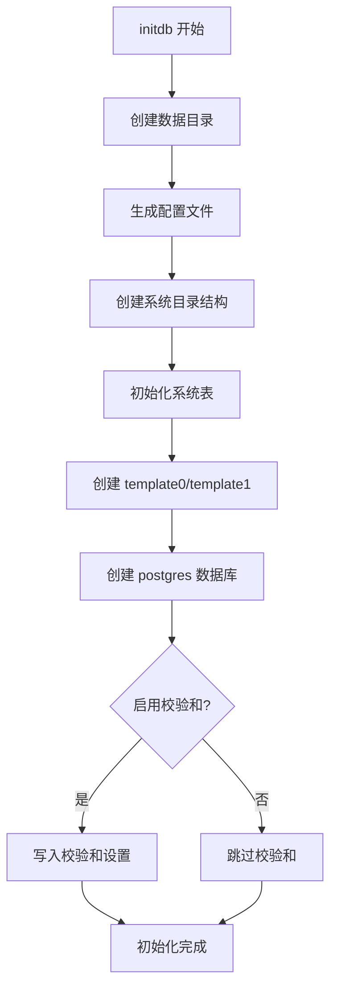
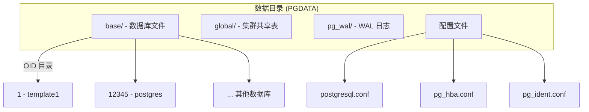
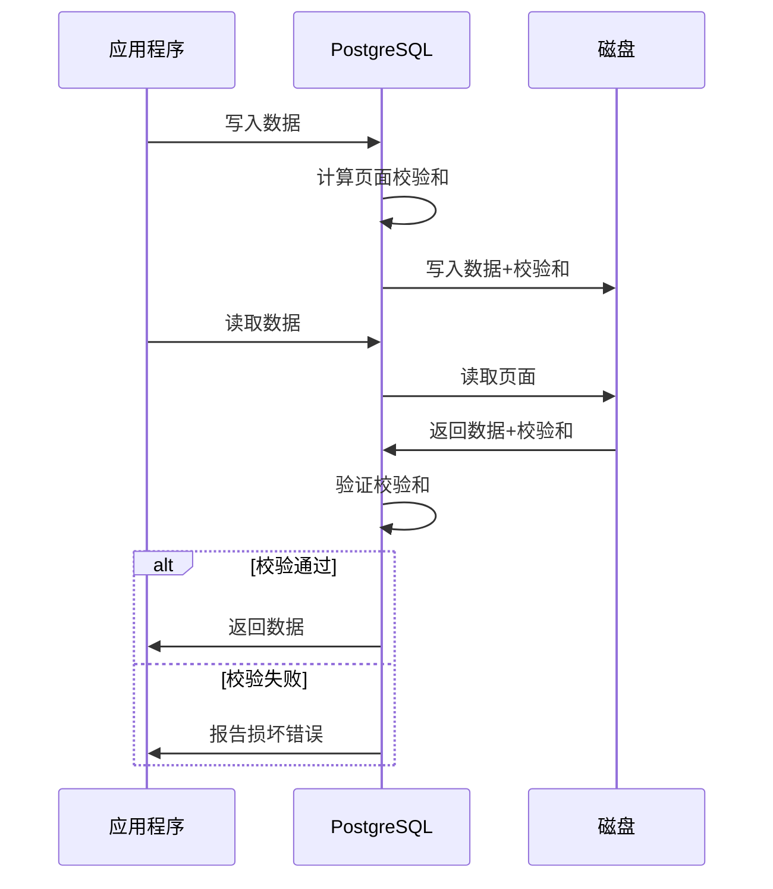

# 2.4 initdb 数据库集群初始化

## 📚 概述

`initdb` 是 PostgreSQL 集群初始化工具，用于创建新的数据库集群（data directory）。在 PostgreSQL 18 中，`initdb` 默认启用数据校验和，这是一个重要的安全增强。

### 🎯 学习目标

- 掌握 initdb 的使用方法和关键选项
- 理解 PostgreSQL 18 的默认校验和特性
- 了解数据目录结构和初始化配置

---

## 🔧 基本语法

```bash
initdb [OPTION]... [DATADIR]
```

### 常用选项

| 选项 | 说明 |
|------|------|
| `-D, --pgdata` | 数据目录路径 |
| `-E, --encoding` | 默认编码 |
| `-U, --username` | 超级用户名 |
| `-W, --pwprompt` | 提示输入密码 |
| `--locale` | 区域设置 |
| `-k, --data-checksums` | 启用数据校验和 (PG18 默认) |
| `--no-data-checksums` | 禁用数据校验和 |
| `--wal-segsize` | WAL 段大小 (MB) |

---

## 🚀 初始化集群

### 基本初始化

```bash
# PostgreSQL 18 基本初始化 (默认启用校验和)
initdb -D /var/lib/pgsql/18/data

# 指定超级用户和密码
initdb -D /var/lib/pgsql/18/data -U postgres -W

# 指定编码和区域
initdb -D /var/lib/pgsql/18/data \
    -E UTF8 \
    --locale=en_US.UTF-8 \
    -U postgres
```

### PostgreSQL 18 初始化示例

```bash
# 完整的生产环境初始化
initdb \
    --pgdata=/var/lib/pgsql/18/data \
    --encoding=UTF8 \
    --locale=en_US.UTF-8 \
    --username=postgres \
    --pwprompt \
    --auth-host=scram-sha-256 \
    --auth-local=peer \
    --wal-segsize=64

# 输出示例:
# The files belonging to this database system will be owned by user "postgres".
# This user must also own the server process.
#
# The database cluster will be initialized with this locale configuration:
#   provider:    libc
#   LC_COLLATE:  en_US.UTF-8
#   LC_CTYPE:    en_US.UTF-8
#   ...
#
# Data page checksums are enabled.    <-- PG18 默认
```

### 初始化流程



---

## 📁 数据目录结构



### 目录详解

| 目录/文件 | 说明 |
|-----------|------|
| `base/` | 数据库数据文件 |
| `global/` | 集群级共享系统表 |
| `pg_wal/` | WAL 日志 (原 pg_xlog) |
| `pg_tblspc/` | 表空间符号链接 |
| `pg_stat_tmp/` | 临时统计信息 |
| `pg_logical/` | 逻辑复制状态 |
| `pg_commit_ts/` | 事务提交时间戳 |
| `postgresql.conf` | 主配置文件 |
| `pg_hba.conf` | 访问控制配置 |
| `pg_ident.conf` | 用户映射配置 |
| `PG_VERSION` | 版本号 |
| `postmaster.pid` | 进程 ID 文件 |

---

## 🔐 数据校验和

### PostgreSQL 18 默认行为

PostgreSQL 18 的重大变化之一是 **默认启用数据校验和**。

```bash
# PG18: 默认启用
initdb -D /data/pg18

# 显式禁用 (不推荐)
initdb -D /data/pg18 --no-data-checksums
```

### 验证校验和状态

```bash
# 使用 pg_controldata 检查
pg_controldata /var/lib/pgsql/18/data | grep checksum

# 输出:
# Data page checksum version:           1
```

```sql
-- SQL 查询
SHOW data_checksums;
-- 输出: on

-- 详细信息
SELECT * FROM pg_control_checkpoint();
```

### 校验和工作原理



---

## ⚙️ 认证配置

### 初始化时设置认证

```bash
# 设置本地和远程认证方式
initdb -D $PGDATA \
    --auth-local=peer \           # 本地连接使用 peer
    --auth-host=scram-sha-256     # 远程连接使用 SCRAM

# PostgreSQL 18 推荐的认证配置
initdb -D $PGDATA \
    --auth-local=peer \
    --auth-host=scram-sha-256 \
    --pwprompt                    # 设置初始密码
```

### 生成的 pg_hba.conf

```ini
# TYPE  DATABASE        USER            ADDRESS                 METHOD
local   all             all                                     peer
host    all             all             127.0.0.1/32            scram-sha-256
host    all             all             ::1/128                 scram-sha-256
```

---

## 📊 高级配置

### WAL 段大小

```bash
# 设置 WAL 段大小 (对于大事务工作负载)
initdb -D $PGDATA --wal-segsize=64

# 支持的大小: 1, 2, 4, 8, 16, 32, 64, 128, 256, 512, 1024 (MB)
```

### 区域设置

```bash
# 完整的区域配置
initdb -D $PGDATA \
    --locale=en_US.UTF-8 \
    --lc-collate=en_US.UTF-8 \
    --lc-ctype=en_US.UTF-8 \
    --lc-messages=en_US.UTF-8 \
    --lc-monetary=en_US.UTF-8 \
    --lc-numeric=en_US.UTF-8 \
    --lc-time=en_US.UTF-8

# 使用 C 区域设置 (最快排序)
initdb -D $PGDATA --locale=C --encoding=UTF8
```

### 同步设置

```bash
# 禁用 fsync (仅用于测试，生产环境不要使用!)
initdb -D $PGDATA --no-sync

# 启用 sync (默认)
initdb -D $PGDATA --sync
```

---

## 🎯 实战案例

### 案例 1: 生产环境初始化

```bash
#!/bin/bash
# init_production.sh - 生产环境集群初始化

# 配置
PGDATA="/var/lib/pgsql/18/data"
ENCODING="UTF8"
LOCALE="en_US.UTF-8"
SUPERUSER="postgres"
WAL_SEGSIZE="64"

# 检查目录是否存在
if [ -d "$PGDATA" ]; then
    echo "Error: Data directory already exists!"
    exit 1
fi

# 创建目录
mkdir -p $PGDATA
chown postgres:postgres $PGDATA
chmod 700 $PGDATA

# 初始化集群
sudo -u postgres initdb \
    --pgdata=$PGDATA \
    --encoding=$ENCODING \
    --locale=$LOCALE \
    --username=$SUPERUSER \
    --auth-local=peer \
    --auth-host=scram-sha-256 \
    --wal-segsize=$WAL_SEGSIZE \
    --pwprompt

# 验证初始化
echo "Verifying initialization..."
pg_controldata $PGDATA | grep -E "(checksum|WAL block size)"

echo "Initialization complete!"
```

### 案例 2: 开发环境快速初始化

```bash
#!/bin/bash
# init_dev.sh - 开发环境快速初始化

PGDATA="/tmp/pg_dev_data"

# 清理旧目录
rm -rf $PGDATA

# 快速初始化
initdb -D $PGDATA \
    --auth=trust \
    --encoding=UTF8 \
    --no-locale

# 启动服务器
pg_ctl start -D $PGDATA -l /tmp/pg_dev.log

echo "Development server started on default port 5432"
```

### 案例 3: 多实例配置

```bash
#!/bin/bash
# init_multi_instance.sh - 多实例初始化

# 实例配置
declare -A INSTANCES
INSTANCES[prod]=5432
INSTANCES[staging]=5433
INSTANCES[dev]=5434

BASE_DIR="/var/lib/pgsql/18"

for instance in "${!INSTANCES[@]}"; do
    PORT=${INSTANCES[$instance]}
    DATA_DIR="$BASE_DIR/data_$instance"
    
    echo "Initializing $instance instance on port $PORT..."
    
    # 初始化
    sudo -u postgres initdb \
        --pgdata=$DATA_DIR \
        --encoding=UTF8 \
        --auth-host=scram-sha-256 \
        --pwprompt
    
    # 配置端口
    echo "port = $PORT" >> $DATA_DIR/postgresql.conf
    
    # 启动
    sudo -u postgres pg_ctl start \
        -D $DATA_DIR \
        -l "$BASE_DIR/log_$instance.log"
    
    echo "$instance instance ready on port $PORT"
done
```

---

## 📊 初始化后检查

```sql
-- 连接后执行检查

-- 1. 版本信息
SELECT version();

-- 2. 校验和状态
SHOW data_checksums;

-- 3. 编码设置
SHOW server_encoding;

-- 4. 区域设置
SELECT name, setting FROM pg_settings 
WHERE name LIKE 'lc_%';

-- 5. 数据目录
SHOW data_directory;

-- 6. 配置文件位置
SELECT name, setting FROM pg_settings 
WHERE name LIKE '%_file';
```

---

## 💡 最佳实践

1. **保持校验和启用**: PG18 默认启用，不要禁用
2. **使用 SCRAM 认证**: 替代过时的 MD5
3. **设置超级用户密码**: 使用 `--pwprompt`
4. **合适的 WAL 段大小**: 大事务考虑增大到 64MB
5. **UTF8 编码**: 除非有特殊需求，始终使用 UTF8

---

## ❓ 常见问题

<details>
<summary><strong>Q: 初始化后能否更改编码？</strong></summary>

不能。编码在初始化时确定，之后无法更改集群编码。需要重新初始化或使用 `pg_dump/pg_restore` 迁移数据。
</details>

<details>
<summary><strong>Q: 能否在现有集群上启用校验和？</strong></summary>

可以，但需要停机：
```bash
# 停止服务器
pg_ctl stop -D $PGDATA -m fast

# 启用校验和
pg_checksums --enable -D $PGDATA

# 启动服务器
pg_ctl start -D $PGDATA
```
注意：这个过程会重写所有数据页面，需要时间。
</details>

<details>
<summary><strong>Q: 如何重新初始化集群？</strong></summary>

```bash
# 1. 停止服务器
pg_ctl stop -D $PGDATA -m fast

# 2. 备份数据 (重要!)
pg_dumpall > backup.sql

# 3. 删除数据目录
rm -rf $PGDATA

# 4. 重新初始化
initdb -D $PGDATA [options]

# 5. 启动并恢复
pg_ctl start -D $PGDATA
psql < backup.sql
```
</details>

---

[⬅️ 上一章: pg_ctl](../2.3-pg_ctl/README.md) | [返回目录](../../README.md) | [下一章: pg_stat_io ➡️](../../module-3-performance/3.1-pg_stat_io/README.md)
