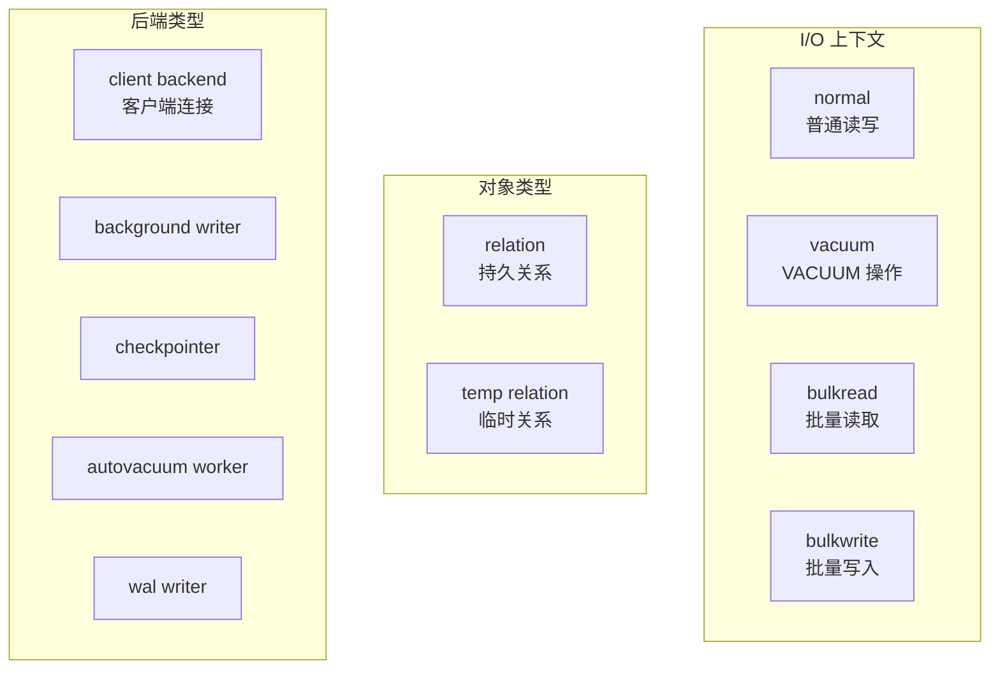
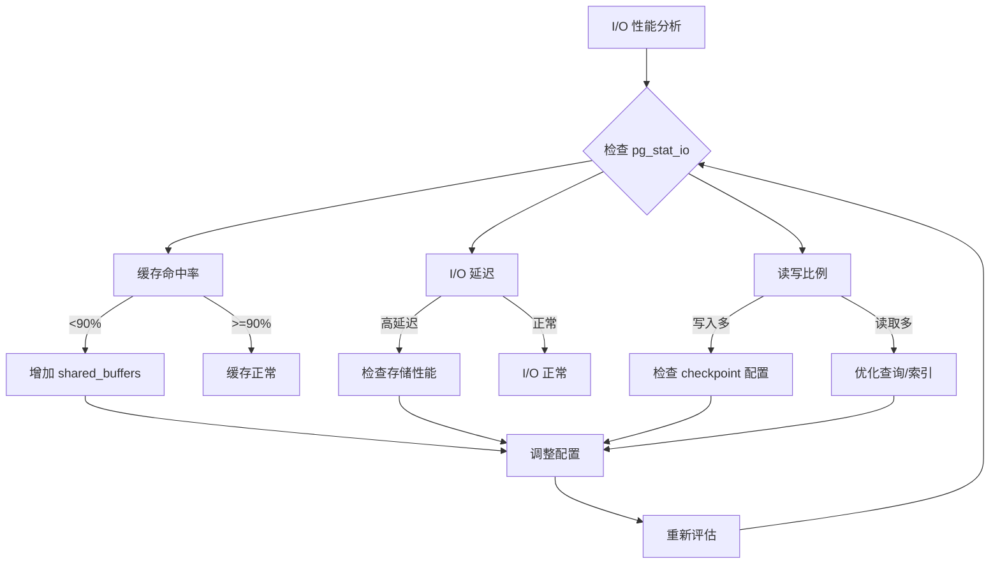

# 3.1 pg_stat_io 性能视图

## 📚 概述

`pg_stat_io` 是 PostgreSQL 18 引入的新系统视图，提供详细的 I/O 统计信息。这是 DBA 诊断性能瓶颈的强大工具，特别是结合 PostgreSQL 18 的异步 I/O 特性使用。

### 🎯 学习目标

- 理解 pg_stat_io 视图的结构和含义
- 掌握使用 I/O 统计诊断性能问题
- 学会结合其他视图进行综合分析

---

## 🆕 PostgreSQL 18 新特性

### pg_stat_io 视图

这是 PostgreSQL 18 新增的系统视图，提供按后端类型、对象类型和上下文分类的 I/O 统计。

```sql
-- 查看 pg_stat_io 结构
\d pg_stat_io

-- 基本查询
SELECT * FROM pg_stat_io;
```

### 视图列说明

| 列名 | 类型 | 说明 |
|------|------|------|
| `backend_type` | text | 后端进程类型 |
| `object` | text | 对象类型 (relation, temp relation) |
| `context` | text | I/O 上下文 |
| `reads` | bigint | 读取操作次数 |
| `read_time` | double | 读取耗时 (毫秒) |
| `writes` | bigint | 写入操作次数 |
| `write_time` | double | 写入耗时 (毫秒) |
| `writebacks` | bigint | 写回操作次数 |
| `writeback_time` | double | 写回耗时 (毫秒) |
| `extends` | bigint | 扩展操作次数 |
| `extend_time` | double | 扩展耗时 (毫秒) |
| `op_bytes` | bigint | 操作字节数 |
| `hits` | bigint | 缓存命中次数 |
| `evictions` | bigint | 缓存淘汰次数 |
| `reuses` | bigint | 缓存复用次数 |
| `fsyncs` | bigint | fsync 调用次数 |
| `fsync_time` | double | fsync 耗时 (毫秒) |
| `stats_reset` | timestamp | 统计重置时间 |

---

## 📊 I/O 上下文类型



---

## 🔍 常用查询

### 1. I/O 概览

```sql
-- 总体 I/O 统计
SELECT 
    backend_type,
    object,
    context,
    reads,
    round(read_time::numeric, 2) AS read_time_ms,
    writes,
    round(write_time::numeric, 2) AS write_time_ms,
    hits,
    CASE WHEN reads + hits > 0 
         THEN round(100.0 * hits / (reads + hits), 2) 
         ELSE 0 
    END AS cache_hit_pct
FROM pg_stat_io
WHERE reads > 0 OR writes > 0 OR hits > 0
ORDER BY reads + writes DESC;
```

### 2. 按后端类型分析

```sql
-- 各后端类型的 I/O 分布
SELECT 
    backend_type,
    SUM(reads) AS total_reads,
    SUM(writes) AS total_writes,
    SUM(hits) AS total_hits,
    round(SUM(read_time)::numeric, 2) AS total_read_time_ms,
    round(SUM(write_time)::numeric, 2) AS total_write_time_ms
FROM pg_stat_io
GROUP BY backend_type
ORDER BY total_reads + total_writes DESC;
```

### 3. 缓存效率分析

```sql
-- 缓存命中率
SELECT 
    context,
    SUM(reads) AS disk_reads,
    SUM(hits) AS buffer_hits,
    CASE WHEN SUM(reads + hits) > 0 
         THEN round(100.0 * SUM(hits) / SUM(reads + hits), 2) 
         ELSE 0 
    END AS hit_ratio
FROM pg_stat_io
WHERE backend_type = 'client backend'
GROUP BY context
ORDER BY disk_reads DESC;
```

### 4. I/O 延迟分析

```sql
-- 平均 I/O 延迟
SELECT 
    backend_type,
    context,
    CASE WHEN reads > 0 
         THEN round((read_time / reads)::numeric, 4) 
         ELSE 0 
    END AS avg_read_ms,
    CASE WHEN writes > 0 
         THEN round((write_time / writes)::numeric, 4) 
         ELSE 0 
    END AS avg_write_ms,
    CASE WHEN fsyncs > 0 
         THEN round((fsync_time / fsyncs)::numeric, 4) 
         ELSE 0 
    END AS avg_fsync_ms
FROM pg_stat_io
WHERE reads > 0 OR writes > 0
ORDER BY read_time + write_time DESC;
```

---

## 📈 性能监控

### 实时监控脚本

```sql
-- io_monitor.sql
-- 每隔一段时间运行，对比差异

-- 创建快照表
CREATE TABLE IF NOT EXISTS io_snapshots (
    snapshot_time TIMESTAMP DEFAULT now(),
    backend_type TEXT,
    context TEXT,
    reads BIGINT,
    writes BIGINT,
    hits BIGINT,
    read_time DOUBLE PRECISION,
    write_time DOUBLE PRECISION
);

-- 插入快照
INSERT INTO io_snapshots 
    (backend_type, context, reads, writes, hits, read_time, write_time)
SELECT 
    backend_type, context, reads, writes, hits, read_time, write_time
FROM pg_stat_io
WHERE reads > 0 OR writes > 0;

-- 计算增量 (最近两个快照)
WITH ranked AS (
    SELECT *,
           ROW_NUMBER() OVER (
               PARTITION BY backend_type, context 
               ORDER BY snapshot_time DESC
           ) AS rn
    FROM io_snapshots
)
SELECT 
    r1.backend_type,
    r1.context,
    r1.reads - COALESCE(r2.reads, 0) AS reads_delta,
    r1.writes - COALESCE(r2.writes, 0) AS writes_delta,
    r1.hits - COALESCE(r2.hits, 0) AS hits_delta,
    round((r1.read_time - COALESCE(r2.read_time, 0))::numeric, 2) AS read_time_delta
FROM ranked r1
LEFT JOIN ranked r2 ON r1.backend_type = r2.backend_type 
                    AND r1.context = r2.context 
                    AND r2.rn = 2
WHERE r1.rn = 1
  AND (r1.reads > COALESCE(r2.reads, 0) OR r1.writes > COALESCE(r2.writes, 0))
ORDER BY reads_delta + writes_delta DESC;
```

### 告警阈值

```sql
-- 检测 I/O 异常
WITH io_stats AS (
    SELECT 
        backend_type,
        context,
        reads,
        hits,
        CASE WHEN reads + hits > 0 
             THEN 100.0 * hits / (reads + hits) 
             ELSE 100 
        END AS hit_ratio,
        CASE WHEN reads > 0 
             THEN read_time / reads 
             ELSE 0 
        END AS avg_read_ms
    FROM pg_stat_io
    WHERE backend_type = 'client backend'
)
SELECT 
    backend_type,
    context,
    round(hit_ratio::numeric, 2) AS hit_ratio,
    round(avg_read_ms::numeric, 4) AS avg_read_ms,
    CASE 
        WHEN hit_ratio < 90 THEN '⚠️ Low cache hit ratio'
        WHEN avg_read_ms > 10 THEN '⚠️ High read latency'
        ELSE '✅ Normal'
    END AS status
FROM io_stats
ORDER BY hit_ratio;
```

---

## 🔗 结合其他视图

### 与 pg_stat_database 结合

```sql
-- 数据库级 I/O 对比
SELECT 
    d.datname,
    d.blks_read AS db_blocks_read,
    d.blks_hit AS db_blocks_hit,
    round(100.0 * d.blks_hit / nullif(d.blks_read + d.blks_hit, 0), 2) AS db_hit_ratio,
    (SELECT SUM(reads) FROM pg_stat_io WHERE backend_type = 'client backend') AS total_io_reads
FROM pg_stat_database d
WHERE d.datname NOT LIKE 'template%'
ORDER BY d.blks_read DESC;
```

### 与 pg_stat_user_tables 结合

```sql
-- 表级 I/O (需要 pg_statio_user_tables)
SELECT 
    schemaname,
    relname,
    heap_blks_read,
    heap_blks_hit,
    idx_blks_read,
    idx_blks_hit,
    round(100.0 * (heap_blks_hit + idx_blks_hit) / 
          nullif(heap_blks_read + heap_blks_hit + idx_blks_read + idx_blks_hit, 0), 2) AS hit_ratio
FROM pg_statio_user_tables
ORDER BY heap_blks_read + idx_blks_read DESC
LIMIT 10;
```

---

## 📊 流程图



---

## 🎯 实战案例

### 案例: 诊断数据库性能下降

**问题**: 应用响应变慢，怀疑是 I/O 问题。

```sql
-- 1. 检查整体 I/O 状况
SELECT 
    backend_type,
    SUM(reads) AS reads,
    SUM(hits) AS hits,
    round(100.0 * SUM(hits) / nullif(SUM(reads + hits), 0), 2) AS hit_ratio,
    round(SUM(read_time)::numeric, 2) AS total_read_time_ms
FROM pg_stat_io
WHERE backend_type = 'client backend'
GROUP BY backend_type;

-- 发现: hit_ratio = 65% (过低!)

-- 2. 分析上下文
SELECT 
    context,
    reads,
    hits,
    round(100.0 * hits / nullif(reads + hits, 0), 2) AS hit_ratio
FROM pg_stat_io
WHERE backend_type = 'client backend'
ORDER BY reads DESC;

-- 发现: bulkread 上下文读取量大

-- 3. 检查大表扫描
SELECT 
    schemaname,
    relname,
    seq_scan,
    seq_tup_read,
    idx_scan
FROM pg_stat_user_tables
WHERE seq_scan > 1000
ORDER BY seq_tup_read DESC
LIMIT 5;

-- 发现: orders 表大量顺序扫描

-- 4. 优化建议
-- 为 orders 表添加适当索引
-- 增加 shared_buffers
-- 考虑分区表策略
```

---

## 💡 最佳实践

1. **定期监控**: 建立 I/O 基线，定期对比
2. **关注缓存命中率**: 保持 90% 以上
3. **分析延迟**: 平均读取延迟不应超过 10ms
4. **结合其他视图**: 综合 pg_stat_database, pg_stat_user_tables
5. **利用 PG18 AIO**: 启用异步 I/O 提升性能

---

## ❓ 常见问题

<details>
<summary><strong>Q: 如何重置 I/O 统计？</strong></summary>

```sql
-- 重置统计
SELECT pg_stat_reset_shared('io');

-- 验证重置
SELECT stats_reset FROM pg_stat_io LIMIT 1;
```
</details>

<details>
<summary><strong>Q: 为什么看不到 read_time？</strong></summary>

需要启用 `track_io_timing`:
```sql
-- 检查设置
SHOW track_io_timing;

-- 启用 (需要重载配置)
ALTER SYSTEM SET track_io_timing = on;
SELECT pg_reload_conf();
```
</details>

---

[⬅️ 上一章: initdb](../../module-2-core-tools/2.4-initdb/README.md) | [返回目录](../../README.md) | [下一章: pg_stat_statements ➡️](../3.2-pg_stat_statements/README.md)
