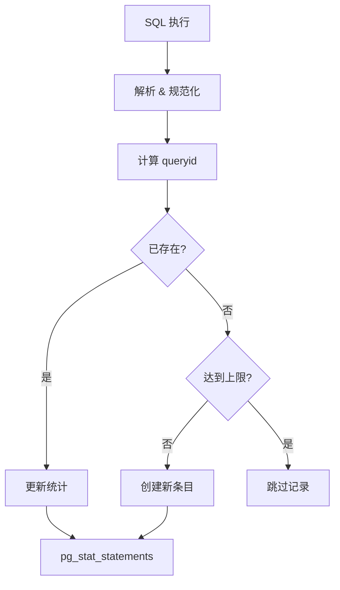
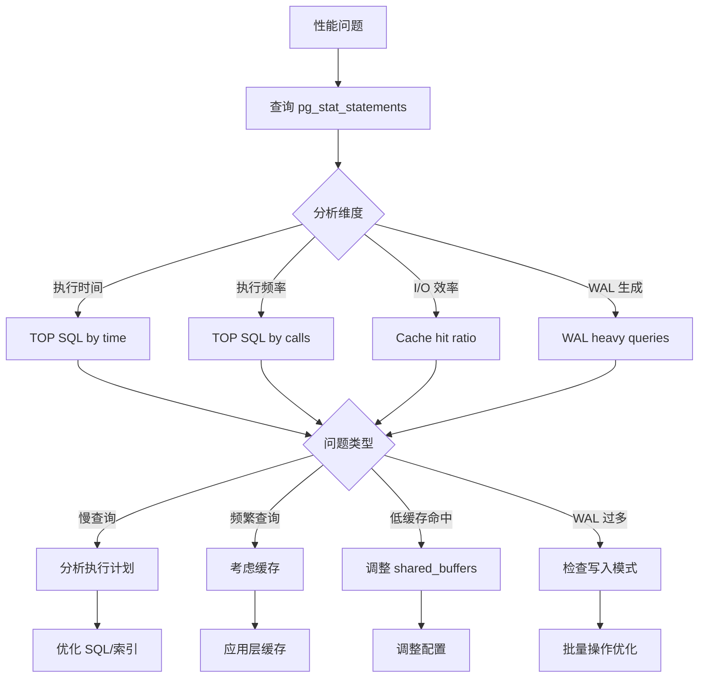

# 3.2 pg_stat_statements 查询分析

## 📚 概述

`pg_stat_statements` 是 PostgreSQL 最重要的性能分析扩展之一，它收集所有 SQL 语句的执行统计信息，帮助 DBA 识别慢查询、优化热点 SQL。

### 🎯 学习目标

- 掌握 pg_stat_statements 的安装和配置
- 学会分析 TOP SQL 和慢查询
- 了解如何使用统计信息优化性能

---

## 🔧 安装配置

### 启用扩展

```sql
-- 检查扩展是否可用
SELECT * FROM pg_available_extensions WHERE name = 'pg_stat_statements';

-- 创建扩展
CREATE EXTENSION pg_stat_statements;
```

### 配置 postgresql.conf

```ini
# 加载模块 (需要重启)
shared_preload_libraries = 'pg_stat_statements'

# 配置参数
pg_stat_statements.max = 10000          # 跟踪的最大语句数
pg_stat_statements.track = all          # all, top, none
pg_stat_statements.track_utility = on   # 跟踪非 DML 语句
pg_stat_statements.track_planning = on  # 跟踪计划时间 (PG13+)
pg_stat_statements.save = on            # 重启后保存统计
```

### 重启并验证

```bash
# 重启 PostgreSQL
pg_ctl restart -D $PGDATA -m fast

# 验证
psql -c "SELECT count(*) FROM pg_stat_statements;"
```

---

## 📊 视图结构

### 主要列说明

| 列名 | 说明 |
|------|------|
| `userid` | 用户 OID |
| `dbid` | 数据库 OID |
| `queryid` | 查询标识符 |
| `query` | 规范化的查询文本 |
| `calls` | 执行次数 |
| `total_exec_time` | 总执行时间 (毫秒) |
| `mean_exec_time` | 平均执行时间 |
| `rows` | 返回/影响的总行数 |
| `shared_blks_hit` | 共享缓存命中 |
| `shared_blks_read` | 共享块读取 |
| `blk_read_time` | 块读取时间 |
| `blk_write_time` | 块写入时间 |
| `wal_records` | 生成的 WAL 记录数 |
| `wal_bytes` | 生成的 WAL 字节数 |

### 查询流程



---

## 🔍 常用查询

### 1. TOP 10 最耗时查询

```sql
SELECT 
    round((100 * total_exec_time / sum(total_exec_time) over())::numeric, 2) AS percent,
    round(total_exec_time::numeric, 2) AS total_ms,
    calls,
    round(mean_exec_time::numeric, 2) AS avg_ms,
    query
FROM pg_stat_statements
ORDER BY total_exec_time DESC
LIMIT 10;
```

### 2. 最频繁执行的查询

```sql
SELECT 
    calls,
    round(total_exec_time::numeric, 2) AS total_ms,
    round(mean_exec_time::numeric, 2) AS avg_ms,
    rows,
    query
FROM pg_stat_statements
ORDER BY calls DESC
LIMIT 10;
```

### 3. 平均执行时间最长的查询

```sql
SELECT 
    round(mean_exec_time::numeric, 2) AS avg_ms,
    round(stddev_exec_time::numeric, 2) AS stddev_ms,
    calls,
    query
FROM pg_stat_statements
WHERE calls >= 10  -- 至少执行10次
ORDER BY mean_exec_time DESC
LIMIT 10;
```

### 4. I/O 密集型查询

```sql
SELECT 
    query,
    calls,
    shared_blks_read,
    shared_blks_hit,
    round(100.0 * shared_blks_hit / 
          nullif(shared_blks_hit + shared_blks_read, 0), 2) AS hit_ratio,
    round((blk_read_time + blk_write_time)::numeric, 2) AS io_time_ms
FROM pg_stat_statements
WHERE shared_blks_read > 1000
ORDER BY shared_blks_read DESC
LIMIT 10;
```

### 5. WAL 生成最多的查询

```sql
SELECT 
    query,
    calls,
    wal_records,
    pg_size_pretty(wal_bytes) AS wal_size,
    rows
FROM pg_stat_statements
WHERE wal_bytes > 0
ORDER BY wal_bytes DESC
LIMIT 10;
```

---

## 📈 性能分析

### 综合分析报告

```sql
-- 创建分析视图
CREATE OR REPLACE VIEW v_statement_analysis AS
SELECT 
    pg_get_userbyid(userid) AS username,
    datname,
    queryid,
    left(query, 100) AS query_preview,
    calls,
    
    -- 时间统计
    round(total_exec_time::numeric, 2) AS total_ms,
    round(mean_exec_time::numeric, 2) AS avg_ms,
    round(min_exec_time::numeric, 2) AS min_ms,
    round(max_exec_time::numeric, 2) AS max_ms,
    
    -- 行统计
    rows,
    round((rows::float / nullif(calls, 0))::numeric, 2) AS avg_rows,
    
    -- 缓存效率
    shared_blks_hit + shared_blks_read AS total_blks,
    round(100.0 * shared_blks_hit / 
          nullif(shared_blks_hit + shared_blks_read, 0), 2) AS cache_hit_pct,
    
    -- I/O 时间
    round((blk_read_time + blk_write_time)::numeric, 2) AS io_time_ms,
    
    -- WAL
    pg_size_pretty(wal_bytes) AS wal_size_pretty

FROM pg_stat_statements pss
JOIN pg_database pd ON pss.dbid = pd.oid
WHERE calls > 0
ORDER BY total_exec_time DESC;

-- 使用视图
SELECT * FROM v_statement_analysis LIMIT 20;
```

### 时间分布分析

```sql
-- 查询执行时间分布
SELECT 
    CASE 
        WHEN mean_exec_time < 1 THEN '< 1ms'
        WHEN mean_exec_time < 10 THEN '1-10ms'
        WHEN mean_exec_time < 100 THEN '10-100ms'
        WHEN mean_exec_time < 1000 THEN '100ms-1s'
        ELSE '> 1s'
    END AS time_bucket,
    count(*) AS query_count,
    sum(calls) AS total_calls,
    round(sum(total_exec_time)::numeric, 2) AS total_time_ms
FROM pg_stat_statements
GROUP BY 1
ORDER BY 
    CASE 
        WHEN mean_exec_time < 1 THEN 1
        WHEN mean_exec_time < 10 THEN 2
        WHEN mean_exec_time < 100 THEN 3
        WHEN mean_exec_time < 1000 THEN 4
        ELSE 5
    END;
```

---

## 🔄 重置与维护

### 重置统计

```sql
-- 重置所有统计
SELECT pg_stat_statements_reset();

-- 重置特定用户的统计
SELECT pg_stat_statements_reset(
    (SELECT oid FROM pg_roles WHERE rolname = 'app_user'),
    0,  -- dbid (0 = all)
    0   -- queryid (0 = all)
);
```

### 监控存储使用

```sql
-- 检查当前条目数
SELECT count(*) AS current_entries,
       current_setting('pg_stat_statements.max') AS max_entries
FROM pg_stat_statements;

-- 如果接近上限，考虑增加 max 或重置
```

---

## 📊 流程图



---

## 🎯 实战案例

### 案例 1: 识别和优化慢查询

```sql
-- 1. 找出最慢的查询
SELECT 
    queryid,
    round(mean_exec_time::numeric, 2) AS avg_ms,
    calls,
    query
FROM pg_stat_statements
WHERE mean_exec_time > 100  -- 超过100ms
ORDER BY mean_exec_time DESC
LIMIT 5;

-- 假设发现问题查询
-- queryid: 12345, avg_ms: 2500ms
-- query: SELECT * FROM orders WHERE customer_id = $1 AND status = $2

-- 2. 分析执行计划
EXPLAIN (ANALYZE, BUFFERS)
SELECT * FROM orders WHERE customer_id = 123 AND status = 'pending';

-- 发现: Seq Scan on orders (cost=0.00..12345.00)

-- 3. 创建索引
CREATE INDEX idx_orders_customer_status ON orders(customer_id, status);

-- 4. 重置统计后监控改善
SELECT pg_stat_statements_reset();

-- 一段时间后再次检查
SELECT 
    round(mean_exec_time::numeric, 2) AS avg_ms,
    calls
FROM pg_stat_statements
WHERE queryid = 12345;

-- 预期: avg_ms 从 2500ms 降至 < 10ms
```

### 案例 2: 定期报告脚本

```sql
-- daily_sql_report.sql
\pset title 'Daily SQL Performance Report'
\pset footer off

\echo '=== Top 10 Slowest Queries ==='
SELECT 
    left(query, 60) AS query,
    calls,
    round(total_exec_time::numeric, 0) AS total_ms,
    round(mean_exec_time::numeric, 2) AS avg_ms
FROM pg_stat_statements
ORDER BY total_exec_time DESC
LIMIT 10;

\echo ''
\echo '=== Cache Efficiency ==='
SELECT 
    round(100.0 * sum(shared_blks_hit) / 
          nullif(sum(shared_blks_hit + shared_blks_read), 0), 2) AS overall_hit_ratio
FROM pg_stat_statements;

\echo ''
\echo '=== Query Distribution ==='
SELECT 
    count(*) AS total_queries,
    sum(calls) AS total_executions,
    pg_size_pretty(sum(wal_bytes)) AS total_wal
FROM pg_stat_statements;
```

---

## 💡 最佳实践

1. **共享预加载**: 必须在 `shared_preload_libraries` 中配置
2. **合适的 max 值**: 根据查询多样性设置，通常 5000-10000
3. **定期分析**: 每日或每周生成性能报告
4. **结合 EXPLAIN**: 对问题查询进行深入分析
5. **启用计划时间跟踪**: 设置 `track_planning = on`

---

## ❓ 常见问题

<details>
<summary><strong>Q: 查询被参数化后如何关联原始 SQL？</strong></summary>

pg_stat_statements 会将参数替换为 `$1, $2` 等占位符。可以通过 `queryid` 来唯一标识查询模式。
</details>

<details>
<summary><strong>Q: 为什么看不到某些查询？</strong></summary>

检查以下设置：
- `pg_stat_statements.track = all` (包含嵌套查询)
- `pg_stat_statements.track_utility = on` (包含 DDL)
- 确认 `pg_stat_statements.max` 足够大
</details>

---

[⬅️ 上一章: pg_stat_io](../3.1-pg_stat_io/README.md) | [返回目录](../../README.md) | [下一章: EXPLAIN ➡️](../3.3-explain/README.md)
