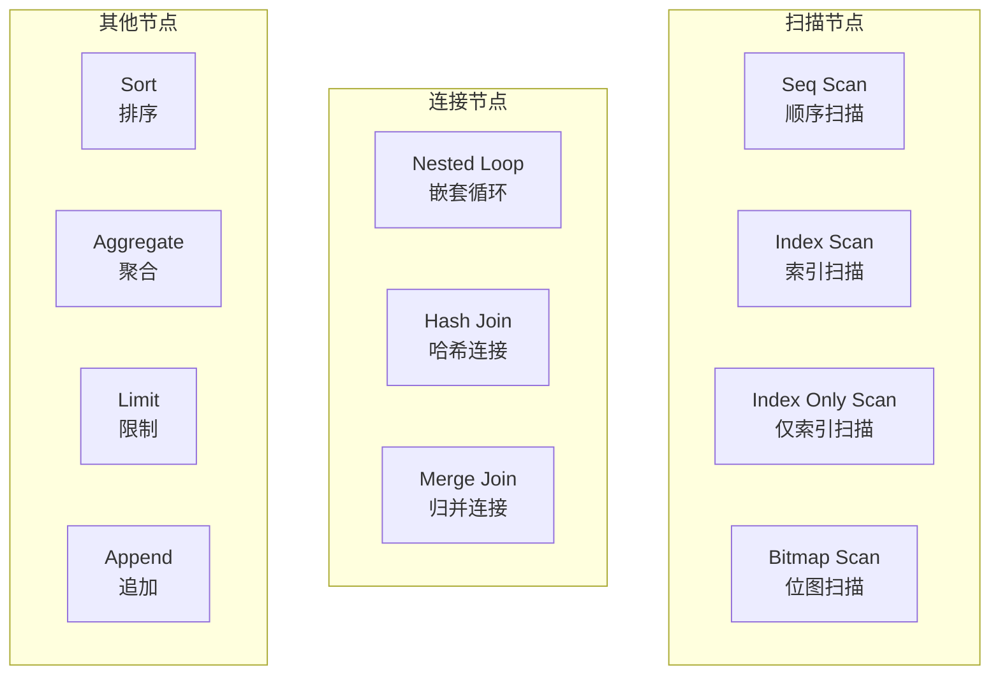
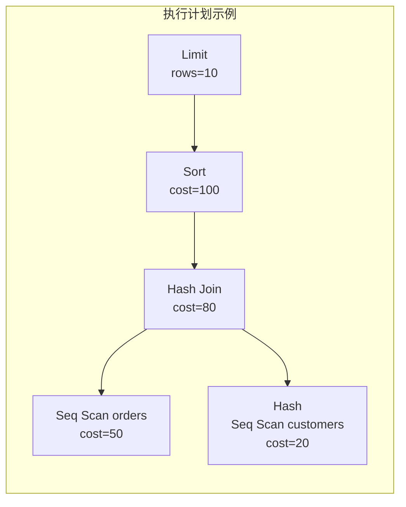

# 3.3 EXPLAIN 与执行计划分析

## 📚 概述

`EXPLAIN` 是 PostgreSQL 查询优化的核心工具，它显示查询优化器选择的执行计划。理解执行计划是 DBA 优化查询性能的关键技能。

### 🎯 学习目标

- 掌握 EXPLAIN 的各种选项和输出格式
- 学会解读执行计划中的关键信息
- 能够根据执行计划优化查询

---

## 🔧 基本语法

```sql
EXPLAIN [ANALYZE] [VERBOSE] [COSTS] [SETTINGS] [BUFFERS] [WAL] 
        [TIMING] [SUMMARY] [FORMAT {TEXT | XML | JSON | YAML}]
        statement
```

### 主要选项

| 选项 | 说明 |
|------|------|
| `ANALYZE` | 实际执行查询，显示真实时间 |
| `VERBOSE` | 显示详细信息 |
| `COSTS` | 显示成本估算 (默认开启) |
| `BUFFERS` | 显示缓冲区使用 (需要 ANALYZE) |
| `TIMING` | 显示实际时间 (需要 ANALYZE) |
| `FORMAT` | 输出格式 |

---

## 📊 执行计划节点



---

## 🔍 基本使用

### 简单 EXPLAIN

```sql
-- 只显示计划 (不执行)
EXPLAIN SELECT * FROM users WHERE age > 30;

-- 输出示例:
-- Seq Scan on users  (cost=0.00..25.00 rows=500 width=68)
--   Filter: (age > 30)
```

### EXPLAIN ANALYZE

```sql
-- 实际执行并显示真实统计
EXPLAIN ANALYZE 
SELECT * FROM users WHERE age > 30;

-- 输出示例:
-- Seq Scan on users  (cost=0.00..25.00 rows=500 width=68) 
--                    (actual time=0.015..0.234 rows=423 loops=1)
--   Filter: (age > 30)
--   Rows Removed by Filter: 577
-- Planning Time: 0.125 ms
-- Execution Time: 0.312 ms
```

### 完整分析

```sql
-- 最详细的分析
EXPLAIN (ANALYZE, BUFFERS, VERBOSE, TIMING)
SELECT * FROM orders o
JOIN customers c ON o.customer_id = c.id
WHERE o.created_at > '2025-01-01';
```

---

## 📈 解读执行计划

### 成本估算

```
(cost=0.00..25.00 rows=500 width=68)
       ↓      ↓      ↓        ↓
   启动成本 总成本  行数估计  行宽度
```

- **启动成本**: 返回第一行之前的成本
- **总成本**: 返回所有行的成本
- **rows**: 估计返回的行数
- **width**: 每行的平均字节数

### 实际执行信息

```
(actual time=0.015..0.234 rows=423 loops=1)
              ↓      ↓      ↓        ↓
         启动时间  总时间  实际行数  循环次数
```

### 缓冲区信息

```sql
EXPLAIN (ANALYZE, BUFFERS) SELECT ...

-- 输出:
-- Buffers: shared hit=100 read=50
--          ↓           ↓
--       缓存命中    磁盘读取
```

---

## 🔄 扫描类型对比

### 顺序扫描 (Seq Scan)

```sql
-- 全表扫描
EXPLAIN SELECT * FROM large_table;

-- Seq Scan on large_table  (cost=0.00..18334.00 rows=1000000 width=37)
```

**何时使用**:
- 表很小
- 需要读取大部分数据
- 没有合适的索引

### 索引扫描 (Index Scan)

```sql
-- 创建索引
CREATE INDEX idx_users_email ON users(email);

-- 使用索引扫描
EXPLAIN SELECT * FROM users WHERE email = 'user@example.com';

-- Index Scan using idx_users_email on users  (cost=0.29..8.31 rows=1 width=68)
--   Index Cond: (email = 'user@example.com'::text)
```

### 仅索引扫描 (Index Only Scan)

```sql
-- 创建覆盖索引
CREATE INDEX idx_users_email_name ON users(email, name);

-- 仅从索引获取数据
EXPLAIN SELECT email, name FROM users WHERE email = 'user@example.com';

-- Index Only Scan using idx_users_email_name on users  (cost=0.29..4.31 rows=1 width=36)
--   Index Cond: (email = 'user@example.com'::text)
```

### 位图扫描 (Bitmap Scan)

```sql
-- 多条件或中等选择性
EXPLAIN SELECT * FROM users WHERE age > 30 OR city = 'Beijing';

-- Bitmap Heap Scan on users  (cost=9.50..25.00 rows=200 width=68)
--   Recheck Cond: ((age > 30) OR (city = 'Beijing'::text))
--   ->  BitmapOr  (cost=9.50..9.50 rows=200 width=0)
--         ->  Bitmap Index Scan on idx_users_age  ...
--         ->  Bitmap Index Scan on idx_users_city  ...
```

---

## 🔗 连接类型

### Nested Loop

```sql
-- 小表连接或索引驱动
EXPLAIN ANALYZE
SELECT * FROM orders o 
JOIN order_items i ON o.id = i.order_id
WHERE o.id = 12345;

-- Nested Loop  (cost=0.57..16.62 rows=5 width=100)
--   ->  Index Scan using orders_pkey on orders o  ...
--   ->  Index Scan using idx_items_order on order_items i  ...
```

**适用场景**:
- 一方很小
- 有索引支持
- 高选择性连接

### Hash Join

```sql
-- 大表等值连接
EXPLAIN ANALYZE
SELECT * FROM orders o 
JOIN customers c ON o.customer_id = c.id;

-- Hash Join  (cost=33.00..2735.00 rows=100000 width=150)
--   Hash Cond: (o.customer_id = c.id)
--   ->  Seq Scan on orders o  ...
--   ->  Hash  (cost=20.00..20.00 rows=1000 width=50)
--         ->  Seq Scan on customers c  ...
```

**适用场景**:
- 两个大表
- 等值连接
- 足够的 work_mem

### Merge Join

```sql
-- 已排序数据的连接
EXPLAIN ANALYZE
SELECT * FROM sorted_table1 t1
JOIN sorted_table2 t2 ON t1.key = t2.key;

-- Merge Join  (cost=100.00..500.00 rows=10000 width=100)
--   Merge Cond: (t1.key = t2.key)
--   ->  Index Scan using idx_t1_key on sorted_table1 t1  ...
--   ->  Index Scan using idx_t2_key on sorted_table2 t2  ...
```

**适用场景**:
- 数据已排序 (通过索引)
- 大表连接
- 需要排序输出

---

## 📊 执行计划可视化



---

## 🎯 实战案例

### 案例: 诊断慢查询

```sql
-- 问题查询
EXPLAIN (ANALYZE, BUFFERS)
SELECT c.name, COUNT(o.id) as order_count, SUM(o.total) as total_spent
FROM customers c
LEFT JOIN orders o ON c.id = o.customer_id
WHERE c.created_at > '2024-01-01'
GROUP BY c.id, c.name
ORDER BY total_spent DESC NULLS LAST
LIMIT 100;

-- 分析输出:
-- Limit  (cost=5000.00..5000.25 rows=100 width=48) 
--        (actual time=2500.123..2500.145 rows=100 loops=1)
--   Buffers: shared hit=1000 read=5000  <-- 大量磁盘读取!
--   ->  Sort  (cost=5000.00..5025.00 rows=10000 width=48)
--         Sort Key: (sum(o.total)) DESC NULLS LAST
--         Sort Method: top-N heapsort  Memory: 25kB
--         ->  HashAggregate  (cost=4500.00..4600.00 rows=10000 width=48)
--               Buffers: shared hit=1000 read=5000
--               ->  Hash Right Join  (cost=300.00..4000.00 rows=100000)
--                     Hash Cond: (o.customer_id = c.id)
--                     ->  Seq Scan on orders o  <-- 全表扫描!
--                     ->  Hash  (cost=250.00..250.00 rows=4000)
--                           ->  Seq Scan on customers c
--                                 Filter: (created_at > '2024-01-01')
-- Planning Time: 0.5 ms
-- Execution Time: 2500.5 ms  <-- 太慢!

-- 优化步骤:
-- 1. 为 orders.customer_id 添加索引
CREATE INDEX idx_orders_customer ON orders(customer_id);

-- 2. 为 customers.created_at 添加索引
CREATE INDEX idx_customers_created ON customers(created_at);

-- 3. 重新分析
EXPLAIN (ANALYZE, BUFFERS)
SELECT c.name, COUNT(o.id), SUM(o.total)
FROM customers c
LEFT JOIN orders o ON c.id = o.customer_id
WHERE c.created_at > '2024-01-01'
GROUP BY c.id, c.name
ORDER BY 3 DESC NULLS LAST
LIMIT 100;

-- 优化后: Execution Time: 50.5 ms (50x 提升!)
```

### 案例: 理解计划选择

```sql
-- 为什么优化器选择 Seq Scan 而不是 Index Scan?

-- 检查表统计信息
SELECT 
    relname,
    reltuples,
    relpages
FROM pg_class
WHERE relname = 'users';

-- 检查列统计
SELECT 
    attname,
    n_distinct,
    most_common_vals,
    most_common_freqs
FROM pg_stats
WHERE tablename = 'users' AND attname = 'status';

-- 可能原因:
-- 1. 统计信息过时 -> ANALYZE users;
-- 2. 选择性太低 (大部分行匹配)
-- 3. 表太小，顺序扫描更快
```

---

## 💡 最佳实践

1. **使用 ANALYZE**: 确保统计信息最新
2. **结合 BUFFERS**: 了解真实 I/O 情况
3. **关注 rows 估算**: 估算与实际差距大说明统计不准
4. **注意 loops**: 循环次数影响实际性能
5. **JSON 格式**: 便于程序解析和可视化

---

## ❓ 常见问题

<details>
<summary><strong>Q: 为什么估算行数与实际行数差异很大？</strong></summary>

可能原因：
- 统计信息过时 (`ANALYZE` 表)
- 相关性未被考虑
- 复杂表达式估算困难

```sql
-- 更新统计信息
ANALYZE users;

-- 增加统计目标
ALTER TABLE users ALTER COLUMN status SET STATISTICS 1000;
ANALYZE users;
```
</details>

<details>
<summary><strong>Q: 如何强制使用某个索引？</strong></summary>

PostgreSQL 没有直接的 INDEX HINT，但可以：
```sql
-- 禁用 seq scan (测试用)
SET enable_seqscan = off;
EXPLAIN SELECT * FROM users WHERE age > 30;
SET enable_seqscan = on;

-- 或调整成本参数
SET random_page_cost = 1.0;  -- 降低随机 I/O 成本
```
</details>

---

[⬅️ 上一章: pg_stat_statements](../3.2-pg_stat_statements/README.md) | [返回目录](../../README.md) | [下一章: PgBadger ➡️](../3.4-pgbadger/README.md)
