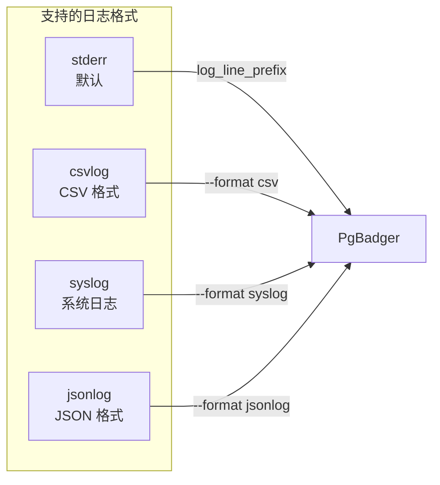
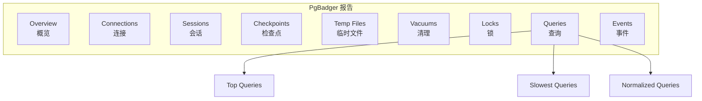
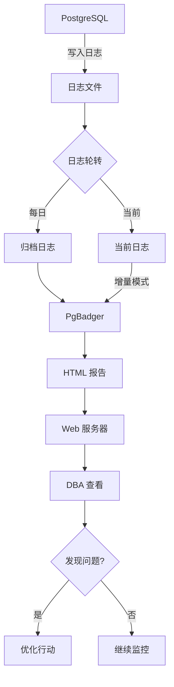

# 3.4 PgBadger 日志分析

## 📚 概述

PgBadger 是一个快速的 PostgreSQL 日志分析工具，可以生成详细的 HTML 报告，帮助 DBA 识别性能问题、慢查询和数据库使用模式。

### 🎯 学习目标

- 配置 PostgreSQL 日志以支持 PgBadger
- 掌握 PgBadger 的使用和报告解读
- 学会自动化日志分析流程

---

## 🔧 安装

### 使用包管理器

```bash
# Ubuntu/Debian
sudo apt-get install pgbadger

# RHEL/CentOS
sudo dnf install pgbadger

# macOS
brew install pgbadger

# 从源码安装
perl Makefile.PL
make && sudo make install
```

### 验证安装

```bash
pgbadger --version
# pgbadger version 12.x
```

---

## ⚙️ 日志配置

### postgresql.conf 配置

```ini
# 启用日志收集
logging_collector = on
log_directory = 'log'
log_filename = 'postgresql-%Y-%m-%d_%H%M%S.log'
log_rotation_age = 1d
log_rotation_size = 100MB

# 日志格式 (PgBadger 推荐)
log_line_prefix = '%t [%p]: [%l-1] user=%u,db=%d,app=%a,client=%h '
log_destination = 'stderr'

# 记录内容
log_min_duration_statement = 0      # 记录所有查询 (或设置阈值如 1000ms)
log_checkpoints = on
log_connections = on
log_disconnections = on
log_lock_waits = on
log_temp_files = 0
log_autovacuum_min_duration = 0

# 详细程度
log_statement = 'none'              # 使用 log_min_duration_statement 代替
log_duration = off
```

### 日志格式选项



---

## 📊 基本使用

### 生成报告

```bash
# 基本用法
pgbadger /var/log/postgresql/postgresql-*.log -o report.html

# 指定日期范围
pgbadger /var/log/postgresql/*.log \
    --begin "2025-01-01 00:00:00" \
    --end "2025-01-31 23:59:59" \
    -o january_report.html

# 指定日志格式
pgbadger --format csv /var/log/postgresql/*.csv -o report.html

# 增量模式 (处理新日志)
pgbadger --incremental /var/log/postgresql/*.log \
    --outdir /var/www/html/pgbadger/
```

### 常用选项

| 选项 | 说明 |
|------|------|
| `-o, --outfile` | 输出文件 |
| `-f, --format` | 日志格式 |
| `-b, --begin` | 开始时间 |
| `-e, --end` | 结束时间 |
| `-d, --dbname` | 过滤数据库 |
| `-u, --user` | 过滤用户 |
| `-j, --jobs` | 并行处理数 |
| `-I, --incremental` | 增量模式 |

---

## 📈 报告内容

### 报告结构



### 关键指标

| 报告部分 | 关键指标 |
|----------|----------|
| **Overview** | 查询总数、错误数、峰值连接 |
| **Queries** | 最慢查询、最频繁查询、TOP SQL |
| **Connections** | 连接模式、用户分布 |
| **Sessions** | 会话持续时间、空闲时间 |
| **Checkpoints** | 触发原因、持续时间 |
| **Temp Files** | 临时文件使用情况 |
| **Locks** | 锁等待、死锁 |

---

## 🔍 高级用法

### 增量分析

```bash
#!/bin/bash
# daily_analysis.sh

LOGDIR="/var/log/postgresql"
OUTDIR="/var/www/html/pgbadger"
DATE=$(date +%Y-%m-%d)

pgbadger \
    --incremental \
    --outdir $OUTDIR \
    --jobs 4 \
    --prefix '%t [%p]: [%l-1] user=%u,db=%d,app=%a,client=%h ' \
    $LOGDIR/postgresql-$DATE*.log

# 发送通知
if [ $? -eq 0 ]; then
    echo "PgBadger report generated: $OUTDIR/index.html"
fi
```

### 过滤特定数据

```bash
# 只分析特定数据库
pgbadger --dbname production *.log -o prod_report.html

# 只分析特定用户
pgbadger --user admin *.log -o admin_report.html

# 排除某些查询
pgbadger --exclude-query "^(COMMIT|BEGIN)" *.log -o report.html

# 只包含 SELECT 查询
pgbadger --select-only *.log -o select_report.html
```

### 多服务器分析

```bash
# 合并多个服务器的日志
pgbadger \
    server1:/var/log/postgresql/*.log \
    server2:/var/log/postgresql/*.log \
    -o combined_report.html
```

---

## 📊 流程图



---

## 🎯 实战案例

### 案例 1: 自动化日报

```bash
#!/bin/bash
# /opt/scripts/pgbadger_daily.sh

set -e

# 配置
PGDATA="/var/lib/pgsql/18/data"
LOG_DIR="$PGDATA/log"
REPORT_DIR="/var/www/html/pgbadger"
DATE=$(date +%Y-%m-%d)
YESTERDAY=$(date -d "yesterday" +%Y-%m-%d)

# 创建报告目录
mkdir -p "$REPORT_DIR/$YESTERDAY"

# 生成报告
pgbadger \
    --prefix '%t [%p]: [%l-1] user=%u,db=%d,app=%a,client=%h ' \
    --outfile "$REPORT_DIR/$YESTERDAY/index.html" \
    --jobs 4 \
    "$LOG_DIR/postgresql-$YESTERDAY"*.log

# 生成汇总
pgbadger \
    --prefix '%t [%p]: [%l-1] user=%u,db=%d,app=%a,client=%h ' \
    --outfile "$REPORT_DIR/weekly.html" \
    --jobs 4 \
    "$LOG_DIR/postgresql-"*.log

# 清理旧报告 (保留30天)
find "$REPORT_DIR" -type d -mtime +30 -exec rm -rf {} \;

echo "Daily report: $REPORT_DIR/$YESTERDAY/index.html"
```

```bash
# Crontab 配置
# 每天早上 6:00 生成前一天的报告
0 6 * * * /opt/scripts/pgbadger_daily.sh >> /var/log/pgbadger.log 2>&1
```

### 案例 2: 解读报告发现问题

```
报告摘要:
---------
Total queries: 1,234,567
Unique queries: 5,432
Total duration: 15h 23m 45s
Peak connections: 150

Top 5 Slowest Queries:
1. SELECT * FROM orders WHERE ... (avg: 15.3s, count: 234)
2. UPDATE inventory SET ... (avg: 8.2s, count: 1,234)
3. SELECT c.*, o.* FROM customers c JOIN orders o ... (avg: 5.1s, count: 567)

分析:
-----
1. 第一个查询平均 15.3 秒，需要检查执行计划
2. UPDATE 语句频繁且慢，可能需要优化索引
3. JOIN 查询需要检查连接条件
```

```sql
-- 根据报告优化
-- 1. 分析慢查询
EXPLAIN (ANALYZE, BUFFERS) 
SELECT * FROM orders WHERE ...;

-- 2. 添加索引
CREATE INDEX idx_orders_... ON orders(...);

-- 3. 重新分析
ANALYZE orders;
```

---

## 💡 最佳实践

1. **日志格式统一**: 使用推荐的 log_line_prefix
2. **定期分析**: 每日生成报告
3. **增量模式**: 大日志文件使用增量分析
4. **并行处理**: 使用 `-j` 选项加速
5. **归档保留**: 保留历史报告便于对比

---

## ❓ 常见问题

<details>
<summary><strong>Q: 日志格式不匹配怎么办？</strong></summary>

使用 `--prefix` 选项指定正确的日志前缀格式：
```bash
pgbadger --prefix '%t [%p]: ' your_log.log
```
</details>

<details>
<summary><strong>Q: 处理大日志文件太慢？</strong></summary>

```bash
# 使用并行处理
pgbadger -j 8 large_log.log

# 使用增量模式
pgbadger --incremental ...

# 分割日志文件
split -l 1000000 large.log small_
pgbadger small_* -o report.html
```
</details>

---

[⬅️ 上一章: EXPLAIN](../3.3-explain/README.md) | [返回目录](../../README.md) | [下一章: PgTune ➡️](../3.5-pgtune/README.md)
