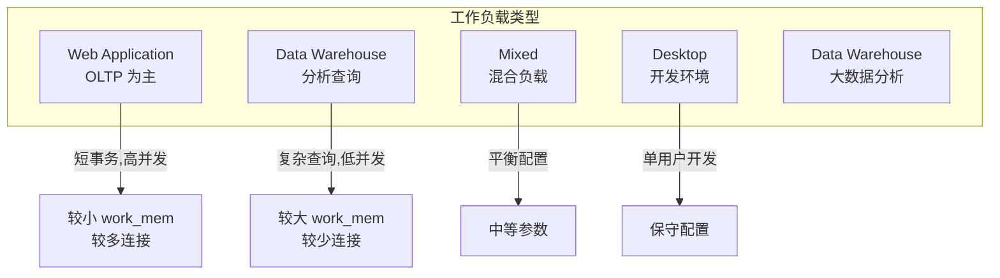
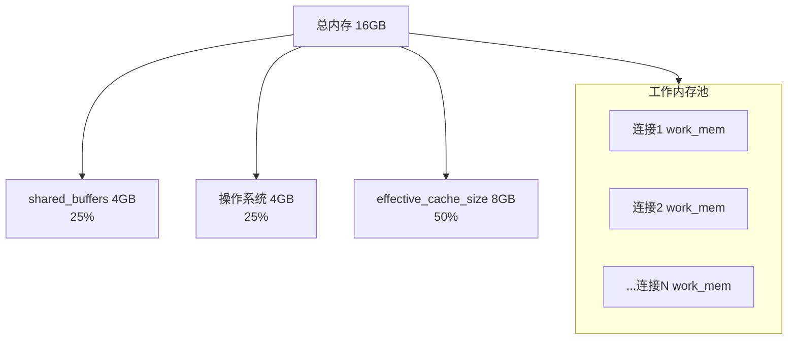
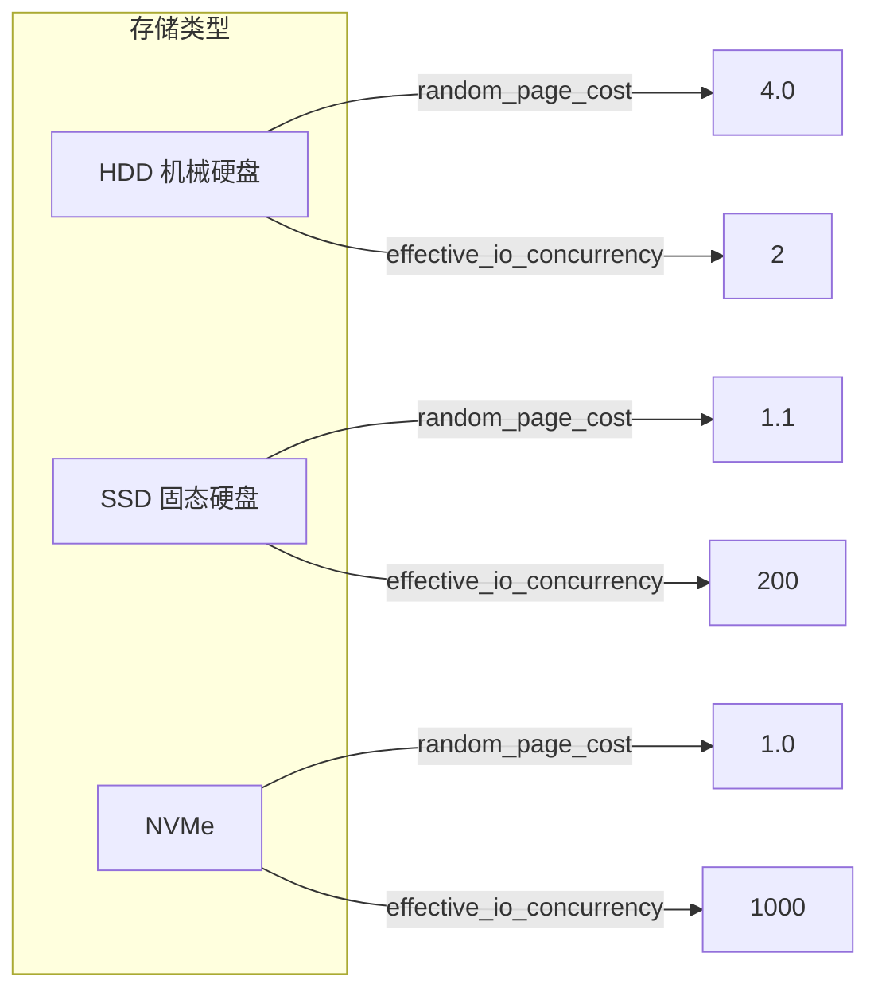

# 3.5 PgTune 配置优化

## 📚 概述

PgTune 是一个 PostgreSQL 配置参数优化工具，可以根据硬件规格和使用场景自动生成优化的配置建议。它帮助 DBA 快速获得合理的初始配置。

### 🎯 学习目标

- 了解 PgTune 的使用方法
- 理解关键参数的优化原理
- 学会根据场景调整配置

---

## 🔧 使用方式

### 在线版本

访问 [pgtune.leopard.in.ua](https://pgtune.leopard.in.ua/) 

### 命令行版本

```bash
# 安装 (Python)
pip install pgtune

# 或使用 Docker
docker run --rm cytopia/pgtune --help

# 基本使用
pgtune -i /path/to/postgresql.conf -o optimized.conf \
    --type=web \
    --memory=16GB \
    --connections=200
```

---

## ⚙️ 工作负载类型



---

## 📊 核心参数解析

### 内存配置

```ini
# shared_buffers
# 建议: 物理内存的 25%
# 作用: 数据页缓存
shared_buffers = 4GB  # 对于 16GB RAM

# effective_cache_size
# 建议: 物理内存的 50-75%
# 作用: 优化器估计缓存大小
effective_cache_size = 12GB

# work_mem
# 建议: 每连接分配,总量不超过 RAM 的 25%
# 作用: 排序、哈希操作
work_mem = 20MB  # (16GB * 0.25) / 200 connections

# maintenance_work_mem
# 建议: 512MB - 2GB
# 作用: VACUUM, CREATE INDEX 等
maintenance_work_mem = 1GB
```

### 内存分配流程



### 检查点配置

```ini
# max_wal_size
# 建议: 根据写入量确定
max_wal_size = 4GB

# min_wal_size
# 建议: max_wal_size 的 25%
min_wal_size = 1GB

# checkpoint_completion_target
# 建议: 0.9
checkpoint_completion_target = 0.9

# wal_buffers
# 建议: shared_buffers 的 3%,最大 64MB
wal_buffers = 64MB
```

### 并行查询

```ini
# max_worker_processes
# 建议: CPU 核心数
max_worker_processes = 8

# max_parallel_workers_per_gather
# 建议: CPU 核心数 / 2
max_parallel_workers_per_gather = 4

# max_parallel_workers
# 建议: 等于 max_worker_processes
max_parallel_workers = 8

# max_parallel_maintenance_workers
# 建议: CPU 核心数 / 2
max_parallel_maintenance_workers = 4
```

---

## 📈 场景配置示例

### Web 应用 (16GB RAM, 8 CPU)

```ini
# pgtune 输出示例

# Memory Settings
shared_buffers = 4GB
effective_cache_size = 12GB
maintenance_work_mem = 1GB
work_mem = 20971kB

# Checkpoint Settings
checkpoint_completion_target = 0.9
wal_buffers = 64MB
max_wal_size = 4GB
min_wal_size = 1GB

# Worker Settings
max_worker_processes = 8
max_parallel_workers_per_gather = 4
max_parallel_workers = 8
max_parallel_maintenance_workers = 4

# Connection Settings
max_connections = 200

# Cost Settings
random_page_cost = 1.1  # SSD
effective_io_concurrency = 200  # SSD
```

### 数据仓库 (64GB RAM, 16 CPU)

```ini
# 数据仓库优化配置

# Memory Settings
shared_buffers = 16GB
effective_cache_size = 48GB
maintenance_work_mem = 2GB
work_mem = 524MB

# Checkpoint Settings
checkpoint_completion_target = 0.9
wal_buffers = 64MB
max_wal_size = 8GB
min_wal_size = 2GB

# Worker Settings
max_worker_processes = 16
max_parallel_workers_per_gather = 8
max_parallel_workers = 16
max_parallel_maintenance_workers = 8

# Connection Settings
max_connections = 40

# Cost Settings
random_page_cost = 1.1
effective_io_concurrency = 200
default_statistics_target = 500
```

### 混合负载 (32GB RAM, 12 CPU)

```ini
# 混合负载平衡配置

# Memory Settings
shared_buffers = 8GB
effective_cache_size = 24GB
maintenance_work_mem = 2GB
work_mem = 52428kB

# Checkpoint Settings
checkpoint_completion_target = 0.9
wal_buffers = 64MB
max_wal_size = 4GB
min_wal_size = 1GB

# Worker Settings
max_worker_processes = 12
max_parallel_workers_per_gather = 6
max_parallel_workers = 12
max_parallel_maintenance_workers = 6

# Connection Settings
max_connections = 100
```

---

## 🔍 参数调优指南

### 存储类型优化



### 连接数与 work_mem 关系

```sql
-- 计算合理的 work_mem
-- 公式: (RAM * 0.25) / max_connections

-- 16GB RAM, 200 连接:
-- (16GB * 0.25) / 200 = 20MB work_mem

-- 注意: 复杂查询可能使用多个 work_mem
-- 排序 + Hash Join = 2x work_mem
-- 并行查询 = workers x work_mem
```

---

## ⚠️ PostgreSQL 18 新配置

```ini
# 异步 I/O (PG18 新特性)
io_method = 'io_uring'  # Linux 5.1+

# I/O 工作进程
io_max_workers = 3

# 并行 COPY
max_copy_workers = 4

# 密码加密 (推荐)
password_encryption = 'scram-sha-256'
```

---

## 📊 配置验证

### 验证内存配置

```sql
-- 查看当前内存配置
SELECT name, setting, unit, context 
FROM pg_settings 
WHERE name IN (
    'shared_buffers',
    'effective_cache_size',
    'work_mem',
    'maintenance_work_mem'
);

-- 检查缓冲区使用
SELECT 
    pg_size_pretty(pg_relation_size('large_table')) AS table_size,
    pg_size_pretty(setting::bigint * 8192) AS shared_buffers
FROM pg_settings 
WHERE name = 'shared_buffers';
```

### 验证检查点

```sql
-- 检查点统计
SELECT 
    checkpoints_timed,
    checkpoints_req,
    checkpoint_write_time,
    checkpoint_sync_time
FROM pg_stat_bgwriter;

-- 如果 checkpoints_req > checkpoints_timed,
-- 考虑增大 max_wal_size
```

---

## 🎯 实战案例

### 案例: 根据负载调优

```bash
# 1. 分析当前负载
psql -c "
SELECT 
    datname,
    numbackends AS connections,
    xact_commit + xact_rollback AS transactions,
    blks_read,
    blks_hit,
    round(100.0 * blks_hit / nullif(blks_read + blks_hit, 0), 2) AS hit_ratio
FROM pg_stat_database
WHERE datname NOT LIKE 'template%';
"

# 2. 使用 PgTune 生成配置
pgtune \
    --type=web \
    --memory=16GB \
    --connections=200 \
    --cpus=8 \
    --storage=ssd \
    > /tmp/pgtune.conf

# 3. 对比当前配置
diff /var/lib/pgsql/18/data/postgresql.conf /tmp/pgtune.conf

# 4. 应用关键配置
cat >> /var/lib/pgsql/18/data/postgresql.conf << 'EOF'
# PgTune Recommendations - 2025-02-04
shared_buffers = 4GB
effective_cache_size = 12GB
work_mem = 20MB
maintenance_work_mem = 1GB
random_page_cost = 1.1
effective_io_concurrency = 200
EOF

# 5. 需要重启的配置
pg_ctl restart -D /var/lib/pgsql/18/data -m fast
```

---

## 💡 最佳实践

1. **从保守开始**: 使用 PgTune 建议作为起点
2. **监控后调整**: 根据实际负载微调
3. **测试环境验证**: 生产环境应用前先测试
4. **记录变更**: 记录每次配置变更和效果
5. **定期评估**: 随着数据增长重新评估

---

## ❓ 常见问题

<details>
<summary><strong>Q: 增加 shared_buffers 一定能提升性能吗？</strong></summary>

不一定。过大的 shared_buffers 可能导致:
- 操作系统可用内存减少
- 检查点时间延长
- 双重缓存问题

建议保持在 RAM 的 25-40%。
</details>

<details>
<summary><strong>Q: 如何确定最佳 work_mem？</strong></summary>

```sql
-- 监控临时文件使用
SELECT * FROM pg_stat_database WHERE temp_files > 0;

-- 如果大量临时文件，考虑增加 work_mem
-- 但要注意总内存使用
```
</details>

---

[⬅️ 上一章: PgBadger](../3.4-pgbadger/README.md) | [返回目录](../../README.md) | [下一章: pg_dump ➡️](../../module-4-backup/4.1-pg_dump/README.md)
