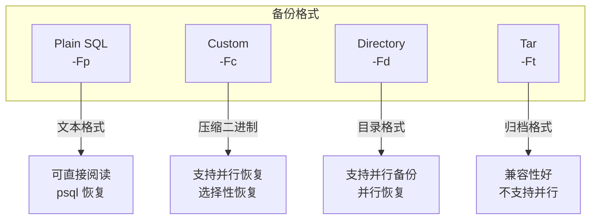
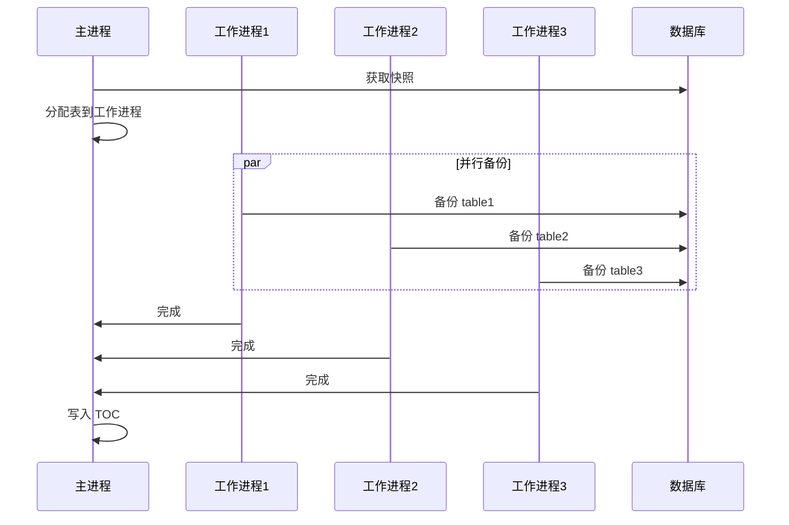
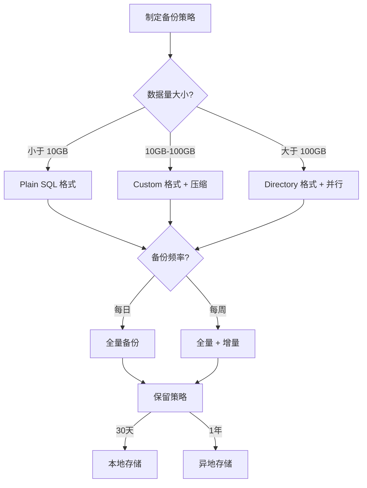

# 4.1 pg_dump 与 pg_dumpall

## 📚 概述

`pg_dump` 和 `pg_dumpall` 是 PostgreSQL 的逻辑备份工具。`pg_dump` 备份单个数据库，而 `pg_dumpall` 备份整个集群（包括角色和表空间定义）。

### 🎯 学习目标

- 掌握 pg_dump 的各种备份格式和选项
- 了解 pg_dumpall 的使用场景
- 学会制定合适的备份策略

---

## 🔧 pg_dump 基本用法

### 语法

```bash
pg_dump [OPTIONS] [DBNAME]
```

### 备份格式



### 基本示例

```bash
# Plain SQL 格式
pg_dump -U postgres mydb > mydb.sql

# Custom 格式 (推荐)
pg_dump -U postgres -Fc mydb > mydb.dump

# Directory 格式 (支持并行)
pg_dump -U postgres -Fd mydb -f mydb_dir/

# Tar 格式
pg_dump -U postgres -Ft mydb > mydb.tar

# 压缩 Plain SQL
pg_dump -U postgres mydb | gzip > mydb.sql.gz
```

---

## 📊 常用选项

### 连接选项

| 选项 | 说明 |
|------|------|
| `-h, --host` | 数据库主机 |
| `-p, --port` | 端口 |
| `-U, --username` | 用户名 |
| `-W, --password` | 提示密码 |
| `-d, --dbname` | 数据库名 |

### 输出选项

| 选项 | 说明 |
|------|------|
| `-f, --file` | 输出文件 |
| `-F, --format` | 输出格式 (p/c/d/t) |
| `-j, --jobs` | 并行作业数 |
| `-Z, --compress` | 压缩级别 (0-9) |

### 内容选项

| 选项 | 说明 |
|------|------|
| `-a, --data-only` | 仅数据 |
| `-s, --schema-only` | 仅模式 |
| `-t, --table` | 指定表 |
| `-T, --exclude-table` | 排除表 |
| `-n, --schema` | 指定模式 |
| `-N, --exclude-schema` | 排除模式 |

---

## 🔄 并行备份

```bash
# 使用 Directory 格式进行并行备份
pg_dump -U postgres -Fd -j 4 mydb -f mydb_parallel/

# 检查备份内容
ls -la mydb_parallel/

# 输出:
# toc.dat           - 目录索引
# 3456.dat.gz       - 表数据 (压缩)
# 3457.dat.gz
# ...
```

### 并行备份流程



---

## 📦 pg_dumpall

### 用途

备份整个集群，包括：
- 所有数据库
- 全局对象（角色、表空间）

```bash
# 完整集群备份
pg_dumpall -U postgres > cluster_backup.sql

# 仅备份全局对象
pg_dumpall -U postgres --globals-only > globals.sql

# 仅备份角色
pg_dumpall -U postgres --roles-only > roles.sql

# 仅备份表空间
pg_dumpall -U postgres --tablespaces-only > tablespaces.sql
```

---

## 🎯 实战案例

### 案例 1: 生产环境备份脚本

```bash
#!/bin/bash
# backup_production.sh

set -e

# 配置
BACKUP_DIR="/backup/postgresql"
RETENTION_DAYS=30
DATE=$(date +%Y%m%d_%H%M%S)
DATABASES="production analytics"

# 创建备份目录
mkdir -p "$BACKUP_DIR/$DATE"

# 备份全局对象
echo "Backing up globals..."
pg_dumpall -U postgres --globals-only > "$BACKUP_DIR/$DATE/globals.sql"

# 备份各数据库
for db in $DATABASES; do
    echo "Backing up $db..."
    pg_dump -U postgres -Fd -j 4 -Z 5 \
        -f "$BACKUP_DIR/$DATE/$db" \
        $db
done

# 创建备份清单
echo "Backup Date: $DATE" > "$BACKUP_DIR/$DATE/manifest.txt"
echo "Databases: $DATABASES" >> "$BACKUP_DIR/$DATE/manifest.txt"
du -sh "$BACKUP_DIR/$DATE"/* >> "$BACKUP_DIR/$DATE/manifest.txt"

# 清理旧备份
echo "Cleaning old backups..."
find "$BACKUP_DIR" -type d -mtime +$RETENTION_DAYS -exec rm -rf {} \;

echo "Backup completed: $BACKUP_DIR/$DATE"
```

### 案例 2: 选择性备份

```bash
# 仅备份特定表
pg_dump -U postgres -t orders -t order_items mydb > orders_backup.sql

# 排除大表
pg_dump -U postgres -T logs -T audit_trail mydb > mydb_no_logs.sql

# 仅备份模式结构
pg_dump -U postgres -s mydb > schema.sql

# 仅备份数据
pg_dump -U postgres -a mydb > data.sql

# 备份特定模式
pg_dump -U postgres -n public -n sales mydb > public_sales.sql
```

### 案例 3: 远程备份

```bash
# 通过 SSH 隧道备份
ssh user@remote-host "pg_dump -U postgres mydb" > mydb.sql

# 直接远程连接
pg_dump -h remote-host -U postgres mydb > mydb.sql

# 压缩传输
pg_dump -U postgres mydb | ssh user@backup-server "cat > /backup/mydb.sql"
```

---

## 📊 备份策略流程



---

## 💡 最佳实践

1. **使用 Custom 或 Directory 格式**: 支持并行和选择性恢复
2. **并行备份大数据库**: 使用 `-j` 选项加速
3. **压缩备份**: 使用 `-Z` 选项节省空间
4. **定期测试恢复**: 确保备份可用
5. **异地存储**: 备份副本存储在不同位置

---

## ❓ 常见问题

<details>
<summary><strong>Q: 如何备份大表而不锁定？</strong></summary>

pg_dump 使用 MVCC，不会阻塞读写操作。但建议在低峰期执行大型备份。
</details>

<details>
<summary><strong>Q: 备份时占用太多内存怎么办？</strong></summary>

```bash
# 使用 -Z 压缩减少内存使用
pg_dump -Fc -Z 5 mydb > mydb.dump

# 或流式压缩
pg_dump mydb | gzip > mydb.sql.gz
```
</details>

---

[⬅️ 上一章: PgTune](../../module-3-performance/3.5-pgtune/README.md) | [返回目录](../../README.md) | [下一章: pg_restore ➡️](../4.2-pg_restore/README.md)
