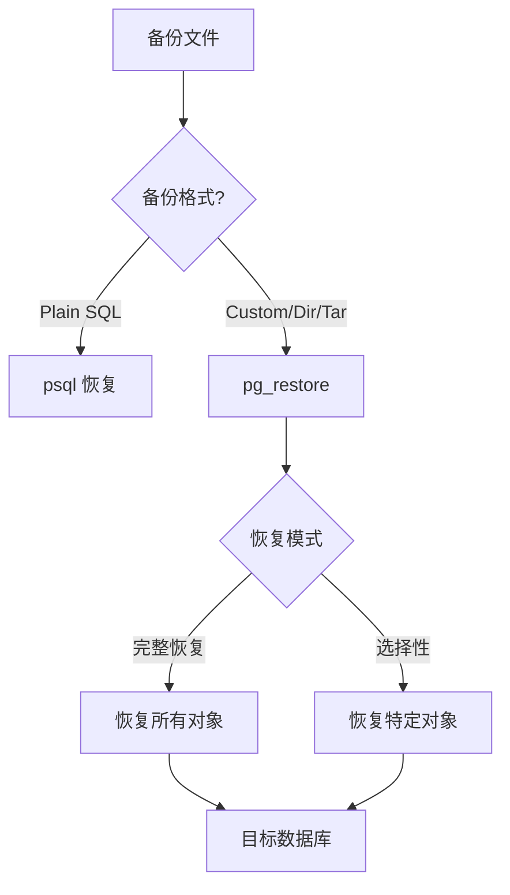
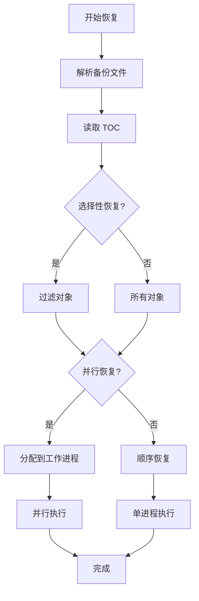

# 4.2 pg_restore 数据恢复

## 📚 概述

`pg_restore` 是从 pg_dump 创建的非文本格式备份（Custom、Directory、Tar）中恢复数据的工具。它支持选择性恢复和并行恢复。

### 🎯 学习目标

- 掌握 pg_restore 的恢复选项
- 学会选择性恢复特定对象
- 了解并行恢复提升效率

---

## 🔧 基本语法

```bash
pg_restore [OPTIONS] [FILENAME]
```

### 恢复流程



---

## 📊 常用选项

| 选项 | 说明 |
|------|------|
| `-d, --dbname` | 目标数据库 |
| `-f, --file` | 输出到文件 (生成 SQL) |
| `-j, --jobs` | 并行恢复作业数 |
| `-c, --clean` | 恢复前删除对象 |
| `-C, --create` | 创建数据库 |
| `-a, --data-only` | 仅恢复数据 |
| `-s, --schema-only` | 仅恢复模式 |
| `-t, --table` | 恢复指定表 |
| `-n, --schema` | 恢复指定模式 |
| `-l, --list` | 列出备份内容 |
| `-L, --use-list` | 使用 TOC 文件 |

---

## 🔄 恢复操作

### 完整恢复

```bash
# 恢复到现有数据库
pg_restore -U postgres -d mydb mydb.dump

# 创建新数据库并恢复
createdb -U postgres newdb
pg_restore -U postgres -d newdb mydb.dump

# 使用 -C 选项创建数据库
pg_restore -U postgres -C -d postgres mydb.dump

# 恢复 Directory 格式
pg_restore -U postgres -d mydb mydb_dir/
```

### 清理并恢复

```bash
# 删除现有对象后恢复
pg_restore -U postgres -c -d mydb mydb.dump

# 如果出错继续
pg_restore -U postgres -c --if-exists -d mydb mydb.dump
```

### 并行恢复

```bash
# 使用 4 个并行作业 (需要 Directory 格式)
pg_restore -U postgres -d mydb -j 4 mydb_dir/

# Custom 格式也支持并行
pg_restore -U postgres -d mydb -j 4 mydb.dump
```

---

## 🎯 选择性恢复

### 查看备份内容

```bash
# 列出备份中的对象
pg_restore -l mydb.dump > toc.txt

# 查看内容
cat toc.txt
# 输出示例:
# ;
# ; Archive created at 2025-02-04 12:00:00 CST
# ;     dbname: mydb
# ;     TOC Entries: 234
# ;
# 1; 3079 16384 EXTENSION - plpgsql
# 2; 1262 16385 DATABASE - mydb postgres
# 3; 2615 2200 SCHEMA - public postgres
# 234; 1259 16789 TABLE public users postgres
# 235; 0 16789 TABLE DATA public users postgres
# ...
```

### 恢复特定对象

```bash
# 恢复特定表
pg_restore -U postgres -d mydb -t users mydb.dump

# 恢复多个表
pg_restore -U postgres -d mydb -t users -t orders mydb.dump

# 恢复特定模式
pg_restore -U postgres -d mydb -n public mydb.dump

# 排除某些表
# 1. 生成 TOC
pg_restore -l mydb.dump > toc.txt

# 2. 编辑 TOC，注释掉不需要的项
# ; 235; 0 16789 TABLE DATA public large_logs postgres

# 3. 使用编辑后的 TOC 恢复
pg_restore -U postgres -d mydb -L toc.txt mydb.dump
```

### 仅恢复数据或模式

```bash
# 仅恢复表结构
pg_restore -U postgres -d mydb -s mydb.dump

# 仅恢复数据
pg_restore -U postgres -d mydb -a mydb.dump

# 禁用触发器恢复数据
pg_restore -U postgres -d mydb -a --disable-triggers mydb.dump
```

---

## 📊 恢复流程图



---

## 🎯 实战案例

### 案例 1: 灾难恢复

```bash
#!/bin/bash
# disaster_recovery.sh

set -e

BACKUP_FILE="/backup/latest/mydb.dump"
TARGET_DB="mydb_recovered"

echo "Starting disaster recovery..."

# 1. 创建新数据库
dropdb --if-exists -U postgres $TARGET_DB
createdb -U postgres $TARGET_DB

# 2. 恢复全局对象 (如果有)
if [ -f "/backup/latest/globals.sql" ]; then
    echo "Restoring globals..."
    psql -U postgres -f /backup/latest/globals.sql 2>/dev/null || true
fi

# 3. 并行恢复数据库
echo "Restoring database..."
pg_restore -U postgres -d $TARGET_DB -j 4 --verbose $BACKUP_FILE

# 4. 分析表
echo "Analyzing tables..."
psql -U postgres -d $TARGET_DB -c "ANALYZE;"

# 5. 验证
echo "Verifying..."
psql -U postgres -d $TARGET_DB -c "
SELECT schemaname, COUNT(*) as tables
FROM pg_tables
WHERE schemaname = 'public'
GROUP BY schemaname;
"

echo "Recovery completed!"
```

### 案例 2: 数据迁移

```bash
# 从旧服务器迁移到新服务器

# 1. 在旧服务器备份
pg_dump -U postgres -Fd -j 4 -f /tmp/mydb_dir production

# 2. 传输到新服务器
rsync -avz /tmp/mydb_dir/ newserver:/tmp/mydb_dir/

# 3. 在新服务器恢复
# 创建数据库
createdb -U postgres production

# 恢复
pg_restore -U postgres -d production -j 4 /tmp/mydb_dir/

# 4. 验证数据完整性
psql -U postgres -d production -c "
SELECT 
    (SELECT COUNT(*) FROM users) as users,
    (SELECT COUNT(*) FROM orders) as orders,
    (SELECT COUNT(*) FROM products) as products;
"
```

### 案例 3: 处理恢复错误

```bash
# 遇到错误时继续恢复
pg_restore -U postgres -d mydb --exit-on-error=false mydb.dump 2> restore_errors.log

# 检查错误
cat restore_errors.log

# 常见错误处理:
# 1. 对象已存在
#    使用 -c --if-exists 选项

# 2. 权限问题
#    使用 --no-owner --no-privileges 选项

# 3. 依赖问题
#    手动处理或忽略
```

---

## 📊 Plain SQL 恢复

```bash
# Plain SQL 格式使用 psql 恢复
psql -U postgres -d mydb -f mydb.sql

# 压缩的 SQL 文件
gunzip -c mydb.sql.gz | psql -U postgres -d mydb

# 单事务恢复 (全部成功或全部回滚)
psql -U postgres -d mydb -1 -f mydb.sql

# 遇错停止
psql -U postgres -d mydb -v ON_ERROR_STOP=1 -f mydb.sql
```

---

## 💡 最佳实践

1. **测试恢复**: 定期在测试环境验证备份
2. **并行恢复**: 大数据库使用 `-j` 选项
3. **记录日志**: 使用 `--verbose` 记录恢复过程
4. **禁用触发器**: 大量数据恢复时禁用触发器
5. **恢复后分析**: 执行 `ANALYZE` 更新统计信息

---

## ❓ 常见问题

<details>
<summary><strong>Q: 恢复时报权限错误怎么办？</strong></summary>

```bash
# 忽略所有权和权限
pg_restore -U postgres -d mydb --no-owner --no-privileges mydb.dump
```
</details>

<details>
<summary><strong>Q: 如何恢复到不同名称的数据库？</strong></summary>

```bash
# 1. 创建新数据库
createdb -U postgres newdb

# 2. 恢复时指定新数据库
pg_restore -U postgres -d newdb mydb.dump
```
</details>

---

[⬅️ 上一章: pg_dump](../4.1-pg_dump/README.md) | [返回目录](../../README.md) | [下一章: pg_basebackup ➡️](../4.3-pg_basebackup/README.md)
