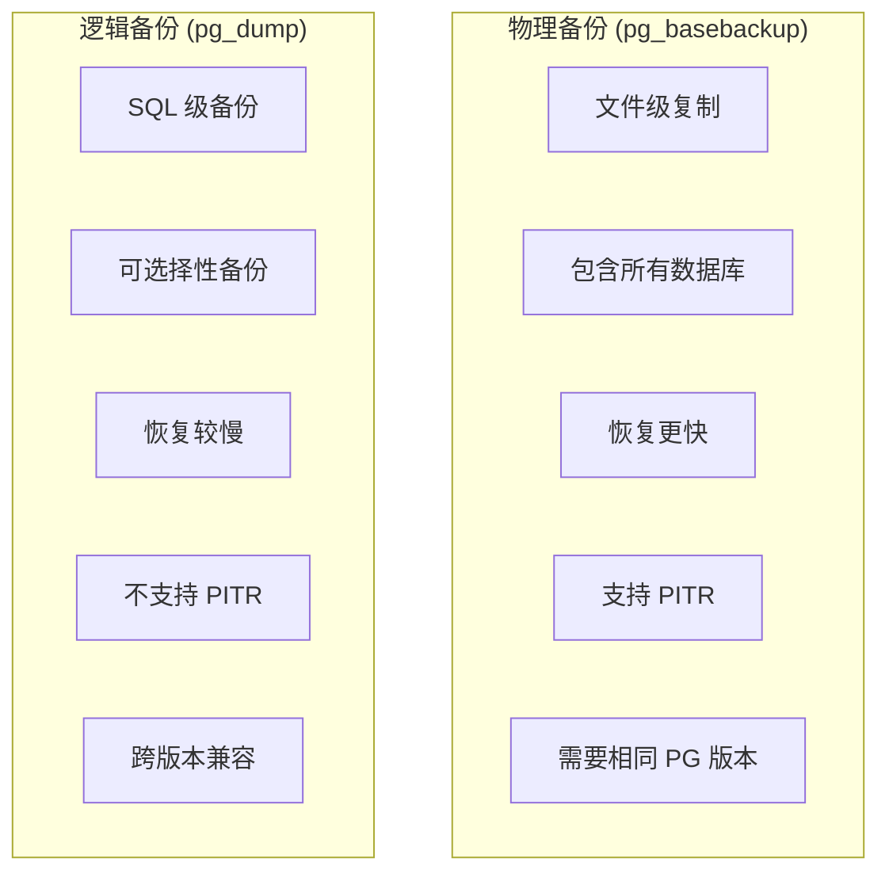
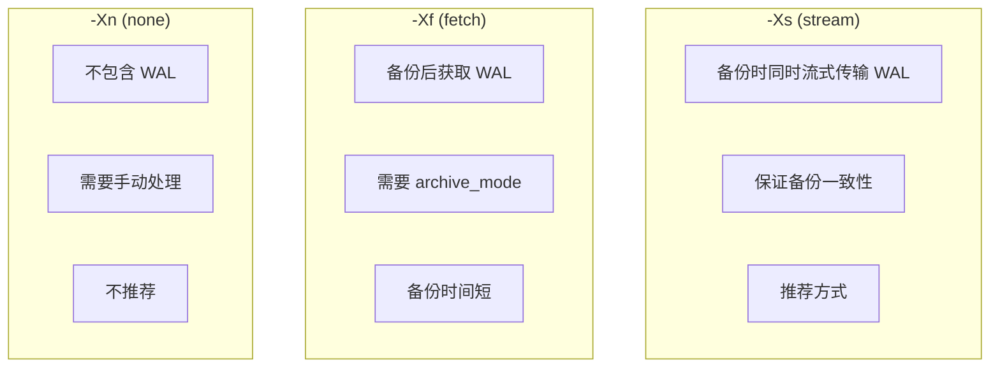
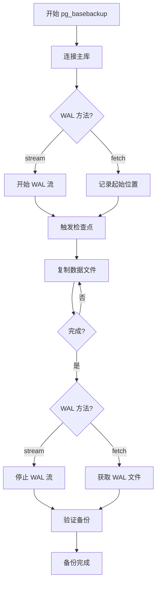

# 4.3 pg_basebackup 物理备份

## 📚 概述

`pg_basebackup` 是 PostgreSQL 的物理备份工具，可以在数据库运行时创建完整的二进制备份。它是实现 PITR（时间点恢复）和流复制的基础。

### 🎯 学习目标

- 掌握 pg_basebackup 的使用方法
- 了解物理备份与逻辑备份的区别
- 学会配置 WAL 归档

---

## 🔧 物理 vs 逻辑备份



---

## ⚙️ 前置配置

### postgresql.conf

```ini
# 启用 WAL 归档
wal_level = replica          # 或 logical
archive_mode = on
archive_command = 'cp %p /var/lib/pgsql/archive/%f'

# 复制配置
max_wal_senders = 3
max_replication_slots = 3
```

### pg_hba.conf

```ini
# 允许复制连接
host    replication     replicator    127.0.0.1/32    scram-sha-256
host    replication     replicator    192.168.1.0/24  scram-sha-256
```

### 创建复制用户

```sql
CREATE ROLE replicator WITH REPLICATION LOGIN PASSWORD 'secure_password';
```

---

## 📊 基本使用

### 基本备份

```bash
# 基本备份
pg_basebackup -U replicator -D /backup/base -Fp -Xs -P

# 带压缩的备份
pg_basebackup -U replicator -D /backup/base -Ft -z -Xs -P

# TAR 格式备份
pg_basebackup -U replicator -D /backup/base.tar -Ft -Xs -P
```

### 常用选项

| 选项 | 说明 |
|------|------|
| `-D, --pgdata` | 输出目录 |
| `-F, --format` | 输出格式 (p=plain, t=tar) |
| `-X, --wal-method` | WAL 模式 (s=stream, f=fetch) |
| `-z, --gzip` | 压缩输出 |
| `-Z, --compress` | 压缩级别 |
| `-P, --progress` | 显示进度 |
| `-c, --checkpoint` | 检查点模式 (fast/spread) |
| `-R, --write-recovery-conf` | 写入恢复配置 |
| `-S, --slot` | 使用复制槽 |

---

## 🔄 WAL 方法



---

## 🎯 实战案例

### 案例 1: 生产环境物理备份

```bash
#!/bin/bash
# physical_backup.sh

set -e

# 配置
BACKUP_DIR="/backup/physical"
DATE=$(date +%Y%m%d_%H%M%S)
PG_USER="replicator"
RETENTION=7

# 创建备份目录
mkdir -p "$BACKUP_DIR/$DATE"

echo "Starting physical backup..."

# 执行备份
pg_basebackup \
    -U $PG_USER \
    -D "$BACKUP_DIR/$DATE" \
    -Fp \
    -Xs \
    -P \
    -c fast \
    --checkpoint=fast \
    --label="backup_$DATE"

# 记录备份信息
echo "Backup completed at $(date)" > "$BACKUP_DIR/$DATE/backup_info.txt"
pg_controldata "$BACKUP_DIR/$DATE" >> "$BACKUP_DIR/$DATE/backup_info.txt"

# 清理旧备份
find "$BACKUP_DIR" -maxdepth 1 -type d -mtime +$RETENTION -exec rm -rf {} \;

echo "Backup completed: $BACKUP_DIR/$DATE"
```

### 案例 2: 创建备库

```bash
# 1. 创建复制槽 (可选，确保 WAL 保留)
psql -U postgres -c "SELECT pg_create_physical_replication_slot('standby1');"

# 2. 使用 pg_basebackup 创建备库
pg_basebackup \
    -h primary-server \
    -U replicator \
    -D /var/lib/pgsql/18/data \
    -Fp \
    -Xs \
    -P \
    -R \
    -S standby1

# 3. 检查生成的配置
cat /var/lib/pgsql/18/data/postgresql.auto.conf
# primary_conninfo = 'host=primary-server user=replicator ...'
# primary_slot_name = 'standby1'

# 4. 创建 standby.signal
touch /var/lib/pgsql/18/data/standby.signal

# 5. 启动备库
pg_ctl start -D /var/lib/pgsql/18/data
```

### 案例 3: TAR 格式备份

```bash
# TAR 格式带压缩
pg_basebackup \
    -U replicator \
    -D /backup/base_tar \
    -Ft \
    -z \
    -Z 5 \
    -Xs \
    -P

# 备份内容
ls -la /backup/base_tar/
# base.tar.gz        - 数据目录
# pg_wal.tar.gz      - WAL 日志

# 恢复
mkdir /var/lib/pgsql/18/data_new
tar -xzf /backup/base_tar/base.tar.gz -C /var/lib/pgsql/18/data_new
tar -xzf /backup/base_tar/pg_wal.tar.gz -C /var/lib/pgsql/18/data_new/pg_wal
```

---

## 📊 备份验证

```bash
# 验证备份完整性
pg_verifybackup /backup/base/

# 检查备份信息
pg_controldata /backup/base/ | grep -E "(checkpoint|WAL)"

# 测试恢复
# 1. 复制到测试目录
cp -r /backup/base/ /tmp/test_restore/

# 2. 修改端口
echo "port = 5433" >> /tmp/test_restore/postgresql.conf

# 3. 启动测试
pg_ctl start -D /tmp/test_restore/

# 4. 验证数据
psql -p 5433 -c "SELECT count(*) FROM important_table;"

# 5. 清理
pg_ctl stop -D /tmp/test_restore/ -m fast
rm -rf /tmp/test_restore/
```

---

## 📊 流程图



---

## 💡 最佳实践

1. **使用流式 WAL**: `-Xs` 选项确保备份一致性
2. **快速检查点**: `-c fast` 减少备份等待
3. **复制槽**: 确保 WAL 不被过早清理
4. **压缩备份**: 节省存储空间
5. **定期验证**: 使用 `pg_verifybackup` 检查

---

## ❓ 常见问题

<details>
<summary><strong>Q: 备份时报 "replication connection" 错误？</strong></summary>

检查：
1. pg_hba.conf 是否允许复制连接
2. 用户是否有 REPLICATION 权限
3. max_wal_senders 是否足够
</details>

<details>
<summary><strong>Q: 备份速度太慢怎么办？</strong></summary>

```bash
# 使用快速检查点
pg_basebackup -c fast ...

# 在低峰期执行

# 使用更高速的存储
```
</details>

---

[⬅️ 上一章: pg_restore](../4.2-pg_restore/README.md) | [返回目录](../../README.md) | [下一章: Barman ➡️](../4.4-barman/README.md)
