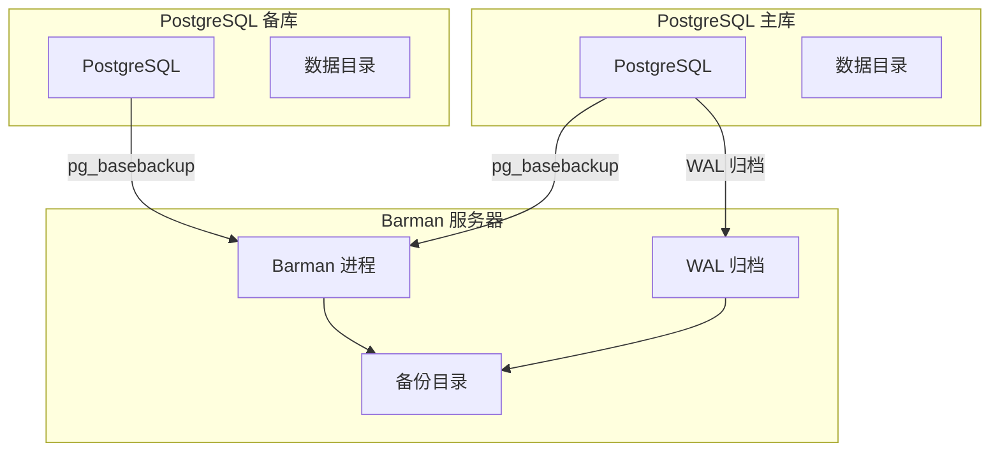
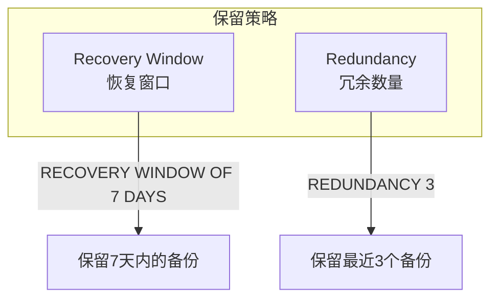
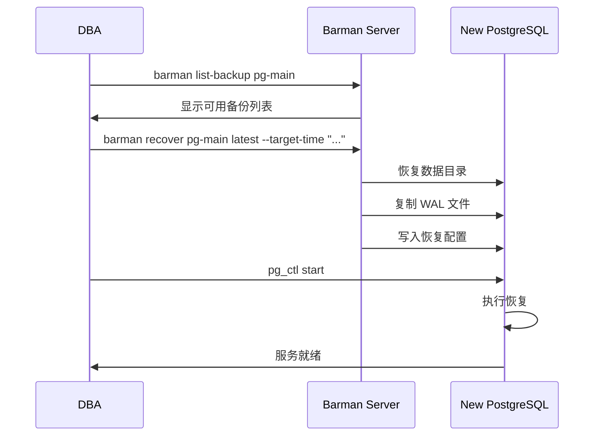

# 4.4 Barman 备份管理

## 📚 概述

Barman (Backup and Recovery Manager) 是一个开源的企业级 PostgreSQL 备份管理工具，由 2ndQuadrant 开发。它提供远程备份、增量备份、保留策略等高级功能。

### 🎯 学习目标

- 了解 Barman 的架构和工作原理
- 掌握 Barman 的安装和配置
- 学会使用 Barman 进行备份和恢复

---

## 🔧 安装

```bash
# RHEL/CentOS
sudo dnf install barman

# Ubuntu/Debian
sudo apt-get install barman

# 使用 pip
pip install barman
```

---

## ⚙️ 架构



---

## 📊 配置

### Barman 全局配置

```ini
# /etc/barman.conf

[barman]
barman_home = /var/lib/barman
configuration_files_directory = /etc/barman.d
barman_user = barman
log_file = /var/log/barman/barman.log
log_level = INFO

; 保留策略
retention_policy = RECOVERY WINDOW OF 7 DAYS
minimum_redundancy = 1

; 压缩
compression = gzip

; 并行作业
parallel_jobs = 4
```

### PostgreSQL 服务器配置

```ini
# /etc/barman.d/pg-main.conf

[pg-main]
description = "Main Production Server"

; 连接信息
conninfo = host=pg-main user=barman dbname=postgres
streaming_conninfo = host=pg-main user=streaming_barman

; 备份方式
backup_method = postgres
streaming_archiver = on

; WAL 归档
archiver = on

; 复制槽
slot_name = barman

; 保留策略 (覆盖全局)
retention_policy = RECOVERY WINDOW OF 14 DAYS

; 路径
backup_directory = /var/lib/barman/pg-main
```

### PostgreSQL 端配置

```sql
-- 创建 Barman 用户
CREATE USER barman WITH SUPERUSER PASSWORD 'barman_password';
CREATE USER streaming_barman WITH REPLICATION PASSWORD 'streaming_password';

-- 允许连接 (pg_hba.conf)
-- host all barman 192.168.1.100/32 scram-sha-256
-- host replication streaming_barman 192.168.1.100/32 scram-sha-256

-- 创建复制槽
SELECT pg_create_physical_replication_slot('barman');
```

---

## 📊 基本操作

### 检查配置

```bash
# 检查所有服务器配置
barman check all

# 检查特定服务器
barman check pg-main

# 诊断信息
barman diagnose

# 列出所有服务器
barman list-server
```

### 执行备份

```bash
# 执行备份
barman backup pg-main

# 带标签的备份
barman backup pg-main --name "before_migration"

# 立即检查点
barman backup pg-main --immediate-checkpoint

# 等待 WAL 归档完成
barman backup pg-main --wait
```

### 查看备份

```bash
# 列出备份
barman list-backup pg-main

# 输出示例:
# pg-main 20250204T120000 - Wed Feb  4 12:00:00 2025 - Size: 10.5 GiB

# 详细备份信息
barman show-backup pg-main latest

# 列出备份中的文件
barman list-files pg-main latest
```

---

## 🔄 恢复操作

### 恢复到本地

```bash
# 恢复最新备份到目标目录
barman recover pg-main latest /var/lib/pgsql/18/data_recovered

# 恢复到特定备份
barman recover pg-main 20250204T120000 /path/to/recovery

# 恢复到远程服务器
barman recover --remote-ssh-command "ssh postgres@remote" \
    pg-main latest /var/lib/pgsql/18/data
```

### PITR 恢复

```bash
# 恢复到特定时间点
barman recover \
    --target-time "2025-02-04 15:30:00" \
    pg-main latest /path/to/recovery

# 恢复到特定事务 ID
barman recover \
    --target-xid "12345" \
    pg-main latest /path/to/recovery

# 恢复到特定 LSN
barman recover \
    --target-lsn "0/3000000" \
    pg-main latest /path/to/recovery
```

---

## 📈 保留策略

```bash
# 应用保留策略 (删除过期备份)
barman cron

# 手动删除备份
barman delete pg-main oldest

# 查看保留策略状态
barman check pg-main --retention-policy
```

### 保留策略类型



---

## 🎯 实战案例

### 案例: 自动化备份脚本

```bash
#!/bin/bash
# /etc/cron.d/barman

# 每小时同步 WAL
0 * * * * barman barman cron

# 每天凌晨2点备份
0 2 * * * barman barman backup all

# 每周日检查
0 3 * * 0 barman barman check all
```

### 灾难恢复流程



---

## 💡 最佳实践

1. **定期检查**: 每天运行 `barman check`
2. **测试恢复**: 定期验证备份可恢复性
3. **监控告警**: 配置备份失败告警
4. **异地存储**: 将备份复制到异地
5. **使用复制槽**: 确保 WAL 不被清理

---

## ❓ 常见问题

<details>
<summary><strong>Q: WAL 归档失败怎么办？</strong></summary>

```bash
# 检查 WAL 归档状态
barman switch-wal --archive pg-main

# 查看归档队列
barman list-backup pg-main --minimal
```
</details>

---

[⬅️ 上一章: pg_basebackup](../4.3-pg_basebackup/README.md) | [返回目录](../../README.md) | [下一章: PITR ➡️](../4.5-pitr/README.md)
