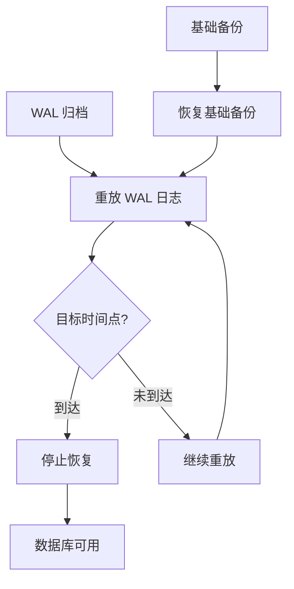
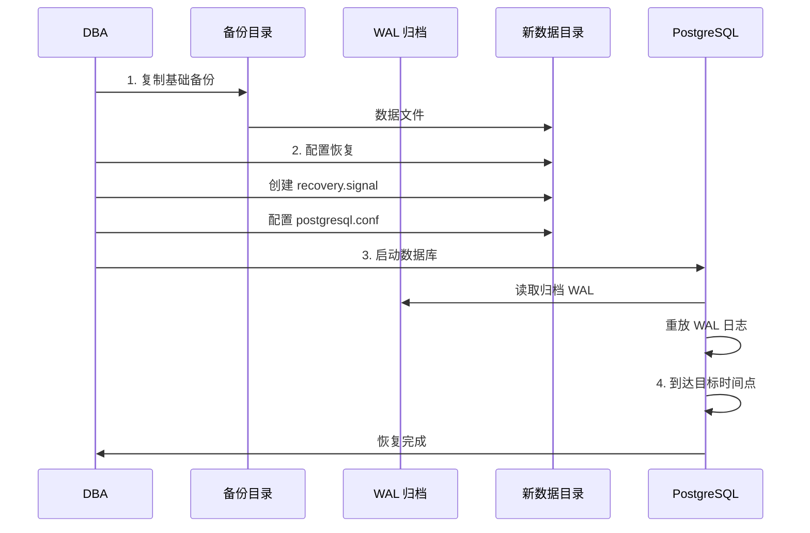
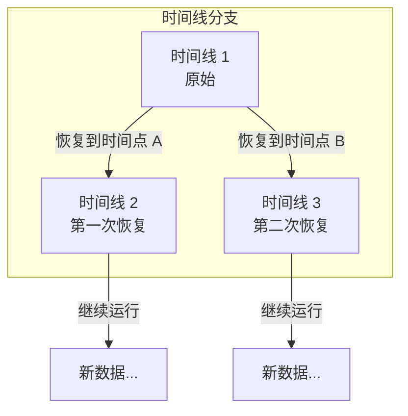

# 4.5 PITR 时间点恢复

## 📚 概述

PITR (Point-In-Time Recovery) 是 PostgreSQL 的时间点恢复功能，允许将数据库恢复到过去任意时刻的状态。它依赖于基础备份和持续的 WAL 归档。

### 🎯 学习目标

- 理解 PITR 的工作原理
- 掌握 WAL 归档配置
- 学会执行时间点恢复

---

## 🔧 工作原理



---

## ⚙️ 配置 WAL 归档

### postgresql.conf

```ini
# WAL 级别
wal_level = replica

# 启用归档
archive_mode = on

# 归档命令
archive_command = 'cp %p /var/lib/pgsql/archive/%f'

# 或使用 rsync 到远程
# archive_command = 'rsync -a %p archiveserver:/archive/%f'

# WAL 保留
max_wal_size = 4GB
min_wal_size = 1GB

# 归档超时 (强制切换)
archive_timeout = 300
```

### 验证归档

```bash
# 检查归档目录
ls -la /var/lib/pgsql/archive/

# 手动触发 WAL 切换
psql -c "SELECT pg_switch_wal();"

# 验证归档成功
ls -la /var/lib/pgsql/archive/ | tail -5
```

---

## 📊 执行基础备份

```bash
# 使用 pg_basebackup
pg_basebackup \
    -U replicator \
    -D /backup/base/$(date +%Y%m%d) \
    -Fp \
    -Xs \
    -P \
    --label="pitr_base_$(date +%Y%m%d)"

# 记录备份信息
pg_controldata /backup/base/$(date +%Y%m%d) | grep "Latest checkpoint"
```

---

## 🔄 执行 PITR 恢复

### 恢复流程



### 步骤 1: 恢复基础备份

```bash
# 停止现有服务器 (如果需要)
pg_ctl stop -D $PGDATA -m fast

# 备份当前数据 (可选)
mv $PGDATA ${PGDATA}_broken

# 恢复基础备份
cp -r /backup/base/20250204 $PGDATA
```

### 步骤 2: 配置恢复

```bash
# 创建恢复信号文件
touch $PGDATA/recovery.signal

# 配置恢复参数 (postgresql.conf 或 postgresql.auto.conf)
cat >> $PGDATA/postgresql.auto.conf << 'EOF'
# 恢复命令
restore_command = 'cp /var/lib/pgsql/archive/%f %p'

# 目标时间点 (选择其一)
recovery_target_time = '2025-02-04 15:30:00'
# recovery_target_xid = '12345'
# recovery_target_lsn = '0/3000000'
# recovery_target_name = 'my_restore_point'

# 恢复后的动作
recovery_target_action = 'pause'
# pause: 暂停，手动确认后继续
# promote: 自动提升为主库
# shutdown: 恢复后关闭

# 时间线 (可选)
# recovery_target_timeline = 'latest'
EOF
```

### 步骤 3: 启动恢复

```bash
# 启动数据库
pg_ctl start -D $PGDATA

# 查看恢复进度
tail -f $PGDATA/log/postgresql-*.log

# 检查恢复状态
psql -c "SELECT pg_is_in_recovery();"
# 返回 true 表示仍在恢复中
```

### 步骤 4: 完成恢复

```bash
# 如果 recovery_target_action = 'pause'
# 验证数据后提升为主库
psql -c "SELECT pg_wal_replay_resume();"

# 或
pg_ctl promote -D $PGDATA

# 验证
psql -c "SELECT pg_is_in_recovery();"
# 返回 false 表示已成为主库
```

---

## 📊 恢复目标选项

| 选项 | 说明 | 示例 |
|------|------|------|
| `recovery_target_time` | 恢复到时间点 | `'2025-02-04 15:30:00'` |
| `recovery_target_xid` | 恢复到事务 ID | `'12345'` |
| `recovery_target_lsn` | 恢复到 LSN | `'0/3000000'` |
| `recovery_target_name` | 恢复到命名点 | `'before_migration'` |
| `recovery_target` | 恢复到一致点 | `'immediate'` |

### 创建恢复点

```sql
-- 创建命名恢复点
SELECT pg_create_restore_point('before_migration');

-- 查看当前 LSN
SELECT pg_current_wal_lsn();
```

---

## 🎯 实战案例

### 案例: 误删数据恢复

```bash
#!/bin/bash
# pitr_recovery.sh

# 场景: 2025-02-04 16:00 有人误删了重要数据
# 需要恢复到 15:55 的状态

PGDATA="/var/lib/pgsql/18/data"
BACKUP_DIR="/backup/base/20250204"
ARCHIVE_DIR="/var/lib/pgsql/archive"
TARGET_TIME="2025-02-04 15:55:00"

# 1. 停止数据库
echo "Stopping PostgreSQL..."
pg_ctl stop -D $PGDATA -m fast

# 2. 备份当前数据
echo "Backing up current data..."
mv $PGDATA ${PGDATA}_$(date +%Y%m%d_%H%M%S)

# 3. 恢复基础备份
echo "Restoring base backup..."
cp -r $BACKUP_DIR $PGDATA

# 4. 配置恢复
echo "Configuring recovery..."
touch $PGDATA/recovery.signal

cat > $PGDATA/postgresql.auto.conf << EOF
restore_command = 'cp $ARCHIVE_DIR/%f %p'
recovery_target_time = '$TARGET_TIME'
recovery_target_action = 'pause'
EOF

# 5. 修改权限
chown -R postgres:postgres $PGDATA

# 6. 启动恢复
echo "Starting recovery..."
pg_ctl start -D $PGDATA

# 7. 等待恢复完成
echo "Waiting for recovery..."
while true; do
    result=$(psql -t -c "SELECT pg_is_in_recovery();" 2>/dev/null)
    if [[ "$result" == " f" ]]; then
        break
    fi
    sleep 5
done

echo "Recovery completed!"

# 8. 验证数据
psql -c "SELECT COUNT(*) FROM important_table;"
```

---

## 📊 时间线管理



```bash
# 查看时间线历史
ls -la $PGDATA/pg_wal/*.history

# 查看当前时间线
pg_controldata $PGDATA | grep TimeLineID
```

---

## 💡 最佳实践

1. **定期测试恢复**: 每月测试 PITR 流程
2. **监控归档**: 确保 WAL 归档正常
3. **保留足够 WAL**: 覆盖恢复窗口
4. **记录恢复点**: 重要操作前创建恢复点
5. **文档化流程**: 记录完整的恢复步骤

---

## ❓ 常见问题

<details>
<summary><strong>Q: 恢复时报 "could not find WAL file"？</strong></summary>

WAL 文件缺失，可能原因：
1. 归档未配置正确
2. WAL 已被清理
3. restore_command 路径错误

检查：
```bash
ls -la /var/lib/pgsql/archive/
cat $PGDATA/postgresql.auto.conf
```
</details>

<details>
<summary><strong>Q: 如何确定正确的恢复时间点？</strong></summary>

```sql
-- 查看事务时间
SELECT xmin, xmax, cmin, cmax FROM pg_class LIMIT 5;

-- 查看 pg_stat_activity 历史 (如果有监控)
-- 或查看应用日志确定操作时间
```
</details>

---

[⬅️ 上一章: Barman](../4.4-barman/README.md) | [返回目录](../../README.md) | [下一章: 流复制 ➡️](../../module-5-replication/5.1-streaming-replication/README.md)
