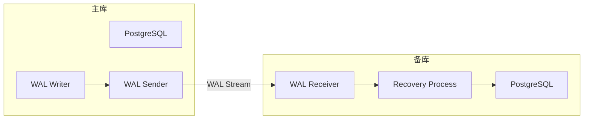
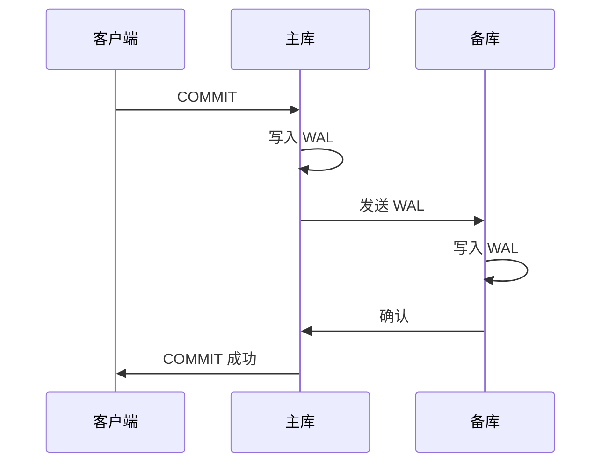

# 5.1 流复制配置

## 📚 概述

PostgreSQL 流复制 (Streaming Replication) 是实现高可用架构的核心技术，它通过实时传输 WAL 日志实现主从同步。

### 🎯 学习目标

- 掌握流复制的配置方法
- 了解同步和异步复制的区别
- 学会监控复制状态

---

## 🔧 架构概览



---

## ⚙️ 主库配置

### postgresql.conf

```ini
# 监听地址
listen_addresses = '*'

# WAL 级别
wal_level = replica

# 复制连接
max_wal_senders = 5
max_replication_slots = 5

# WAL 保留
wal_keep_size = 1GB

# 同步设置 (可选)
# synchronous_standby_names = 'standby1'
```

### pg_hba.conf

```ini
# 允许复制连接
host    replication     replicator    192.168.1.0/24    scram-sha-256
```

### 创建复制用户

```sql
CREATE ROLE replicator WITH REPLICATION LOGIN PASSWORD 'secure_password';
```

---

## 📊 备库创建

```bash
# 使用 pg_basebackup
pg_basebackup \
    -h primary-host \
    -U replicator \
    -D /var/lib/pgsql/18/data \
    -Fp -Xs -P -R

# 验证配置
cat /var/lib/pgsql/18/data/postgresql.auto.conf
# primary_conninfo = 'host=primary-host user=replicator password=...'

# 启动备库
pg_ctl start -D /var/lib/pgsql/18/data
```

---

## 🔄 复制模式

### 异步复制 (默认)

```ini
# 主库配置
synchronous_commit = on  # 默认
# 不设置 synchronous_standby_names
```

### 同步复制

```ini
# 主库配置
synchronous_commit = on
synchronous_standby_names = 'standby1'
# 或多个: 'FIRST 1 (standby1, standby2)'
```



---

## 📈 监控复制

### 主库监控

```sql
-- 查看复制状态
SELECT 
    client_addr,
    state,
    sent_lsn,
    write_lsn,
    flush_lsn,
    replay_lsn,
    sync_state
FROM pg_stat_replication;

-- 查看复制延迟 (字节)
SELECT 
    client_addr,
    pg_wal_lsn_diff(sent_lsn, replay_lsn) AS replication_lag_bytes
FROM pg_stat_replication;
```

### 备库监控

```sql
-- 查看恢复状态
SELECT 
    pg_is_in_recovery() AS is_standby,
    pg_last_wal_receive_lsn() AS receive_lsn,
    pg_last_wal_replay_lsn() AS replay_lsn,
    pg_last_xact_replay_timestamp() AS last_replay_time;

-- 计算延迟时间
SELECT 
    now() - pg_last_xact_replay_timestamp() AS replication_delay;
```

---

## 🎯 实战案例

### 案例: 故障切换

```bash
# 1. 主库故障
# 2. 在备库执行提升
pg_ctl promote -D /var/lib/pgsql/18/data

# 或
psql -c "SELECT pg_promote();"

# 3. 验证
psql -c "SELECT pg_is_in_recovery();"
# 返回 false 表示已成为主库

# 4. 更新应用连接
```

---

## 💡 最佳实践

1. **使用复制槽**: 防止 WAL 被清理
2. **监控延迟**: 设置告警阈值
3. **定期切换测试**: 验证故障切换流程
4. **级联复制**: 减轻主库压力

---

[⬅️ 上一章: PITR](../../module-4-backup/4.5-pitr/README.md) | [返回目录](../../README.md) | [下一章: 逻辑复制 ➡️](../5.2-logical-replication/README.md)
