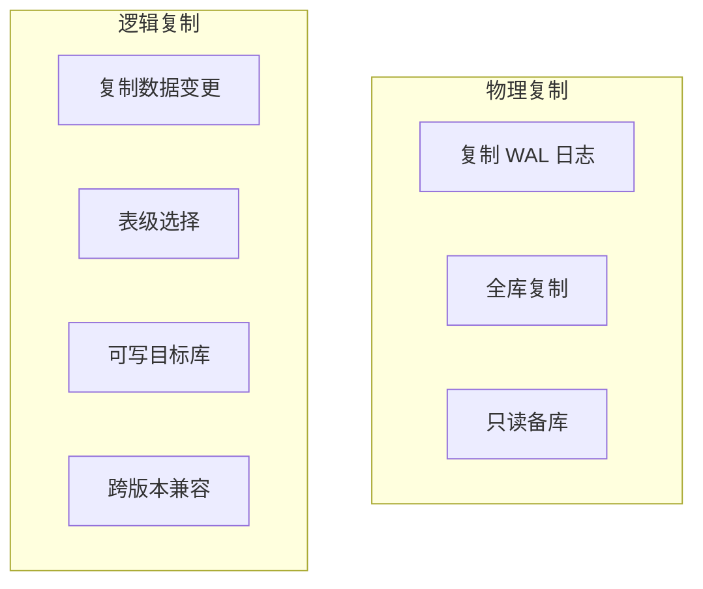
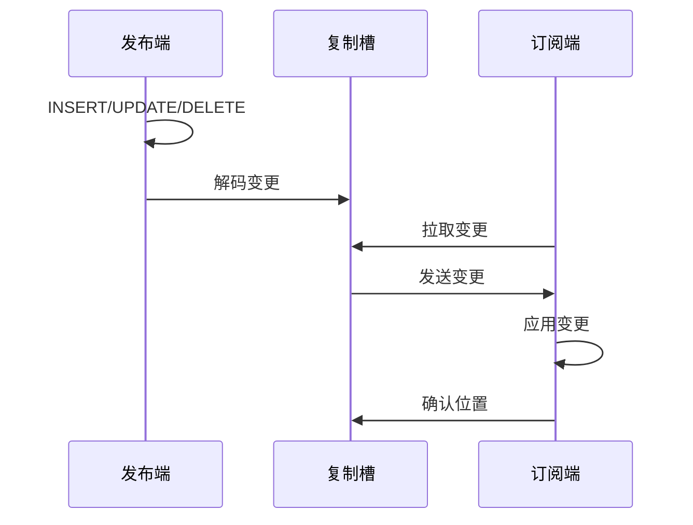

# 5.2 逻辑复制

## 📚 概述

PostgreSQL 逻辑复制基于发布/订阅模式，复制数据变更而非 WAL 日志。PostgreSQL 18 重大增强：**支持 DDL 语句复制**。

### 🎯 学习目标

- 理解逻辑复制的工作原理
- 掌握发布和订阅的配置
- 了解 PostgreSQL 18 的 DDL 复制新特性

---

## 🆕 PostgreSQL 18 新特性

PostgreSQL 18 将逻辑复制扩展到 DDL 语句：
- CREATE TABLE
- ALTER TABLE
- DROP TABLE
- 其他 DDL 语句

```sql
-- PG18: 创建包含 DDL 的发布
CREATE PUBLICATION my_pub 
FOR ALL TABLES
WITH (publish_ddl = true);
```

---

## 🔧 架构对比



---

## ⚙️ 配置发布端

### postgresql.conf

```ini
wal_level = logical
max_replication_slots = 5
max_wal_senders = 5
```

### 创建发布

```sql
-- 发布所有表
CREATE PUBLICATION all_tables FOR ALL TABLES;

-- 发布特定表
CREATE PUBLICATION selected_tables 
FOR TABLE users, orders, products;

-- 发布特定操作
CREATE PUBLICATION inserts_only 
FOR TABLE logs
WITH (publish = 'insert');

-- PG18: 包含 DDL
CREATE PUBLICATION with_ddl 
FOR ALL TABLES
WITH (publish = 'insert, update, delete, truncate', publish_ddl = true);
```

---

## 📊 配置订阅端

```sql
-- 创建订阅
CREATE SUBSCRIPTION my_sub
CONNECTION 'host=publisher port=5432 dbname=source user=replicator password=xxx'
PUBLICATION all_tables;

-- 查看订阅状态
SELECT * FROM pg_stat_subscription;

-- 禁用/启用订阅
ALTER SUBSCRIPTION my_sub DISABLE;
ALTER SUBSCRIPTION my_sub ENABLE;
```

---

## 🔄 复制流程



---

## 📈 监控

```sql
-- 发布端
SELECT * FROM pg_publication;
SELECT * FROM pg_publication_tables;
SELECT * FROM pg_stat_replication;

-- 订阅端
SELECT * FROM pg_subscription;
SELECT * FROM pg_stat_subscription;
SELECT * FROM pg_stat_subscription_stats;
```

---

## 🎯 实战案例

### 案例: 表迁移

```sql
-- 源库: 创建发布
CREATE PUBLICATION migrate_users FOR TABLE users;

-- 目标库: 创建表结构
CREATE TABLE users (LIKE source.users INCLUDING ALL);

-- 目标库: 创建订阅
CREATE SUBSCRIPTION migrate_users_sub
CONNECTION 'host=source-db dbname=app user=replicator'
PUBLICATION migrate_users
WITH (copy_data = true);

-- 验证同步完成后删除订阅
DROP SUBSCRIPTION migrate_users_sub;
```

---

## 💡 最佳实践

1. **表需要主键**: 确保复制表有主键或 REPLICA IDENTITY
2. **监控延迟**: 定期检查订阅状态
3. **利用 PG18 DDL 复制**: 简化模式同步
4. **冲突处理**: 配置冲突解决策略

---

[⬅️ 上一章: 流复制](../5.1-streaming-replication/README.md) | [返回目录](../../README.md) | [下一章: Patroni ➡️](../5.3-patroni/README.md)
