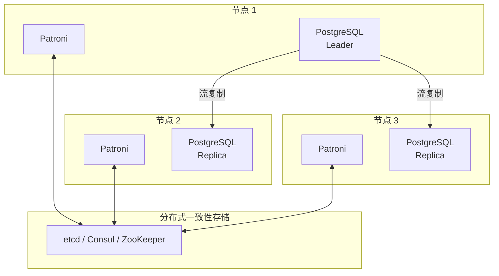
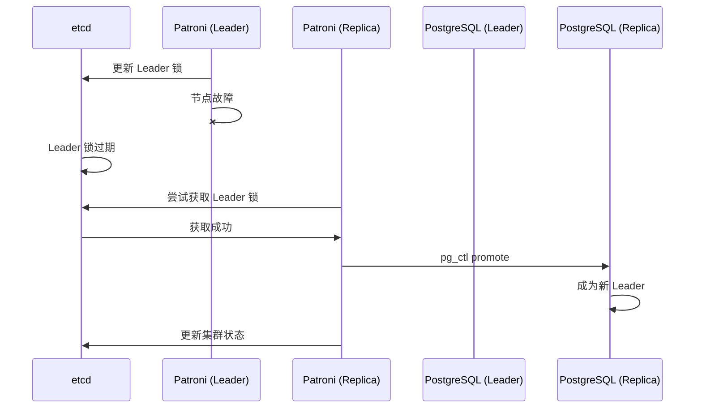

# 5.3 Patroni 高可用集群

## 📚 概述

Patroni 是一个开源的 PostgreSQL 高可用解决方案，使用分布式一致性存储（如 etcd、Consul、ZooKeeper）来管理集群状态和自动故障转移。

### 🎯 学习目标

- 了解 Patroni 的架构和组件
- 掌握 Patroni 集群的配置
- 学会管理和监控 Patroni 集群

---

## 🔧 架构



---

## ⚙️ 配置

### patroni.yml

```yaml
scope: postgres-cluster
name: node1

restapi:
  listen: 0.0.0.0:8008
  connect_address: 192.168.1.101:8008

etcd:
  hosts: 192.168.1.100:2379

bootstrap:
  dcs:
    ttl: 30
    loop_wait: 10
    retry_timeout: 10
    maximum_lag_on_failover: 1048576
    postgresql:
      use_pg_rewind: true
      use_slots: true
      parameters:
        max_connections: 200
        shared_buffers: 2GB
        wal_level: replica
        max_wal_senders: 5

  initdb:
    - encoding: UTF8
    - data-checksums

  pg_hba:
    - host replication replicator 192.168.1.0/24 scram-sha-256
    - host all all 192.168.1.0/24 scram-sha-256

  users:
    admin:
      password: admin_password
      options:
        - createrole
        - createdb

postgresql:
  listen: 0.0.0.0:5432
  connect_address: 192.168.1.101:5432
  data_dir: /var/lib/postgresql/18/data
  bin_dir: /usr/pgsql-18/bin
  authentication:
    replication:
      username: replicator
      password: repl_password
    superuser:
      username: postgres
      password: postgres_password
```

---

## 📊 常用命令

```bash
# 查看集群状态
patronictl -c /etc/patroni.yml list

# 手动切换
patronictl -c /etc/patroni.yml switchover

# 故障转移
patronictl -c /etc/patroni.yml failover

# 重新初始化
patronictl -c /etc/patroni.yml reinit node2

# 重启 PostgreSQL
patronictl -c /etc/patroni.yml restart postgres-cluster

# 重载配置
patronictl -c /etc/patroni.yml reload postgres-cluster

# 编辑动态配置
patronictl -c /etc/patroni.yml edit-config
```

---

## 🔄 故障转移流程



---

## 📈 监控

```bash
# REST API
curl http://localhost:8008/patroni
curl http://localhost:8008/cluster

# 健康检查
curl http://localhost:8008/health

# Leader 检查
curl http://localhost:8008/leader
```

---

## 💡 最佳实践

1. **使用奇数节点**: 确保 DCS 法定人数
2. **同步复制**: 关键场景使用 synchronous_mode
3. **监控延迟**: 设置 maximum_lag_on_failover
4. **定期测试**: 演练故障转移

---

[⬅️ 上一章: 逻辑复制](../5.2-logical-replication/README.md) | [返回目录](../../README.md) | [下一章: PgBouncer ➡️](../5.4-pgbouncer/README.md)
