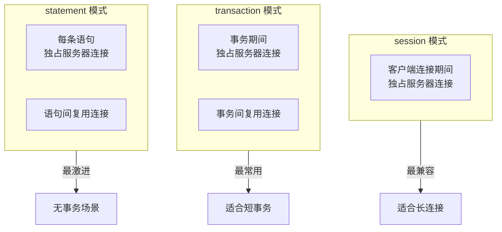

# 5.4 PgBouncer 连接池

## 📚 概述

PgBouncer 是一个轻量级的 PostgreSQL 连接池，可以显著减少数据库连接开销，提高应用程序性能。

### 🎯 学习目标

- 理解连接池的作用和原理
- 掌握 PgBouncer 的配置和使用
- 了解不同的池化模式

---

## 🔧 池化模式



---

## ⚙️ 配置

### pgbouncer.ini

```ini
[databases]
mydb = host=127.0.0.1 port=5432 dbname=mydb

[pgbouncer]
listen_addr = *
listen_port = 6432
auth_type = scram-sha-256
auth_file = /etc/pgbouncer/userlist.txt

; 池化模式
pool_mode = transaction

; 连接数
max_client_conn = 1000
default_pool_size = 20
min_pool_size = 5
reserve_pool_size = 5

; 超时
server_idle_timeout = 60
client_idle_timeout = 0
query_timeout = 0

; 日志
log_connections = 1
log_disconnections = 1
log_pooler_errors = 1
```

### userlist.txt

```
"postgres" "SCRAM-SHA-256$iterations:..."
"app_user" "md5..."
```

---

## 📊 监控

```sql
-- 连接到 PgBouncer 管理数据库
psql -p 6432 -U postgres pgbouncer

-- 查看池状态
SHOW POOLS;

-- 查看客户端连接
SHOW CLIENTS;

-- 查看服务器连接
SHOW SERVERS;

-- 查看统计
SHOW STATS;

-- 查看内存使用
SHOW MEM;
```

---

## 🎯 最佳实践

1. **使用 transaction 模式**: 大多数 Web 应用的最佳选择
2. **合理设置连接数**: default_pool_size 约为 CPU 核心数的 2-4 倍
3. **监控等待队列**: 避免客户端等待时间过长
4. **准备语句**: transaction 模式需注意 prepared statements

---

[⬅️ 上一章: Patroni](../5.3-patroni/README.md) | [返回目录](../../README.md) | [下一章: 用户与角色 ➡️](../../module-6-security/6.1-users-roles/README.md)
