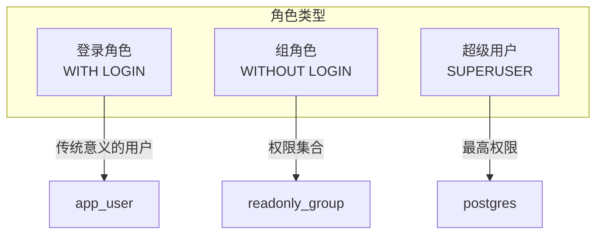
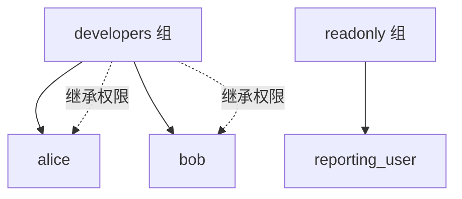

# 6.1 用户与角色管理

## 📚 概述

PostgreSQL 使用角色 (Role) 概念统一管理用户和组。理解角色系统是实现安全数据库管理的基础。

### 🎯 学习目标

- 理解角色与权限的关系
- 掌握角色的创建和管理
- 学会设计权限体系

---

## 🔧 角色类型



---

## ⚙️ 角色管理

### 创建角色

```sql
-- 创建登录角色 (用户)
CREATE ROLE app_user WITH 
    LOGIN 
    PASSWORD 'secure_password'
    VALID UNTIL '2026-12-31';

-- 创建组角色
CREATE ROLE developers;
CREATE ROLE readonly_users;

-- 创建超级用户
CREATE ROLE admin WITH SUPERUSER LOGIN PASSWORD 'admin_pass';
```

### 角色属性

| 属性 | 说明 |
|------|------|
| `LOGIN` | 允许登录 |
| `SUPERUSER` | 超级用户 |
| `CREATEDB` | 可创建数据库 |
| `CREATEROLE` | 可创建角色 |
| `REPLICATION` | 可用于复制 |
| `INHERIT` | 继承组权限 |

### 修改和删除

```sql
-- 修改密码
ALTER ROLE app_user WITH PASSWORD 'new_password';

-- 授予属性
ALTER ROLE developer WITH CREATEDB;

-- 删除角色
DROP ROLE IF EXISTS temp_user;
```

---

## 📊 权限管理

### 数据库级权限

```sql
-- 授予连接权限
GRANT CONNECT ON DATABASE mydb TO app_user;

-- 授予创建模式权限
GRANT CREATE ON DATABASE mydb TO developer;
```

### 模式级权限

```sql
-- 授予模式使用权限
GRANT USAGE ON SCHEMA public TO readonly_users;

-- 授予所有权限
GRANT ALL ON SCHEMA sales TO developer;
```

### 表级权限

```sql
-- 只读权限
GRANT SELECT ON ALL TABLES IN SCHEMA public TO readonly_users;

-- 读写权限
GRANT SELECT, INSERT, UPDATE, DELETE ON users TO app_user;

-- 默认权限 (新建表自动授权)
ALTER DEFAULT PRIVILEGES IN SCHEMA public
GRANT SELECT ON TABLES TO readonly_users;
```

---

## 🔄 角色继承



```sql
-- 创建组角色
CREATE ROLE developers;
GRANT SELECT, INSERT, UPDATE ON ALL TABLES IN SCHEMA public TO developers;

-- 将用户加入组
GRANT developers TO alice;
GRANT developers TO bob;

-- 查看成员
SELECT r.rolname AS role, m.rolname AS member
FROM pg_auth_members am
JOIN pg_roles r ON r.oid = am.roleid
JOIN pg_roles m ON m.oid = am.member;
```

---

## 🎯 实战案例

### 最小权限原则

```sql
-- 1. 创建只读用户
CREATE ROLE readonly_user WITH LOGIN PASSWORD 'readonly_pass';
GRANT CONNECT ON DATABASE production TO readonly_user;
GRANT USAGE ON SCHEMA public TO readonly_user;
GRANT SELECT ON ALL TABLES IN SCHEMA public TO readonly_user;
ALTER DEFAULT PRIVILEGES IN SCHEMA public GRANT SELECT ON TABLES TO readonly_user;

-- 2. 创建应用用户
CREATE ROLE app_user WITH LOGIN PASSWORD 'app_pass';
GRANT CONNECT ON DATABASE production TO app_user;
GRANT USAGE ON SCHEMA public TO app_user;
GRANT SELECT, INSERT, UPDATE, DELETE ON ALL TABLES IN SCHEMA public TO app_user;
GRANT USAGE ON ALL SEQUENCES IN SCHEMA public TO app_user;

-- 3. 创建管理员 (非超级用户)
CREATE ROLE dba WITH LOGIN PASSWORD 'dba_pass' CREATEDB CREATEROLE;
```

---

## 💡 最佳实践

1. **避免使用超级用户**: 应用程序使用受限用户
2. **使用角色继承**: 通过组管理权限
3. **最小权限原则**: 只授予必要权限
4. **定期审计**: 检查权限分配

---

[⬅️ 上一章: PgBouncer](../../module-5-replication/5.4-pgbouncer/README.md) | [返回目录](../../README.md) | [下一章: pg_hba.conf ➡️](../6.2-pg_hba/README.md)
