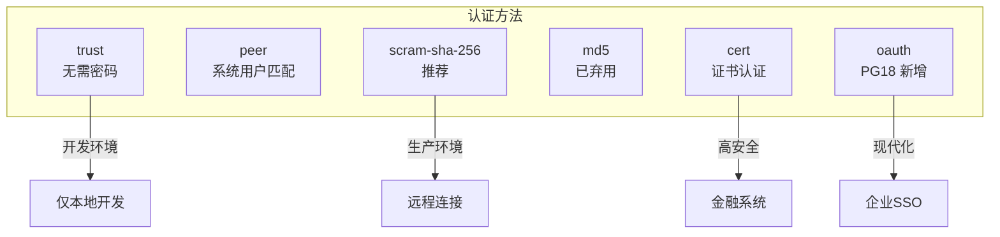
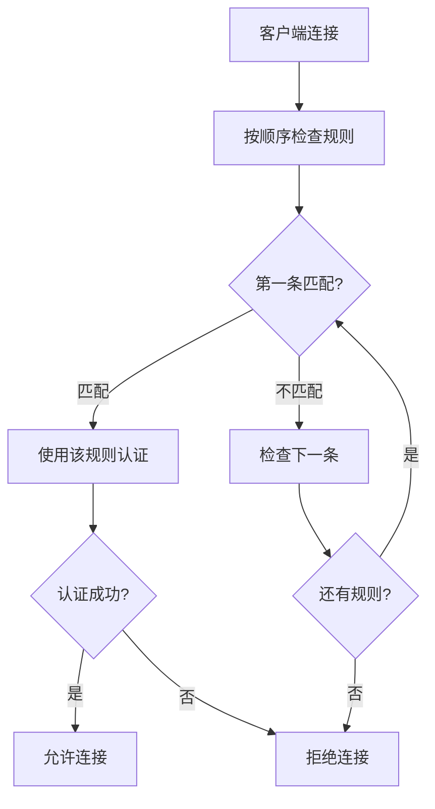

# 6.2 pg_hba.conf 权限控制

## 📚 概述

`pg_hba.conf` (Host-Based Authentication) 是 PostgreSQL 的访问控制配置文件，决定谁可以从哪里以什么方式连接到数据库。

### 🎯 学习目标

- 理解 pg_hba.conf 的配置格式
- 掌握各种认证方法
- 学会配置安全的访问策略

---

## 🔧 配置格式

```
TYPE   DATABASE   USER   ADDRESS     METHOD   [OPTIONS]
```

### 连接类型

| 类型 | 说明 |
|------|------|
| `local` | Unix 套接字连接 |
| `host` | TCP/IP 连接 (SSL 可选) |
| `hostssl` | 仅 SSL 连接 |
| `hostnossl` | 非 SSL 连接 |
| `hostgssenc` | GSSAPI 加密连接 |

---

## 📊 认证方法



### PostgreSQL 18 新特性

```ini
# PG18 原生 OAuth 2.0 支持
host    all    all    0.0.0.0/0    oauth
```

---

## ⚙️ 配置示例

### 生产环境配置

```ini
# TYPE  DATABASE        USER            ADDRESS                 METHOD

# 本地管理 (使用系统用户)
local   all             postgres                                peer

# 本地应用连接
host    all             all             127.0.0.1/32            scram-sha-256
host    all             all             ::1/128                 scram-sha-256

# 内网应用服务器
host    app_db          app_user        10.0.1.0/24             scram-sha-256

# 只读副本用户
host    all             readonly        10.0.2.0/24             scram-sha-256

# 复制连接
host    replication     replicator      10.0.0.0/16             scram-sha-256

# 监控系统
host    postgres        monitor         10.0.3.50/32            scram-sha-256
```

---

## 🔄 规则匹配



> ⚠️ **重要**: 规则按顺序匹配，第一条匹配的规则生效！

---

## 🎯 实战案例

### 高安全环境配置

```ini
# 禁止所有默认连接
# 仅允许特定来源

# 仅超级用户可本地管理
local   all             postgres                                peer
local   all             all                                     reject

# 应用服务器 SSL 连接
hostssl app_db          app_user        192.168.1.100/32        scram-sha-256

# DBA 工具 SSL 连接
hostssl all             dba             192.168.1.50/32         cert

# 拒绝其他所有连接
host    all             all             0.0.0.0/0               reject
```

---

## 📈 验证和重载

```bash
# 检查配置语法
pg_ctl reload -D $PGDATA

# 或 SQL 方式重载
psql -c "SELECT pg_reload_conf();"

# 查看当前规则
psql -c "SELECT * FROM pg_hba_file_rules;"
```

---

## 💡 最佳实践

1. **使用 scram-sha-256**: 比 md5 更安全
2. **限制 IP 范围**: 精确到具体 IP 或小网段
3. **SSL 加密**: 生产环境使用 hostssl
4. **末尾拒绝**: 末尾添加 reject all 规则

---

[⬅️ 上一章: 用户与角色](../6.1-users-roles/README.md) | [返回目录](../../README.md) | [下一章: SSL/TLS ➡️](../6.3-ssl-tls/README.md)
