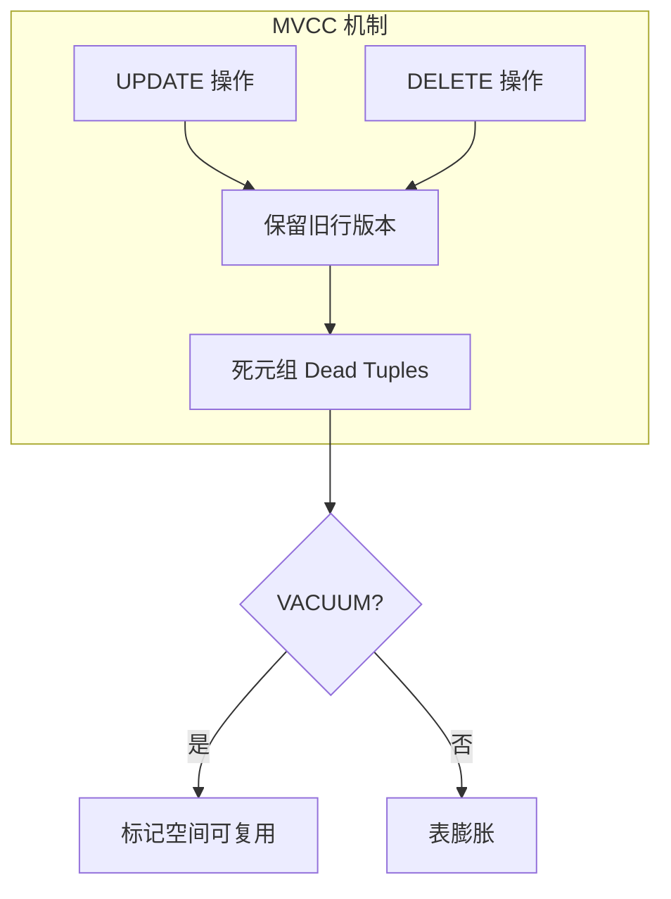

# 7.1 VACUUM 与表膨胀管理

## 📚 概述

VACUUM 是 PostgreSQL 的核心维护操作，用于回收被删除/更新行占用的空间。PostgreSQL 18 在 VACUUM 性能方面有显著改进。

### 🎯 学习目标

- 理解 MVCC 和表膨胀原因
- 掌握 VACUUM 的使用方法
- 了解 PostgreSQL 18 的 VACUUM 优化

---

## 🔧 表膨胀原理



---

## 📊 VACUUM 类型

### 普通 VACUUM

```sql
-- 基本 VACUUM
VACUUM users;

-- 带分析
VACUUM ANALYZE users;

-- 详细输出
VACUUM VERBOSE users;

-- 所有表
VACUUM;
```

### VACUUM FULL

```sql
-- 完全回收空间 (锁表!)
VACUUM FULL users;

-- 注意: VACUUM FULL 会锁表并重写整个表
```

---

## 🆕 PostgreSQL 18 优化

PostgreSQL 18 在 VACUUM 方面的改进：

```sql
-- 1. 惰性修剪优化
-- 减少 VACUUM 的工作量

-- 2. 并行 VACUUM 索引
VACUUM (PARALLEL 4) large_table;

-- 3. 查看 VACUUM 进度
SELECT * FROM pg_stat_progress_vacuum;
```

---

## ⚙️ Autovacuum 配置

```ini
# postgresql.conf

# 启用自动清理
autovacuum = on

# 工作进程数
autovacuum_max_workers = 3

# 触发阈值
autovacuum_vacuum_threshold = 50
autovacuum_vacuum_scale_factor = 0.1
autovacuum_analyze_threshold = 50
autovacuum_analyze_scale_factor = 0.05

# 资源限制
autovacuum_vacuum_cost_limit = 200
autovacuum_vacuum_cost_delay = 2ms
```

---

## 📈 监控

```sql
-- 查看表膨胀
SELECT 
    schemaname || '.' || relname AS table,
    n_dead_tup AS dead_tuples,
    n_live_tup AS live_tuples,
    last_vacuum,
    last_autovacuum
FROM pg_stat_user_tables
WHERE n_dead_tup > 1000
ORDER BY n_dead_tup DESC;

-- 膨胀率估算
SELECT 
    tablename,
    pg_size_pretty(pg_relation_size(schemaname || '.' || tablename)) AS size,
    round(100 * n_dead_tup::numeric / nullif(n_live_tup + n_dead_tup, 0), 2) AS dead_ratio
FROM pg_stat_user_tables
ORDER BY n_dead_tup DESC
LIMIT 10;
```

---

## 🎯 实战：处理大表膨胀

```sql
-- 1. 诊断膨胀
SELECT 
    relname,
    n_live_tup,
    n_dead_tup,
    pg_size_pretty(pg_relation_size(relid)) as size
FROM pg_stat_user_tables
WHERE relname = 'large_table';

-- 2. 手动 VACUUM
VACUUM VERBOSE large_table;

-- 3. 如果膨胀严重，使用 pg_repack (无锁重建)
-- pg_repack -d mydb -t large_table
```

---

## 💡 最佳实践

1. **保持 autovacuum 开启**: 不要关闭自动清理
2. **监控死元组**: 定期检查膨胀情况
3. **避免长事务**: 长事务会阻止 VACUUM
4. **使用 pg_repack**: 大表无锁重建

---

[⬅️ 上一章: pg_hba.conf](../../module-6-security/6.2-pg_hba/README.md) | [返回目录](../../README.md) | [下一章: REINDEX ➡️](../7.2-reindex/README.md)
