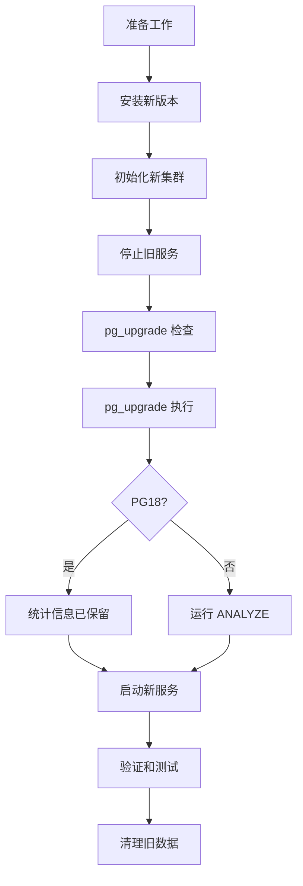

# 7.3 pg_upgrade 版本升级

## 📚 概述

`pg_upgrade` 是 PostgreSQL 的就地升级工具，可以在不导出/导入数据的情况下升级数据库。PostgreSQL 18 的重大改进：**升级时保留优化器统计信息**。

### 🎯 学习目标

- 掌握 pg_upgrade 的使用方法
- 了解 PostgreSQL 18 保留统计信息的新特性
- 学会规划和执行安全的升级

---

## 🆕 PostgreSQL 18 新特性

```bash
# PG18: 升级后自动保留统计信息
# 不再需要运行 vacuumdb --analyze-in-stages

pg_upgrade \
    --old-datadir=/var/lib/pgsql/17/data \
    --new-datadir=/var/lib/pgsql/18/data \
    --old-bindir=/usr/pgsql-17/bin \
    --new-bindir=/usr/pgsql-18/bin

# 升级完成后，统计信息已保留
# 跳过以前必需的 ANALYZE 步骤！
```

---

## 🔧 升级流程



---

## ⚙️ 升级命令

```bash
# 1. 安装新版本
sudo dnf install postgresql18-server postgresql18-contrib

# 2. 初始化新集群
sudo /usr/pgsql-18/bin/postgresql-18-setup initdb

# 3. 停止两个服务
sudo systemctl stop postgresql-17
sudo systemctl stop postgresql-18

# 4. 检查兼容性
sudo -u postgres /usr/pgsql-18/bin/pg_upgrade \
    --check \
    --old-datadir=/var/lib/pgsql/17/data \
    --new-datadir=/var/lib/pgsql/18/data \
    --old-bindir=/usr/pgsql-17/bin \
    --new-bindir=/usr/pgsql-18/bin

# 5. 执行升级
sudo -u postgres /usr/pgsql-18/bin/pg_upgrade \
    --old-datadir=/var/lib/pgsql/17/data \
    --new-datadir=/var/lib/pgsql/18/data \
    --old-bindir=/usr/pgsql-17/bin \
    --new-bindir=/usr/pgsql-18/bin \
    --link  # 使用硬链接加速

# 6. 启动新服务
sudo systemctl start postgresql-18
```

---

## 📊 升级模式

| 模式 | 选项 | 说明 |
|------|------|------|
| 复制模式 | (默认) | 复制数据文件，安全但慢 |
| 链接模式 | `--link` | 硬链接，快但需保留旧数据 |
| 克隆模式 | `--clone` | 使用 reflink (支持的文件系统) |

---

## ✅ 验证

```sql
-- 检查版本
SELECT version();

-- 验证统计信息 (PG18 应该保留)
SELECT 
    schemaname,
    relname,
    last_analyze,
    n_live_tup
FROM pg_stat_user_tables
LIMIT 10;

-- 检查扩展
SELECT * FROM pg_extension;
```

---

## 💡 最佳实践

1. **测试环境先行**: 在测试环境完整演练
2. **备份数据**: 升级前完整备份
3. **检查扩展兼容性**: 确保扩展支持新版本
4. **使用 --link**: 大数据库加速升级
5. **利用 PG18 特性**: 跳过升级后的 ANALYZE

---

[⬅️ 上一章: VACUUM](../7.1-vacuum/README.md) | [返回目录](../../README.md) | [下一章: 异步 I/O ➡️](../7.5-async-io/README.md)
