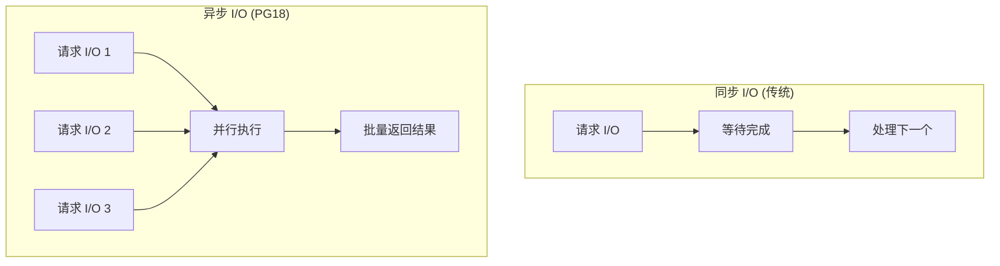

# 7.5 异步 I/O

## 📚 概述

PostgreSQL 18 引入了原生异步 I/O (AIO) 子系统，是该版本最重要的性能特性之一。它可以显著提升 I/O 密集型工作负载的性能。

### 🎯 学习目标

- 理解异步 I/O 的工作原理
- 掌握 AIO 的配置和启用方法
- 了解 AIO 对不同工作负载的影响

---

## 🆕 工作原理



---

## ⚙️ 配置

### postgresql.conf

```ini
# I/O 方法 (Linux)
io_method = 'io_uring'     # 推荐 (需要 Linux 5.1+)
# io_method = 'sync'       # 同步模式 (回退)

# I/O 工作进程
io_max_workers = 3

# 并行度设置
effective_io_concurrency = 200        # SSD
# effective_io_concurrency = 2        # HDD

# maintenance 操作的并行度
maintenance_io_concurrency = 10
```

### 验证配置

```sql
-- 查看当前 I/O 方法
SHOW io_method;

-- 查看 I/O 相关参数
SELECT name, setting, context
FROM pg_settings
WHERE name LIKE 'io%' OR name LIKE '%io_%';
```

---

## 📊 受益场景

| 操作 | 改进程度 | 说明 |
|------|----------|------|
| 顺序扫描 | ⭐⭐⭐⭐⭐ | 预读优化 |
| VACUUM | ⭐⭐⭐⭐ | 并行页面扫描 |
| 位图堆扫描 | ⭐⭐⭐⭐ | 随机读取优化 |
| pg_basebackup | ⭐⭐⭐ | 备份性能提升 |
| 检查点 | ⭐⭐⭐ | 写入效率提升 |

---

## 📈 性能监控

```sql
-- 使用 pg_stat_io 监控
SELECT 
    backend_type,
    context,
    reads,
    round(read_time::numeric, 2) AS read_time_ms,
    writes,
    round(write_time::numeric, 2) AS write_time_ms
FROM pg_stat_io
WHERE reads > 0 OR writes > 0
ORDER BY reads + writes DESC;

-- 检查异步 I/O 使用情况
SELECT 
    backend_type,
    SUM(reads) AS total_reads,
    SUM(writes) AS total_writes
FROM pg_stat_io
GROUP BY backend_type;
```

---

## 🎯 实战案例

### 基准测试

```bash
# 创建测试表
psql -c "CREATE TABLE test_aio AS SELECT generate_series(1, 10000000) AS id, random() AS val;"

# 测试顺序扫描 (冷缓存)
echo 3 > /proc/sys/vm/drop_caches  # Linux: 清除缓存
psql -c "EXPLAIN ANALYZE SELECT COUNT(*) FROM test_aio WHERE val > 0.5;"

# 对比同步模式
ALTER SYSTEM SET io_method = 'sync';
SELECT pg_reload_conf();
-- 重新测试...

# 恢复异步模式
ALTER SYSTEM SET io_method = 'io_uring';
SELECT pg_reload_conf();
```

---

## 💡 最佳实践

1. **Linux 使用 io_uring**: 需要内核 5.1+
2. **SSD 环境优先**: AIO 对 SSD 效果最佳
3. **监控 I/O 统计**: 使用 pg_stat_io 验证效果
4. **合理设置并发度**: 根据存储类型调整

---

## ❓ 常见问题

<details>
<summary><strong>Q: 如何检查系统是否支持 io_uring？</strong></summary>

```bash
# 检查内核版本
uname -r
# 需要 5.1 或更高

# 检查 PostgreSQL 编译选项
pg_config | grep io_uring
```
</details>

---

[⬅️ 上一章: pg_upgrade](../7.3-pg_upgrade/README.md) | [返回目录](../../README.md) | [下一章: DBeaver ➡️](../../module-8-third-party/8.1-dbeaver/README.md)
