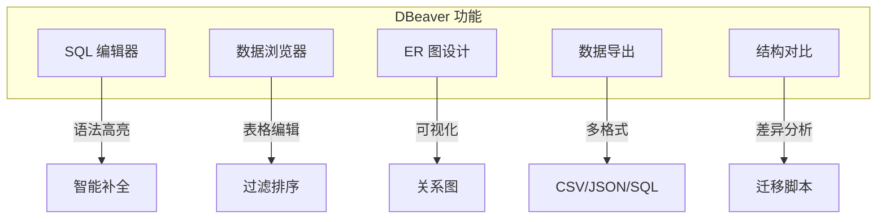

# 8.1 DBeaver 数据库工具

## 📚 概述

DBeaver 是一款免费、开源的通用数据库管理工具，支持包括 PostgreSQL 在内的多种数据库。它提供直观的界面和强大的功能。

### 🎯 学习目标

- 了解 DBeaver 的安装和配置
- 掌握常用功能的使用
- 学会使用高级特性

---

## 🔧 安装

```bash
# Windows (winget)
winget install dbeaver.dbeaver

# macOS (brew)
brew install --cask dbeaver-community

# Linux (snap)
sudo snap install dbeaver-ce
```

---

## ⚙️ 连接 PostgreSQL

1. 点击 **New Connection** → 选择 **PostgreSQL**
2. 填写连接信息：
   - Host: localhost
   - Port: 5432
   - Database: postgres
   - Username: postgres
   - Password: ******
3. 点击 **Test Connection**
4. 保存连接

---

## 📊 主要功能



### SQL 编辑器

- 语法高亮和智能补全
- 多标签页查询
- 执行计划可视化
- 格式化 SQL

### 数据浏览器

- 表格式浏览和编辑
- 高级过滤和排序
- 行级编辑和新增
- 外键导航

### ER 图

- 自动生成数据库关系图
- 导出图片或 PDF
- 可视化设计新表

---

## 🎯 实战技巧

```sql
-- DBeaver 特殊注释
-- @set tableName = users
SELECT * FROM ${tableName} LIMIT 10;

-- 变量提示
SELECT * FROM users WHERE id = :user_id;
```

---

## 💡 最佳实践

1. **保存连接配置**: 使用项目功能组织连接
2. **使用书签**: 保存常用查询
3. **键盘快捷键**: Ctrl+Enter 执行查询
4. **数据比较**: 使用结构对比功能

---

[⬅️ 上一章: 异步 I/O](../../module-7-maintenance/7.5-async-io/README.md) | [返回目录](../../README.md)
